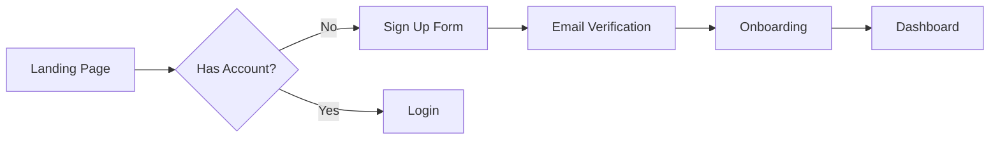

# PRD Architect Reference

## Discovery Phase Questions

### Phase 1: Problem & Vision
- What problem are we solving, and for whom?
- What does success look like from the user's perspective?
- What's the broader vision this fits into?
- Why is this important now?

### Phase 2: Goals & Success Metrics
- What are the specific, measurable goals?
- How will we know this is successful? (KPIs, metrics)
- What's the expected timeline and key milestones?
- What constraints or limitations exist?

### Phase 3: User & Stakeholder Context
- Who are the primary users? What are their characteristics?
- What are the key user personas and their needs?
- Who are the stakeholders, and what are their priorities?
- What existing solutions or workarounds do users employ?

### Phase 4: Functional Requirements
- What are the must-have features vs. nice-to-have?
- What are the critical user flows and journeys?
- What data needs to be captured, stored, or processed?
- What integrations or dependencies exist?

### Phase 5: Technical & Non-Functional Requirements
- What are the performance, scalability, or reliability requirements?
- What are the security, privacy, or compliance considerations?
- What platforms, devices, or browsers must be supported?
- What are the technical constraints or preferred technologies?

### Phase 6: Scope & Prioritization
- What's explicitly in scope for this release?
- What's explicitly out of scope?
- How should features be prioritized if tradeoffs are needed?
- What's the MVP vs. future iterations?

### Phase 7: Risks & Dependencies
- What are the key risks or unknowns?
- What dependencies exist (other teams, systems, external factors)?
- What assumptions are we making?
- What could cause this to fail?

## PRD Quality Checklist

### Structure
- [ ] Table of contents present
- [ ] All 13 required sections included
- [ ] Clear section headings and navigation

### Requirements Quality
- [ ] All requirements have acceptance criteria
- [ ] Requirements are specific and testable
- [ ] Priority levels assigned (Must Have/Should Have/Nice to Have)
- [ ] Dependencies identified

### Metrics Quality
- [ ] Success metrics are quantifiable
- [ ] Baseline values documented
- [ ] Target values specified
- [ ] Timeline for measurement defined

### Scope Quality
- [ ] MVP clearly defined
- [ ] Out of scope items listed with rationale
- [ ] Future iterations outlined
- [ ] Priority matrix included

### Risk Quality
- [ ] Risks identified with probability and impact
- [ ] Mitigation strategies defined
- [ ] Assumptions documented
- [ ] External dependencies noted

## Common Anti-Patterns to Avoid

1. **Vague Requirements**
   - BAD: "The system should be fast"
   - GOOD: "Page load time < 2 seconds on 3G connection"

2. **Missing Acceptance Criteria**
   - BAD: "Users can log in"
   - GOOD: "Users can log in with email/password, receiving session token valid for 24 hours"

3. **Unquantifiable Metrics**
   - BAD: "Improve user engagement"
   - GOOD: "Increase DAU by 20% within 30 days of launch"

4. **Scope Creep Enablers**
   - BAD: "And any other features users might want"
   - GOOD: Explicitly list out-of-scope items with rationale

5. **Undefined Personas**
   - BAD: "Users will appreciate this feature"
   - GOOD: "Power users (>10 sessions/week) will save 15 minutes daily"

## Edge Cases

| Scenario | Behavior |
|----------|----------|
| No context directory | Create it, add README.md, proceed to full interview |
| Empty context directory | Note it, proceed to full interview |
| Only README.md exists | Treat as empty, proceed to full interview |
| Contradictory information | List contradictions, ask developer to clarify |
| Outdated information | Ask "Is this still accurate?" before using |
| Very large files (>1000 lines) | Summarize key sections, note full file available |
| Non-markdown files | Note existence, explain can't parse |
| Partial coverage | Conduct mini-interviews for gaps only |
| Developer disagrees with synthesis | Allow corrections, update understanding |
| Reality conflicts with context | Reality wins, flag conflict for user review |
| Stale reality (>7 days) | Prompt user to refresh or proceed with cached |
| /ride failed | Log blocker, proceed without grounding (with warning) |
| Brownfield detected but no reality | Present 3-option AskUserQuestion: Run /ride, Run /ride --enriched, Skip grounding |
| Greenfield project | Skip codebase grounding entirely, no message |

## Visual Communication (Optional)

Follow `.claude/protocols/visual-communication.md` for diagram standards.

### When to Include Diagrams

PRDs may benefit from visual aids for:
- **User Journeys** (flowchart) - Show user flows through the product
- **Process Flows** (flowchart) - Illustrate business processes
- **Stakeholder Maps** (flowchart) - Show stakeholder relationships

### Output Format

If including diagrams, use Mermaid with preview URLs:

```markdown
### User Registration Journey



> **Preview**: [View diagram](https://agents.craft.do/mermaid?code=...&theme=github)
```

### Theme Configuration

Read theme from `.loa.config.yaml` visual_communication.theme setting.

Diagram inclusion is **optional** for PRDs - use agent discretion based on complexity.

## Phase Transition Protocol

Applied after each discovery phase (see SKILL.md "### Phase Transitions" for the
per-phase value table). Substitute `{THIS}` = current phase name, `{NEXT}` = next
phase name, `{NEXT_NUM}` = next phase number.

When `gate_between` is true:
1. Summarize what was learned in this phase (3-5 bullets, cited)
2. State what carries forward to the next phase
3. Present transition:
   - If `routing_style` == "structured": Use AskUserQuestion:
     question: "Phase {N} complete. Ready for Phase {NEXT_NUM}: {NEXT}?"
     header: "Phase {N}"
     options:
       - label: "Continue"
         description: "Move to {NEXT}"
       - label: "Go back"
         description: "Revisit this phase — I have corrections"
       - label: "Skip ahead"
         description: "Jump to PRD generation — enough context gathered"
   - If `routing_style` == "plain":
     "Phase {N}: {THIS} complete. Moving to Phase {NEXT_NUM}: {NEXT}. Continue, go back, or skip ahead?"
4. WAIT for response. DO NOT auto-continue.

When `gate_between` is false:
One-line transition: "Moving to Phase {NEXT_NUM}: {NEXT}."

Phase 7 is terminal — it moves to pre-generation review, not a next phase: carry
forward to PRD generation, omit the "Skip ahead" option, and use "Moving to
pre-generation review." (plain) / "Moving to PRD generation." (gate off). The
Phase 7 structured option description is "Move to pre-generation summary".
