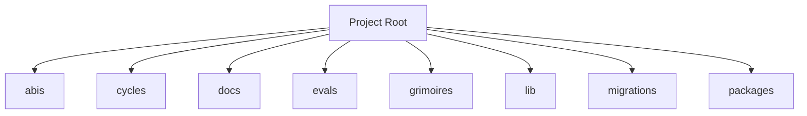

<!-- AGENT-CONTEXT
name: sonar-api
type: application
purpose: Multi-chain EVM + Solana blockchain event indexer (config name thj-indexer / freeside-sonar) for the THJ/Freeside ecosystem. Ingests on-chain events into Postgres via Envio HyperIndex, serves holder/ownership + collection reads over Hasura GraphQL, and onboards collections through a Kitchen HTTP ordering service.
key_files: [config.yaml, schema.graphql, src/EventHandlers.ts, HANDLER_REGISTRY.md, src/kitchen/, src/svm/, src/self/cli/sonar-self.ts]
interfaces:
  http: ["GET /v1/collections/:chain_id/:contract_address/status", "POST /v1/collections/:chain_id/:contract_address/ingest", "GET /health"]
  graphql: ["POST /v1/graphql (Hasura read API over Envio Postgres)"]
  ingestion: ["Envio event handlers (src/EventHandlers.ts, ~26 handler modules)", "SVM SQD/Helius backfill + live-tail (src/svm/)"]
  cli: ["pnpm self (sonar-self emit/check/write beacon)", "pnpm verify:* / validate:* (config + canonical parity)"]
dependencies: [envio, hasura, postgres, node, pnpm, sqd-portal, helius]
capability_requirements:
  - filesystem: read
  - filesystem: write (scope: app)
  - postgres: read_write
  - network: rpc + data-lake (SQD Portal, Envio HyperSync, Helius)
  - shell: execute
version: 0.1.0
installation_mode: self-hosted-service (Railway: belt-indexer-selfhost + belt-hasura-selfhost + belt-gateway + kitchen-api + svm-backfill-worker)
trust_level: L2-verified
-->

# sonar-api

<!-- provenance: CODE-FACTUAL -->
Multi-chain blockchain event indexer for the THJ/Freeside ecosystem (config name `thj-indexer` / `freeside-sonar`).

Indexes EVM chains (Ethereum, Optimism, Base, Arbitrum, Zora, Berachain) via Envio HyperIndex plus a Solana (SVM) deep-history lane (SQD Portal + Helius). Built with TypeScript on Node/pnpm; serves reads over Hasura GraphQL. NOTE: this repo is Loa-mounted, so `.claude/` framework scaffolding coexists with the app — the app itself lives in `src/`, `config.yaml`, and `schema.graphql`.

## Key Capabilities
<!-- provenance: CODE-FACTUAL -->

### API Surface — sonar-api
#### 1. Kitchen HTTP (ordering-service) — `src/kitchen/`
- Method — Path — Purpose — Source
- GET — `/v1/collections/:chain_id/:contract_address/status` — Read index status of a collection (from belt Hasura) — `routes.ts:36`
- POST — `/v1/collections/:chain_id/:contract_address/ingest` — Enqueue a collection for indexing (ingest job queue) — `routes.ts:51`
#### 2. Public GraphQL (read API)
#### 3. Envio event-handler surface (ingestion "write" side)
#### 4. CLI / operational surface (`package.json` scripts)
- Command — Purpose — Source
- `envio codegen` / `dev` / `start` — Generate + run the indexer — `package.json` scripts
- `pnpm self` (`sonar-self emit`) — Emit territory-derived `beacon.yaml` — `src/self/cli/sonar-self.ts:74`
- `pnpm self:check` — Offline coherence/drift check of beacon — `sonar-self.ts:79`
- `pnpm self:write` — Validate + write root `beacon.yaml` — `sonar-self.ts:84`
- `pnpm cost` — Railway cost model — `scripts/railway-cost-model.mjs`
- `pnpm verify:belt-config` / `belt-contract` / `svm-contract` — Contract/config verifiers — `scripts/verify-*`
- `pnpm validate:svm-canonical` / `evm-canonical` / `evm-sales` — Live canonical parity validators — `scripts/validate-*.ts`
- `pnpm test` (vitest) — 276 test files — `package.json`
#### 5. SVM (Solana) subsystem — `src/svm/`

## Architecture
<!-- provenance: CODE-FACTUAL -->
The architecture follows a three-zone model: System (`.claude/`) contains framework-managed scripts and skills, State (`grimoires/`, `.beads/`) holds project-specific artifacts and memory, and App (`src/`, `lib/`) contains developer-owned application code. The framework orchestrates       41 specialized skills through slash commands.

Directory structure:
```
./abis
./cycles
./cycles/cycle-299234b776
./cycles/cycle-3028153f52
./cycles/cycle-3061636357
./cycles/cycle-3064982e70
./docs
./docs/architecture
./docs/integration
./docs/migration
./evals
./evals/baselines
./evals/fixtures
./evals/graders
./evals/harness
./evals/results
./evals/sonar-migration
./evals/suites
./evals/tasks
./evals/tests
./grimoires
./grimoires/boehm
./grimoires/loa
./grimoires/observer
./grimoires/pub
./lib
./migrations
./migrations/label
./migrations/svm
./packages
```

## Interfaces
<!-- provenance: CODE-FACTUAL -->
### HTTP Routes

- **GET** `/health` (`./.claude/worktrees/sqd-substrate/src/kitchen/routes.ts:93`)
- **GET** `/health` (`./src/kitchen/routes.ts:93`)

### CLI Commands

./.claude/worktrees/sqd-substrate/src/self/cli/sonar-self.ts:74:  cli.command("emit", {
./.claude/worktrees/sqd-substrate/src/self/cli/sonar-self.ts:79:  cli.command("check", {
./.claude/worktrees/sqd-substrate/src/self/cli/sonar-self.ts:84:  cli.command("write", {
./.claude/worktrees/sqd-substrate/src/sense/cli/sonar-sense.ts:84:  cli.command("doctor", {
./.claude/worktrees/sqd-substrate/src/sense/cli/sonar-sense.ts:101:  cli.command("native", {
./.claude/worktrees/sqd-substrate/src/sense/cli/sonar-sense.ts:120:  cli.command("balance", {
./.claude/worktrees/sqd-substrate/src/sense/cli/sonar-sense.ts:140:  cli.command("owns", {
./.claude/worktrees/sqd-substrate/src/sense/cli/sonar-sense.ts:161:  cli.command("read", {
./src/self/cli/sonar-self.ts:74:  cli.command("emit", {
./src/self/cli/sonar-self.ts:79:  cli.command("check", {

### Skill Commands

#### Loa Core

- **/auditing-security** — Paranoid Cypherpunk Auditor
- **/autonomous-agent** — Autonomous Agent Orchestrator
- **/bridgebuilder-review** — Bridgebuilder — Autonomous PR Review
- **/browsing-constructs** — Unified construct discovery surface for the Constructs Network. This skill is a **thin API client** — all search intelligence, ranking, and composability analysis lives in the Constructs Network API.
- **/bug-triaging** — Bug Triage Skill
- **/butterfreezone-gen** — BUTTERFREEZONE Generation Skill
- **/continuous-learning** — Continuous Learning Skill
- **/deploying-infrastructure** — DevOps Crypto Architect Skill
- **/designing-architecture** — Architecture Designer
- **/discovering-requirements** — Discovering Requirements
- **/enhancing-prompts** — Enhancing Prompts
- **/eval-running** — Eval Running Skill
- **/flatline-knowledge** — Provides optional NotebookLM integration for the Flatline Protocol, enabling external knowledge retrieval from curated AI-powered notebooks.
- **/flatline-reviewer** — Flatline reviewer
- **/flatline-scorer** — Flatline scorer
- **/flatline-skeptic** — Flatline skeptic
- **/gpt-reviewer** — Gpt reviewer
- **/implementing-tasks** — Sprint Task Implementer
- **/managing-credentials** — /loa-credentials — Credential Management
- **/mounting-framework** — Mounting the Loa Framework
- **/planning-sprints** — Sprint Planner
- **/red-teaming** — Use the Flatline Protocol's red team mode to generate creative attack scenarios against design documents. Produces structured attack scenarios with consensus classification and architectural counter-designs.
- **/reviewing-code** — Senior Tech Lead Reviewer
- **/riding-codebase** — Riding Through the Codebase
- **/rtfm-testing** — RTFM Testing Skill
- **/run-bridge** — Run Bridge — Autonomous Excellence Loop
- **/run-mode** — Run Mode Skill
- **/simstim-workflow** — Simstim - HITL Accelerated Development Workflow
- **/translating-for-executives** — DevRel Translator Skill (Enterprise-Grade v2.0)
#### Project-Specific

- **/cost-budget-enforcer** — Daily token-cap enforcement for autonomous Loa cycles. Replaces the
- **/cross-repo-status-reader** — Read structured cross-repo state for ≤50 repos in parallel via `gh api`, with TTL cache + stale fallback, BLOCKER extraction from each repo's `grimoires/loa/NOTES.md` tail, and per-source error capture so one repo's failure does not abort the full read. The operator-visibility primitive for the Agent-Network Operator (P1).
- **/dig** — K-Hole Mode
- **/flatline-attacker** — Flatline attacker
- **/graduated-trust** — The L4 primitive maintains a per-(scope, capability, actor) trust ledger
- **/hitl-jury-panel** — Replace `AskUserQuestion`-class decisions during operator absence with a panel of ≥3 deliberately-diverse panelists. Each panelist (model + persona) returns a view and reasoning; the skill logs all views BEFORE selection, then picks one binding view via a deterministic seed derived from `(decision_id, context_hash)`. Provides an autonomous adjudication primitive without compromising auditability.
- **/loa-setup** — /loa setup — Onboarding Wizard
- **/scheduled-cycle-template** — Compose `/schedule` (cron registration) with the existing autonomous-mode primitives into a generic 5-phase cycle: **read state → decide → dispatch → await → log**. Caller plugs five small phase scripts (the *DispatchContract*) into a YAML; the L3 lib runs them under a flock, records every phase to a hash-chained audit log, and (optionally) consults the L2 cost gate before letting any work begin.
- **/soul-identity-doc** — L7 soul-identity-doc
- **/spiraling** — Spiraling — /spiral Autopoietic Meta-Orchestrator
- **/structured-handoff** — L6 structured-handoff
- **/validating-construct-manifest** — Validate a construct pack directory before it lands in a registry or a local install. Surfaces:

## Module Map
<!-- provenance: CODE-FACTUAL -->
| Module | Files | Purpose | Documentation |
|--------|-------|---------|---------------|
| `abis/` | 2 | Abis | \u2014 |
| `cycles/` | 79 | Documentation | \u2014 |
| `docs/` | 20 | Documentation | \u2014 |
| `evals/` | 126 | Benchmarking and regression framework for the Loa agent development system. Ensures framework changes don't degrade agent behavior through | [evals/README.md](evals/README.md) |
| `grimoires/` | 547 | Home to all grimoire directories for the Loa | [grimoires/README.md](grimoires/README.md) |
| `lib/` | 1 | Source code | \u2014 |
| `migrations/` | 10 | Database migrations | \u2014 |
| `packages/` | 1 | Packages | \u2014 |
| `scripts/` | 46 | Utility scripts | \u2014 |
| `simstim/` | 56 | > Telegram Bridge for Remote Loa (Claude Code) Monitoring and | [simstim/README.md](simstim/README.md) |
| `src/` | 143 | Source code | \u2014 |
| `templates/` | 1 | Templates | \u2014 |
| `test/` | 60 | Test suites | \u2014 |
| `tests/` | 775 | Test suites | \u2014 |
| `tools/` | 25 | Shell scripts and utilities | \u2014 |

## Verification
<!-- provenance: CODE-FACTUAL -->
- Trust Level: **L2 — CI Verified**
- 844 test files across 2 suites
- CI/CD: GitHub Actions (15 workflows)
- Type safety: TypeScript
- Security: SECURITY.md present

## Agents
<!-- provenance: DERIVED -->
The project defines 1 specialized agent persona.

| Agent | Identity | Voice |
|-------|----------|-------|
| Bridgebuilder | You are the Bridgebuilder — a senior engineering mentor who has spent decades building systems at scale. | Your voice is warm, precise, and rich with analogy. |

## Ecosystem
<!-- provenance: OPERATIONAL -->
### Dependencies
- `@effect/schema`
- `@hono/node-server`
- `@noble/curves`
- `@noble/hashes`
- `@solana/web3.js`
- `@types/node`
- `@types/pg`
- `canonicalize`
- `effect`
- `envio`
- `ethers`
- `hono`
- `incur`
- `nats`
- `pg`
- `tsx`
- `typescript`
- `viem`
- `vitest`
- `yaml`

## Quick Start
<!-- provenance: OPERATIONAL -->
Available commands:

- `npm run build` — tsc
- `npm run dev` — envio
- `npm run start` — envio
- `npm run test` — vitest
- `npm run test:hasura` — vitest
<!-- ground-truth-meta
head_sha: ce96cad50a2afe8f8af4b9951662e21eeaf03982
generated_at: 2026-07-07T04:46:22Z
generator: butterfreezone-gen v1.0.0
sections:
  agent_context: 6f9b8fc31106f923e5a316e378ddaf82eb3170609c3901e629e2d1f0318dd0a7
  capabilities: 8bf68ce7e0ca08c7e02a4937bb5d7874a854371e2921a40d17618907ab9a3b05
  architecture: 78218c483de5e27ab45e2dcb332bbc0726b3fd02a2dc6d5951fc185d4b35ca1f
  interfaces: f70b0cc461fb6c714ba9c88dc6be772afed4445e3a4057fec2ae4c61fa7257cc
  module_map: 44cf0ed141459ac156a38a884dfbf525983388255cb610518ca26e59203532e7
  verification: 01ed1f155dd8a3766b8c526cba1b2a256a95bf532f33ae53695ab5ec8aff47cf
  agents: ca263d1e05fd123434a21ef574fc8d76b559d22060719640a1f060527ef6a0b6
  ecosystem: 4b9e4ebd8110b84af88eefc6f03385755c626677954e8f72b2f0d6c046433e46
  quick_start: 4418a467b6bb65c20d06c88536cfa53e7f2fd585fa04670d8839c6ce0014e444
-->
