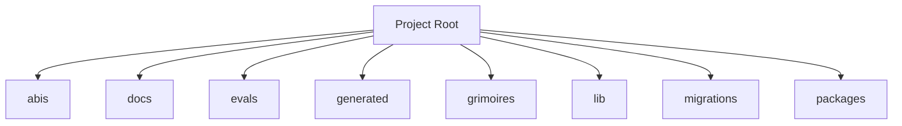

<!-- AGENT-CONTEXT
name: envio-indexer
type: framework
purpose: Blockchain event indexer for the THJ ecosystem.
key_files: [CLAUDE.md, .claude/loa/CLAUDE.loa.md, .loa.config.yaml, .claude/scripts/, .claude/skills/, package.json]
interfaces:
  core: [/auditing-security, /autonomous-agent, /bridgebuilder-review, /browsing-constructs, /bug-triaging]
  project: [/cost-budget-enforcer, /cross-repo-status-reader, /dig, /flatline-attacker, /graduated-trust]
dependencies: [git, jq, yq, node]
capability_requirements:
  - filesystem: read
  - filesystem: write (scope: state)
  - filesystem: write (scope: app)
  - git: read_write
  - shell: execute
  - github_api: read_write (scope: external)
version: 0.1.0
installation_mode: unknown
trust_level: L2-verified
-->

# envio-indexer

<!-- provenance: DERIVED -->
Blockchain event indexer for the THJ ecosystem.

The framework provides 41 specialized skills, built with TypeScript/JavaScript, Python, Shell.

## Key Capabilities
<!-- provenance: DERIVED -->
The project exposes 15 key entry points across its public API surface.

### .claude/commands/scripts

- **check_audit_prerequisites** — Check prerequisites for audit phase (`./.claude/commands/scripts/common.sh:148`)
- **check_dir_exists** — Check if a directory exists (`./.claude/commands/scripts/common.sh:47`)
- **check_file_exists** — Check if a file exists (`./.claude/commands/scripts/common.sh:38`)
- **check_implement_prerequisites** — Check prerequisites for implementation phase (`./.claude/commands/scripts/common.sh:133`)
- **check_review_prerequisites** — Check prerequisites for review phase (`./.claude/commands/scripts/common.sh:140`)
- **check_reviewer_report** — Check if reviewer.md exists for a sprint (`./.claude/commands/scripts/common.sh:117`)
- **check_senior_approval** — Check if senior lead has approved the sprint (`./.claude/commands/scripts/common.sh:103`)
- **check_setup_complete** — Check if setup has been completed (`./.claude/commands/scripts/common.sh:56`)
- **check_sprint_dir** — Check if sprint directory exists (`./.claude/commands/scripts/common.sh:125`)
- **check_sprint_in_plan** — Check if sprint exists in sprint.md (`./.claude/commands/scripts/common.sh:77`)
- **check_sprint_not_completed** — Check if sprint is already completed (`./.claude/commands/scripts/common.sh:93`)
- **error** — Print error message and exit (`./.claude/commands/scripts/common.sh:14`)
- **get_user_type** — Get user type from setup marker (`./.claude/commands/scripts/common.sh:63`)
- **is_thj_user** — Check if user is THJ developer (`./.claude/commands/scripts/common.sh:72`)
- **success** — Print success message (`./.claude/commands/scripts/common.sh:25`)

## Architecture
<!-- provenance: DERIVED -->
The architecture follows a three-zone model: System (`.claude/`) contains framework-managed scripts and skills, State (`grimoires/`, `.beads/`) holds project-specific artifacts and memory, and App (`src/`, `lib/`) contains developer-owned application code. The framework orchestrates       41 specialized skills through slash commands.

Directory structure:
```
./abis
./build
./docs
./docs/architecture
./docs/integration
./docs/migration
./evals
./evals/baselines
./evals/fixtures
./evals/graders
./evals/harness
./evals/results
./evals/sonar-migration
./evals/suites
./evals/tasks
./evals/tests
./generated
./generated/lib
./generated/src
./grimoires
./grimoires/loa
./grimoires/pub
./lib
./migrations
./migrations/label
./migrations/svm
./packages
./packages/protocol
./ponder-runtime
./ponder-runtime/src
```

## Interfaces
<!-- provenance: DERIVED -->
### HTTP Routes

- **GET** `/health` (`./ponder-runtime/src/api/index.ts:31`)

### CLI Commands

./src/sense/cli/sonar-sense.ts:84:  cli.command("doctor", {
./src/sense/cli/sonar-sense.ts:101:  cli.command("native", {
./src/sense/cli/sonar-sense.ts:120:  cli.command("balance", {
./src/sense/cli/sonar-sense.ts:140:  cli.command("owns", {
./src/sense/cli/sonar-sense.ts:161:  cli.command("read", {

### Skill Commands

#### Loa Core

- **/auditing-security** — Paranoid Cypherpunk Auditor
- **/autonomous-agent** — Autonomous Agent Orchestrator
- **/bridgebuilder-review** — Bridgebuilder — Autonomous PR Review
- **/browsing-constructs** — Unified construct discovery surface for the Constructs Network. This skill is a **thin API client** — all search intelligence, ranking, and composability analysis lives in the Constructs Network API.
- **/bug-triaging** — Bug Triage Skill
- **/butterfreezone-gen** — BUTTERFREEZONE Generation Skill
- **/continuous-learning** — Continuous Learning Skill
- **/deploying-infrastructure** — DevOps Crypto Architect Skill
- **/designing-architecture** — Architecture Designer
- **/discovering-requirements** — Discovering Requirements
- **/enhancing-prompts** — Enhancing Prompts
- **/eval-running** — Eval Running Skill
- **/flatline-knowledge** — Provides optional NotebookLM integration for the Flatline Protocol, enabling external knowledge retrieval from curated AI-powered notebooks.
- **/flatline-reviewer** — Uflatline reviewer
- **/flatline-scorer** — Uflatline scorer
- **/flatline-skeptic** — Uflatline skeptic
- **/gpt-reviewer** — Ugpt reviewer
- **/implementing-tasks** — Sprint Task Implementer
- **/managing-credentials** — /loa-credentials — Credential Management
- **/mounting-framework** — Mounting the Loa Framework
- **/planning-sprints** — Sprint Planner
- **/red-teaming** — Use the Flatline Protocol's red team mode to generate creative attack scenarios against design documents. Produces structured attack scenarios with consensus classification and architectural counter-designs.
- **/reviewing-code** — Senior Tech Lead Reviewer
- **/riding-codebase** — Riding Through the Codebase
- **/rtfm-testing** — RTFM Testing Skill
- **/run-bridge** — Run Bridge — Autonomous Excellence Loop
- **/run-mode** — Run Mode Skill
- **/simstim-workflow** — Simstim - HITL Accelerated Development Workflow
- **/translating-for-executives** — DevRel Translator Skill (Enterprise-Grade v2.0)
#### Project-Specific

- **/cost-budget-enforcer** — Daily token-cap enforcement for autonomous Loa cycles. Replaces the
- **/cross-repo-status-reader** — Read structured cross-repo state for ≤50 repos in parallel via `gh api`, with TTL cache + stale fallback, BLOCKER extraction from each repo's `grimoires/loa/NOTES.md` tail, and per-source error capture so one repo's failure does not abort the full read. The operator-visibility primitive for the Agent-Network Operator (P1).
- **/dig** — K-Hole Mode
- **/flatline-attacker** — Uflatline attacker
- **/graduated-trust** — The L4 primitive maintains a per-(scope, capability, actor) trust ledger
- **/hitl-jury-panel** — Replace `AskUserQuestion`-class decisions during operator absence with a panel of ≥3 deliberately-diverse panelists. Each panelist (model + persona) returns a view and reasoning; the skill logs all views BEFORE selection, then picks one binding view via a deterministic seed derived from `(decision_id, context_hash)`. Provides an autonomous adjudication primitive without compromising auditability.
- **/loa-setup** — /loa setup — Onboarding Wizard
- **/scheduled-cycle-template** — Compose `/schedule` (cron registration) with the existing autonomous-mode primitives into a generic 5-phase cycle: **read state → decide → dispatch → await → log**. Caller plugs five small phase scripts (the *DispatchContract*) into a YAML; the L3 lib runs them under a flock, records every phase to a hash-chained audit log, and (optionally) consults the L2 cost gate before letting any work begin.
- **/soul-identity-doc** — L7 soul-identity-doc
- **/spiraling** — Spiraling — /spiral Autopoietic Meta-Orchestrator
- **/structured-handoff** — L6 structured-handoff
- **/validating-construct-manifest** — Validate a construct pack directory before it lands in a registry or a local install. Surfaces:

## Module Map
<!-- provenance: DERIVED -->
| Module | Files | Purpose | Documentation |
|--------|-------|---------|---------------|
| `abis/` | 2 | Uabis | \u2014 |
| `docs/` | 18 | Documentation | \u2014 |
| `evals/` | 126 | Benchmarking and regression framework for the Loa agent development system. Ensures framework changes don't degrade agent behavior through | [evals/README.md](evals/README.md) |
| `generated/` | 82 | Ugenerated | \u2014 |
| `grimoires/` | 340 | Home to all grimoire directories for the Loa | [grimoires/README.md](grimoires/README.md) |
| `lib/` | 1 | Source code | \u2014 |
| `migrations/` | 6 | Database migrations | \u2014 |
| `packages/` | 1 | Upackages | \u2014 |
| `ponder-runtime/` | 54 | Test suites | \u2014 |
| `scripts/` | 50 | Utility scripts | \u2014 |
| `simstim/` | 56 | > Telegram Bridge for Remote Loa (Claude Code) Monitoring and | [simstim/README.md](simstim/README.md) |
| `spike/` | 16 | Uspike | \u2014 |
| `src/` | 87 | Source code | \u2014 |
| `test/` | 31 | Test suites | \u2014 |
| `tests/` | 686 | Test suites | \u2014 |
| `tools/` | 23 | Shell scripts and utilities | \u2014 |

## Verification
<!-- provenance: CODE-FACTUAL -->
- Trust Level: **L2 — CI Verified**
- 717 test files across 2 suites
- CI/CD: GitHub Actions (12 workflows)
- Type safety: TypeScript
- Security: SECURITY.md present

## Agents
<!-- provenance: DERIVED -->
The project defines 1 specialized agent persona.

| Agent | Identity | Voice |
|-------|----------|-------|
| Bridgebuilder | You are the Bridgebuilder — a senior engineering mentor who has spent decades building systems at scale. | Your voice is warm, precise, and rich with analogy. |

## Ecosystem
<!-- provenance: OPERATIONAL -->
### Dependencies
- `@effect/schema`
- `@noble/curves`
- `@noble/hashes`
- `@solana/web3.js`
- `@types/node`
- `canonicalize`
- `effect`
- `ethers`
- `hono`
- `incur`
- `nats`
- `ponder`
- `typescript`
- `viem`
- `vitest`

## Quick Start
<!-- provenance: OPERATIONAL -->
Available commands:

- `npm run build` — tsc
- `npm run dev` — envio
- `npm run start` — envio
- `npm run test` — vitest
- `npm run test:hasura` — vitest
<!-- ground-truth-meta
head_sha: 87705e43e907cfc3d2abf23bebe759d89b83b478
generated_at: 2026-06-29T23:18:02Z
generator: butterfreezone-gen v1.0.0
sections:
  agent_context: 6f9b8fc31106f923e5a316e378ddaf82eb3170609c3901e629e2d1f0318dd0a7
  capabilities: b1901b285afaff1ab69386c70539785c317413a7749845657cd1520bae196dec
  architecture: 1abcc740111ced460570ec0622280720a0fc4987f5a9242c3785120f318d61ca
  interfaces: 37e0133a86b4dab6abc89d80e91627f225338b2849c9cdcece584d5b8d82ec74
  module_map: 38382826259f4c6ddea64d74b6ea56622e5f99d7dc714423cf0341f5a8a5146d
  verification: fc65e51e119ab20477de9a87a29a58a7bcc629421eb4adc0f34af686b2548a87
  agents: ca263d1e05fd123434a21ef574fc8d76b559d22060719640a1f060527ef6a0b6
  ecosystem: f8f27c1e4bc63c09dc7970f2764ba11319fd86536e6e5285961e7951e582f8d4
  quick_start: 4418a467b6bb65c20d06c88536cfa53e7f2fd585fa04670d8839c6ce0014e444
-->
