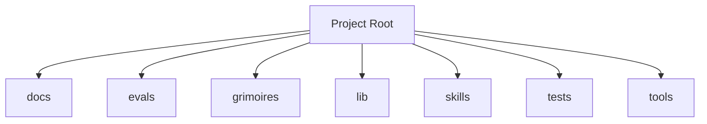

<!-- AGENT-CONTEXT
name: loa
type: framework
purpose: Loa is an agent-driven development framework for [Claude Code](https://docs.anthropic.com/en/docs/claude-code/overview) (Anthropic's official CLI).
key_files: [CLAUDE.md, .claude/loa/CLAUDE.loa.md, .loa.config.yaml, .claude/scripts/, .claude/skills/]
interfaces:
  core: [/auditing-security, /autonomous-agent, /bridgebuilder-review, /browsing-constructs, /bug-triaging]
  project: [/cost-budget-enforcer, /cross-repo-status-reader, /flatline-attacker, /graduated-trust, /hitl-jury-panel]
dependencies: [git, jq, yq]
ecosystem:
  - repo: 0xHoneyJar/loa-finn
    role: runtime
    interface: hounfour-router
    protocol: loa-hounfour@8.3.1
  - repo: 0xHoneyJar/loa-hounfour
    role: protocol
    interface: npm-package
    protocol: loa-hounfour@8.3.1
  - repo: 0xHoneyJar/arrakis
    role: distribution
    interface: jwt-auth
    protocol: loa-hounfour@8.3.1
capability_requirements:
  - filesystem: read
  - filesystem: write (scope: state)
  - filesystem: write (scope: app)
  - git: read_write
  - shell: execute
  - github_api: read_write (scope: external)
version: v1.147.0
installation_mode: unknown
trust_level: L2-verified
-->

# loa

<!-- provenance: CODE-FACTUAL -->
Loa is an agent-driven development framework for [Claude Code](https://docs.anthropic.com/en/docs/claude-code/overview) (Anthropic's official CLI).

The framework provides 40 specialized skills, built with TypeScript/JavaScript, Python, Shell.

## Key Capabilities
<!-- provenance: CODE-FACTUAL -->

# Loa Reality — API Surface
## Slash commands (53 total)
### Golden Path (5)
### Workflow (truenames)
### Run mode
### Ad-hoc
## Key bash entry points
### Mount + setup
- `.claude/scripts/mount-loa.sh` — install on existing repo (one command)
- `.claude/scripts/golden-path.sh` — Golden Path dispatcher
### Orchestration
- `.claude/scripts/run-mode.sh` — autonomous sprint executor
- `.claude/scripts/run-bridge.sh` — iterative excellence loop
- `.claude/scripts/spiral.sh` — autopoietic meta-orchestrator
- `.claude/scripts/post-merge-orchestrator.sh` — release pipeline
- `.claude/scripts/post-pr-validation.sh` — post-PR Bridgebuilder loop
### Audit / safety

## Architecture
<!-- provenance: CODE-FACTUAL -->
The architecture follows a three-zone model: System (`.claude/`) contains framework-managed scripts and skills, State (`grimoires/`, `.beads/`) holds project-specific artifacts and memory, and App (`src/`, `lib/`) contains developer-owned application code. The framework orchestrates 40 specialized skills through slash commands.

Directory structure:
```
./docs
./docs/architecture
./docs/integration
./docs/migration
./evals
./evals/baselines
./evals/fixtures
./evals/graders
./evals/harness
./evals/results
./evals/suites
./evals/tasks
./evals/tests
./grimoires
./grimoires/loa
./grimoires/pub
./lib
./skills
./skills/legba
./tests
./tests/__pycache__
./tests/bash
./tests/conformance
./tests/e2e
./tests/edge-cases
./tests/fixtures
./tests/helpers
./tests/integration
./tests/lib
./tests/perf
```

## Interfaces
<!-- provenance: CODE-FACTUAL -->
### Skill Commands

#### Loa Core

- **/auditing-security** — Paranoid Cypherpunk Auditor
- **/autonomous-agent** — Autonomous Agent Orchestrator
- **/bridgebuilder-review** — Bridgebuilder — Autonomous PR Review
- **/browsing-constructs** — Unified construct discovery surface for the Constructs Network. This skill is a **thin API client** — all search intelligence, ranking, and composability analysis lives in the Constructs Network API.
- **/bug-triaging** — Bug Triage Skill
- **/butterfreezone-gen** — BUTTERFREEZONE Generation Skill
- **/continuous-learning** — Continuous Learning Skill
- **/deploying-infrastructure** — DevOps Crypto Architect Skill
- **/designing-architecture** — Architecture Designer
- **/discovering-requirements** — Discovering Requirements
- **/enhancing-prompts** — Enhancing Prompts
- **/eval-running** — Eval Running Skill
- **/flatline-knowledge** — Provides optional NotebookLM integration for the Flatline Protocol, enabling external knowledge retrieval from curated AI-powered notebooks.
- **/flatline-reviewer** — Flatline reviewer
- **/flatline-scorer** — Flatline scorer
- **/flatline-skeptic** — Flatline skeptic
- **/gpt-reviewer** — Gpt reviewer
- **/implementing-tasks** — Sprint Task Implementer
- **/managing-credentials** — /loa-credentials — Credential Management
- **/mounting-framework** — Mounting the Loa Framework
- **/planning-sprints** — Sprint Planner
- **/red-teaming** — Use the Flatline Protocol's red team mode to generate creative attack scenarios against design documents. Produces structured attack scenarios with consensus classification and architectural counter-designs.
- **/reviewing-code** — Senior Tech Lead Reviewer
- **/riding-codebase** — Riding Through the Codebase
- **/rtfm-testing** — RTFM Testing Skill
- **/run-bridge** — Run Bridge — Autonomous Excellence Loop
- **/run-mode** — Run Mode Skill
- **/simstim-workflow** — Simstim - HITL Accelerated Development Workflow
- **/translating-for-executives** — DevRel Translator Skill (Enterprise-Grade v2.0)
#### Project-Specific

- **/cost-budget-enforcer** — Daily token-cap enforcement for autonomous Loa cycles. Replaces the
- **/cross-repo-status-reader** — Read structured cross-repo state for ≤50 repos in parallel via `gh api`, with TTL cache + stale fallback, BLOCKER extraction from each repo's `grimoires/loa/NOTES.md` tail, and per-source error capture so one repo's failure does not abort the full read. The operator-visibility primitive for the Agent-Network Operator (P1).
- **/flatline-attacker** — Flatline attacker
- **/graduated-trust** — The L4 primitive maintains a per-(scope, capability, actor) trust ledger
- **/hitl-jury-panel** — Replace `AskUserQuestion`-class decisions during operator absence with a panel of ≥3 deliberately-diverse panelists. Each panelist (model + persona) returns a view and reasoning; the skill logs all views BEFORE selection, then picks one binding view via a deterministic seed derived from `(decision_id, context_hash)`. Provides an autonomous adjudication primitive without compromising auditability.
- **/loa-setup** — /loa setup — Onboarding Wizard
- **/scheduled-cycle-template** — Compose `/schedule` (cron registration) with the existing autonomous-mode primitives into a generic 5-phase cycle: **read state → decide → dispatch → await → log**. Caller plugs five small phase scripts (the *DispatchContract*) into a YAML; the L3 lib runs them under a flock, records every phase to a hash-chained audit log, and (optionally) consults the L2 cost gate before letting any work begin.
- **/soul-identity-doc** — L7 soul-identity-doc
- **/spiraling** — Spiraling
- **/structured-handoff** — L6 structured-handoff
- **/validating-construct-manifest** — Validate a construct pack directory before it lands in a registry or a local install. Surfaces:

## Module Map
<!-- provenance: CODE-FACTUAL -->
| Module | Files | Purpose | Documentation |
|--------|-------|---------|---------------|
| `docs/` | 10 | Documentation | \u2014 |
| `evals/` | 5818 | Benchmarking and regression framework for the Loa agent development system. Ensures framework changes don't degrade agent behavior through | [evals/README.md](evals/README.md) |
| `grimoires/` | 2511 | Home to all grimoire directories for the Loa | [grimoires/README.md](grimoires/README.md) |
| `lib/` | 1 | Source code | \u2014 |
| `skills/` | 5112 | Specialized agent skills | \u2014 |
| `tests/` | 587 | Test suites | \u2014 |
| `tools/` | 5 | Shell scripts and utilities | \u2014 |

## Verification
<!-- provenance: CODE-FACTUAL -->
- Trust Level: **L2 — CI Verified**
- 587 test files across 1 suite
- CI/CD: GitHub Actions (36 workflows)
- Security: SECURITY.md present

## Agents
<!-- provenance: DERIVED -->
The project defines 1 specialized agent persona.

| Agent | Identity | Voice |
|-------|----------|-------|
| Bridgebuilder | You are the Bridgebuilder — a senior engineering mentor who has spent decades building systems at scale. | Your voice is warm, precise, and rich with analogy. |

## Culture
<!-- provenance: OPERATIONAL -->
**Naming**: Vodou terminology (Loa, Grimoire, Hounfour, Simstim) as cognitive hooks for agent framework concepts.

**Principles**: Think Before Coding — plan and analyze before implementing, Simplicity First — minimum complexity for the current task, Surgical Changes — minimal diff, maximum impact, Goal-Driven — every action traces to acceptance criteria.

**Methodology**: Agent-driven development with iterative excellence loops (Simstim, Run Bridge, Flatline Protocol).
**Creative Methodology**: Creative methodology drawing from cyberpunk fiction, free jazz improvisation, and temporary autonomous zones.

**Influences**: Neuromancer (Gibson) — Simstim as shared consciousness metaphor, Flatline Protocol — adversarial multi-model review as creative tension, TAZ (Hakim Bey) — temporary spaces for autonomous agent exploration.

**Knowledge Production**: Knowledge production through collective inquiry — Flatline as multi-model study group.

## Quick Start
<!-- provenance: OPERATIONAL -->

**Prerequisites**: [Claude Code](https://docs.anthropic.com/en/docs/claude-code/overview) (Anthropic's CLI for Claude), Git, jq, [yq v4+](https://github.com/mikefarah/yq). See **[INSTALLATION.md](INSTALLATION.md)** for full details.

> [!WARNING]
> **Some Loa features invoke external AI APIs and incur costs.** The three most expensive are:
> - **Flatline Protocol** — multi-model adversarial review (~$15–25 per planning cycle, Opus + GPT-5.3-codex)
> - **Simstim** — HITL-accelerated full cycle (~$25–65 per cycle, Opus + GPT-5.3-codex + Gemini)
> - **Spiral** — autonomous multi-cycle orchestrator (~$10–35 per cycle depending on profile)
>
> **Flatline Protocol** and **Simstim** are **enabled by default** but require API keys (`OPENAI_API_KEY`, `GOOGLE_API_KEY`) to function — without them, multi-model review phases are skipped. **Spiral** is **disabled by default** and must be explicitly enabled. See [`docs/CONFIG_REFERENCE.md`](docs/CONFIG_REFERENCE.md#cost-matrix) for the full cost table. Run `/loa setup` inside Claude Code before enabling autonomous modes to choose a budget-appropriate configuration.

```bash
# Install (one command, any existing repo — adds Loa as git submodule)
curl -fsSL https://raw.githubusercontent.com/0xHoneyJar/loa/main/.claude/scripts/mount-loa.sh | bash

# Or pin to a specific version
curl -fsSL https://raw.githubusercontent.com/0xHoneyJar/loa/main/.claude/scripts/mount-loa.sh | bash -s -- --tag v1.109.4

# Start Claude Code
claude
<!-- ground-truth-meta
head_sha: 2b70d2fba56a6e5921e3241e889de43ee3366061
generated_at: 2026-05-11T13:09:08Z
generator: butterfreezone-gen v1.0.0
sections:
  agent_context: dbf6d2026aca10060b33bb5fdf4df62bff19359d162c1545d1a2a1f85dc882cb
  capabilities: ca1f0122b28b76b45029b89aaf8d0a5c42d18a0eac40a3d450701ea41d0199f5
  architecture: 5f17d57717b1d879ad87a009a8b67c98a8217134c50c069d6c0d0dadeccd71b6
  interfaces: a879a429060fc13c5fce7d87f68e59a286fdb98ec764cd3c8cb8d645139c6cc2
  module_map: 2d2998f52ea1c44b92acf4fef1e0fb6cfe8505a1e431723f12dd18554d0a0a2b
  verification: e81cf3a5528573e33f729414917956787e9f231a349de6a6514edc262f86a3e9
  agents: ca263d1e05fd123434a21ef574fc8d76b559d22060719640a1f060527ef6a0b6
  culture: f73380f93bb4fadf36ccc10d60fc57555914363fc90e4f15b4dc4eb92bd1640f
  quick_start: d9f37d2522d05d1683438abcbd4bd48dd92b87a6afeed611102d2fde349f9192
-->
