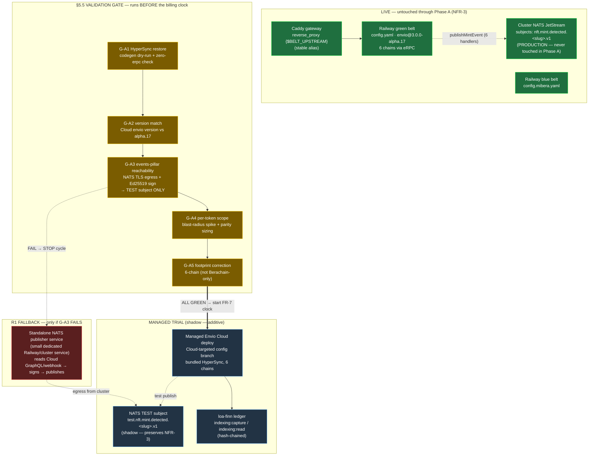
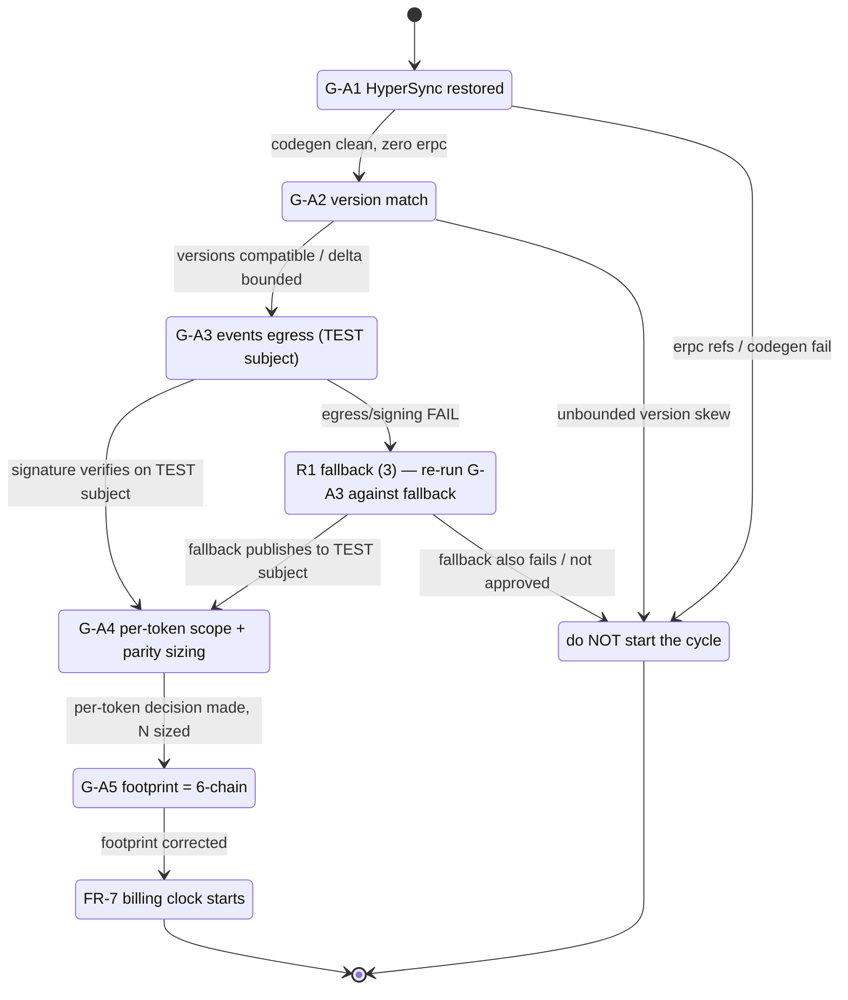
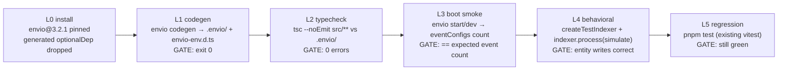
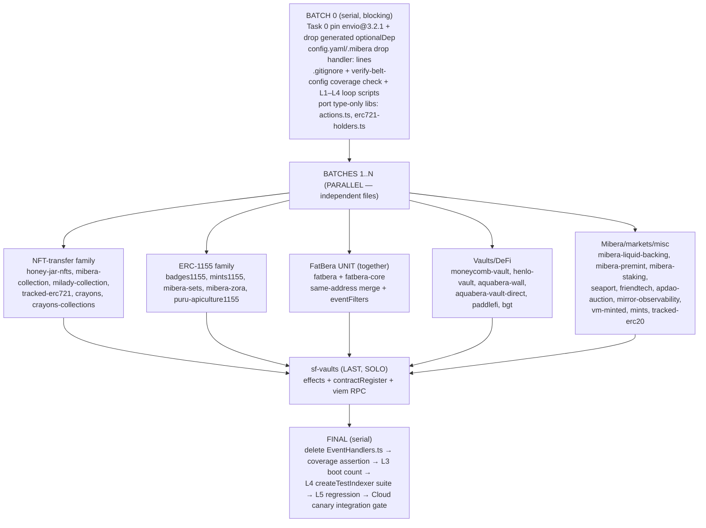
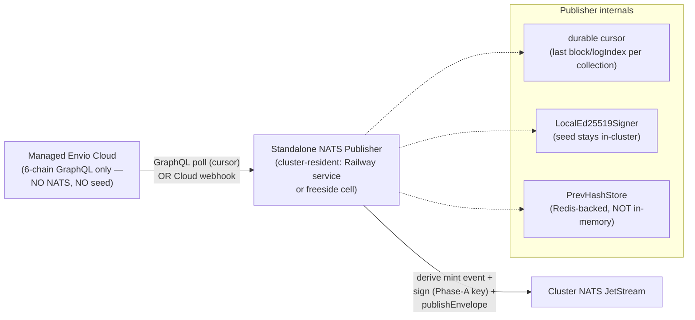

---
hivemind:
  schema_version: "1.0"
  artifact_type: technical-rfc
  product_area: "sonar-api — Layer-1 indexing migration to managed Envio"
  workstream: delivery
  priority: high
  jtbd: {category: functional, description: "design the Phase-A validation gate (G-A1…G-A5) + R1 events-pillar fallback so a 30-day managed-Envio measurement cycle is only paid for once it is provably valid — events egress, version, footprint, parity, and per-token scope all GREEN before the billing clock starts"}
  learning_status: directionally-correct
  source: team-internal
trust_tier: operator-authored
read_state: unread
confidence: 0.6
decay_class: working
last_confirmed: 2026-06-23
operator_signed: self_attested
---

# Software Design Document: sonar-api → Managed Envio (Phase A — Validation Gate + Measured Stand-Up)

**Version:** 1.1 (managed-Envio Phase A + the alpha.17→3.2.1 API port)
**Date:** 2026-06-17
**Author:** Architecture Designer Agent (ARCH · OSTROM, craft lens)
**Status:** Draft
**PRD Reference:** `grimoires/loa/prd.md` (r3 — canary verdict folded in; the "redeploy the existing source" premise is REFUTED, a feature-sized envio alpha.17→3.2.1 port is now required before the managed deploy can run)
**Flatline Reference:** `grimoires/loa/a2a/flatline/prd-review.json` (3-model, 8 high-consensus + 8 blockers)
**Repo HEAD at design time:** `d0a4034b` on `feat/envio-cloud-hypersync` (the canary branch; `git`) — HyperSync restore (G-A1) already landed.

> **v1.1 delta (canary verdict 2026-06-17).** A live Envio Cloud canary (`canary/envio-cloud-hypersync`, deploy `sonar-api-3`) proved the path is *reachable* (connect ✓ version ✓ install/postinstall ✓ codegen ✓ FatBera same-address merge ✓) but the indexer **crash-loops at runtime**: managed Envio Cloud runs **`3.2.1`** and the source is on the deprecated **`3.0.0-alpha.17`** API, so every handler `import … from "generated"` fails. This **resolves G-A2 / OQ-1**: there is no "version match" to confirm — there is a confirmed breaking-API delta to port. The port is the new gate; it is designed in **§2A** below and slots into the development phases as **Phase A.1-PORT** (a hard prerequisite to A.2 backfill). v1.0's §2–§12 (gate, R1 fallback, measurement) are unchanged and still govern; §2A is additive.
**Supersedes:** `sdd.md` r7 "Consolidated Belt + Blue-Green Promotion" (`sonar-belt-factory`) — archived at `grimoires/loa/context/sdd-sonar-belt-factory-r7-SUPERSEDED-2026-06-17.md`. That SDD's premise (self-host Envio belts on Railway, beat managed on cost) was inverted by the loa-finn TCO experiment, exactly as its PRD was. **Carries forward (not redone):** the Caddy stable-alias gateway seam, the eRPC L2 shared substrate, and the per-chain HyperSync-coverage verification discipline.

> **Grounding legend:** `[CODE:file]` = codebase reality I read · `> file:Lnn` = doc quote · `(git:SHA)` = commit evidence · `[ASSUMPTION]` = ungrounded claim flagged.

---

## Table of Contents

1. [Project Architecture](#1-project-architecture)
2. [The §5.5 Validation Gate (G-A1…G-A5) — Design Core](#2-the-55-validation-gate-g-a1g-a5--design-core)
2A. [The alpha.17 → 3.2.1 API Port — the canary's new gating requirement](#2a-the-alpha17--321-api-port--the-canarys-new-gating-requirement)
3. [R1 Fallback Architecture — Standalone NATS Publisher Service](#3-r1-fallback-architecture--standalone-nats-publisher-service)
4. [Software Stack](#4-software-stack)
5. [Data & Schema Considerations](#5-data--schema-considerations)
6. [Measurement & Capture Specifications](#6-measurement--capture-specifications)
7. [Error Handling & Halt Strategy](#7-error-handling--halt-strategy)
8. [Testing & Verification Strategy](#8-testing--verification-strategy)
9. [Development Phases](#9-development-phases)
10. [Known Risks and Mitigation](#10-known-risks-and-mitigation)
11. [Open Questions](#11-open-questions)
12. [Appendix](#12-appendix)

---

## 1. Project Architecture

### 1.1 System Overview

Phase A stands the **existing 6-chain Envio HyperIndex source up on managed Envio Cloud** for one real billing cycle, to produce the single `measured` cost+toil number that ratifies-or-revises the indexing-strategy ADR and closes `bd-buho`. It is **additive and reversible** (NFR-3): live serving (the Railway green/blue belt behind the Caddy stable-alias gateway) is untouched throughout.

The Envio source is **live at HEAD**, not a repo to revert (PRD §1):
> "the Envio source is **live at HEAD** — `Dockerfile.belt` runs `envio@3.0.0-alpha.17` on `config.yaml` (green, 6-chain) / `config.mibera.yaml` (blue)" (prd.md:25)

Grounded against the code: `Dockerfile.belt` selects the config via `BELT_CONFIG` (default `config.mibera.yaml`; green sets `BELT_CONFIG=config.yaml`) and runs `pnpm envio codegen --config "${BELT_CONFIG}"` `[CODE:Dockerfile.belt]`.

**This SDD is not a "build the indexer" design.** The indexer exists. This SDD designs **the validation harness that proves a managed-Envio measurement would be valid before the 30-day billing clock starts** (the §5.5 gate), plus **the fallback architecture (R1)** for the one failure mode that can block the whole direction: the events-pillar being unable to publish from managed Envio Cloud.

### 1.2 Architectural Pattern

**Pattern:** Pre-flight validation gate (sequential, fail-closed) → measured trial → ratification. Composed with an additive shadow-deploy and a contingent fallback service.

**Justification:** The PRD's whole thesis is *measurement integrity* (NFR-2). Flatline's strongest finding (IMP-001, avg 896) is that §5.5 converts §10's implicit mitigations into an **execution-order barrier**:
> "It converts an implicit mitigation into an execution-order gate, directly preventing avoidable spend and invalid measurement sequencing." (prd-review.json IMP-001)

A fail-closed gate is the right pattern because the cost of a false-GREEN (paying for a 30-day cycle that proves the approach invalid) dominates the cost of an extra pre-cycle check. Each gate is **machine-verifiable where possible** (G-A1 codegen dry-run, G-A2 version diff, G-A3 signature verify against a TEST subject) so the GREEN decision is auditable, not asserted.

### 1.3 Component Diagram



### 1.4 System Components

#### G-A* Gate Harness (this SDD's primary deliverable)
- **Purpose:** Prove a managed-Envio measurement is valid before paying for it. Fail-closed: any RED halts before FR-7's clock starts.
- **Responsibilities:** codegen dry-run (G-A1), Cloud version compatibility (G-A2), events egress+signing to a TEST subject (G-A3), per-token decision + parity sizing (G-A4), footprint correction (G-A5).
- **Interfaces:** a Cloud-targeted config branch; `envio codegen`; the cluster NATS over TLS (TEST subject); the loa-finn runbook.
- **Dependencies:** Envio Cloud account (operator-gated), a SEPARATE Phase-A signing key (SKP-002), cluster NATS CA.

#### Cloud-targeted config branch (the only Phase-A code change)
- **Purpose:** Restore HyperSync without disturbing the self-host green (which intentionally routes via `erpc.railway.internal`).
- **Responsibilities:** Provide the 6-chain config that managed Envio Cloud will run with bundled HyperSync (FR-1).
- **Dependencies:** `config.yaml` / `config.mibera.yaml` at HEAD; the de-HyperSync commits to revert (`01d19638` / `cb0c2f4e` / `d7f38fef` `(git)`).

#### R1 Standalone NATS publisher (contingent — §3)
- **Purpose:** The named fallback if managed Envio Cloud cannot reach the private cluster NATS or hold the signing seed (Flatline SKP-001/002, the highest-consensus blocker).
- **Responsibilities:** Consume Cloud indexer state (GraphQL poll or webhook), re-derive mint events, sign with the Phase-A key, publish to NATS.
- **Status:** Designed-but-dormant — instantiated only on G-A3 FAIL.

### 1.5 Data Flow

**Validation-gate flow (pre-cycle):** Cloud-config branch → `envio codegen` dry-run (G-A1) → Cloud version probe (G-A2) → canary Cloud deploy → synthetic mint → signed envelope → **TEST subject** → subscriber verifies signature against the Phase-A `signing_key_id` (G-A3) → per-token spike + parity sample sizing (G-A4) → footprint corrected to 6-chain (G-A5).

**Trial flow (post-GREEN):** Cloud deploy backfills 6 chains to head → GraphQL parity sampled vs live green (FR-4) → toil logged as-it-happens to loa-finn ledger → invoice normalized → `indexing:capture` → `indexing:read` → RATIFY/revise → `bd-buho` closed.

**Live flow (unchanged):** Caddy `{$BELT_UPSTREAM}` → green belt → production NATS subjects. Phase A never repoints `BELT_UPSTREAM` and never publishes to a production subject.

### 1.6 External Integrations

| Service | Purpose | Type | Reference |
|---------|---------|------|-----------|
| Managed Envio Cloud | Host the 6-chain source for the measured cycle; bundles HyperSync | Managed SaaS (HyperIndex) | https://docs.envio.dev/docs/HyperIndex/hosted-service |
| Envio HyperSync | First-class data source per chain (incl. Zora 7777777 — unverified, NFR-4) | HyperSync endpoint | https://docs.envio.dev/docs/HyperSync/overview |
| Cluster NATS JetStream | events-pillar transport (`nft.mint.detected.<slug>.v1`) | NATS over TLS/mTLS | `src/lib/events-publisher.ts` `[CODE]` |
| `@0xhoneyjar/events` | ACVP envelope sign + publish (`publishEnvelope`, `LocalEd25519Signer`, `nftMintDetectedTopic`) | Vendored npm pkg | `scripts/rebuild-events-dist.sh` (cluster-pinned loa-freeside SHA) `[CODE]` |
| loa-finn ledger | hash-chained TCO ledger; `indexing:capture` / `indexing:read` | tsx CLI | `~/Documents/GitHub/loa-finn/package.json:32-33` `[CODE]` |

### 1.7 Deployment Architecture

- **Live (untouched):** Railway — green belt (`config.yaml`), blue belt (`config.mibera.yaml`), eRPC proxy, Caddy gateway. `Dockerfile.belt` build runs a custom postinstall (`rebuild-events-dist.sh`) + `envio codegen`, bypassing Nixpacks (DISS-002) `[CODE:Dockerfile.belt]`.
- **Trial (additive):** Managed Envio Cloud project, deployed from the Cloud-targeted config branch. **Build-environment constraint:** sonar's build is not vanilla `envio codegen` — it materializes `@0xhoneyjar/events` from a cluster-pinned loa-freeside SHA via a git clone in `rebuild-events-dist.sh`, then runs `patch-envio-instrumentation.js`. Whether managed Envio Cloud's build sandbox permits this custom postinstall + external git clone is an **open question (OQ-3)** that G-A2/G-A3 must surface — if Cloud only accepts stock handlers + config, the in-process events-pillar is structurally unavailable on Cloud, forcing R1.
- **Fallback (contingent):** A small dedicated service (Railway or cluster) per §3 — only if G-A3 fails.

### 1.8 Scalability Strategy

Out of scope for a one-cycle measurement. The only scale signal captured is `scale_ceiling` (observed) into the ledger `cost_basis` (per the loa-finn runbook row schema). The trial measures the *existing* footprint; it does not re-architect for scale.

### 1.9 Security Architecture (load-bearing — Flatline escalated this)

**Three distinct key-handling rules, all from Flatline blockers:**

| Rule | Source | Design implication |
|------|--------|-------------------|
| **Rotate `SONAR_SIGNING_SEED_HEX` (`bd-54c`) NOW** — independent of the migration | SKP-001 (CRITICAL, score 950 — highest in the review) | A known-compromised Ed25519 seed signs live NATS events right now; every event between exposure and rotation is forgeable. This is a **live security action gating Phase A**, not a Phase-B footnote. Rotation = new env value in Railway + restart; no consumer repoint. |
| **Managed deploy uses a SEPARATE signing key** | SKP-002 (HIGH, 750) | Adopting managed Envio hands the seed + private NATS CA to a third party. Provision a **distinct Phase-A key**; never give the production seed to Envio's infra. G-A3 verifies signatures against *that* key's `signing_key_id`. |
| **Define the third-party secrets model** before any production publish | SKP-002, R7 | How the Phase-A key + CA reach Cloud (env var? secret store?), scoped lifetime, revocation. Documented as part of G-A3's executor checklist. |

- **TLS posture (already implemented `[CODE:events-publisher.ts:166-187]`):** `NATS_URL` MUST be `tls://`/`nats+tls://`, or `nats://` **with** `NATS_TLS_CA`; plaintext refused. Optional mTLS via `NATS_TLS_CLIENT_CERT`+`NATS_TLS_CLIENT_KEY` (both-or-neither, else permanent-disable). Path-ε convention: all three env vars hold **PEM bodies**, not file paths.
- **TEST-subject isolation (NFR-3, SKP-001):** the Phase-A deploy publishes ONLY to `test.nft.mint.detected.<slug>.v1` (or a `test.` prefix), never the production subjects — see §2 G-A3.

---

## 2. The §5.5 Validation Gate (G-A1…G-A5) — Design Core

> **Invariant (PRD §5.5):** "Only when G-A1…G-A5 are GREEN does FR-7's billing clock start." This SDD makes each gate a concrete, machine-verifiable-where-possible procedure with an explicit pass artifact. The gate is **sequential and fail-closed**: a RED halts; G-A3 RED specifically triggers the R1 fallback (§3).

### 2.0 Gate sequencing



### 2.1 G-A1 — HyperSync restored (FR-1, IMP-008 avg 836.5)

**Check:** `envio codegen` dry-run against the **Cloud-targeted config** branch.

**Pass criterion (machine-verifiable):** clean codegen; **zero `erpc.railway.internal` references**; bundled-HyperSync data source present for all 6 chains.

**Grounded design notes (these are subtle — the naive check is wrong):**

1. **The de-HyperSync is an `rpc:` block, not a missing one.** Every chain in both configs currently has, per chain, an `rpc:` block with two entries (`for: sync` + `for: live`) pointing at `http://erpc.railway.internal:4000/main/evm/<chainId>` `[CODE:config.yaml:555-690, config.mibera.yaml:210-366]`. Restoring HyperSync = **removing the bare `rpc:` block** (HyperSync is Envio's *default* source for HyperSync-supported chains) OR adding an explicit `hypersync_config`, per FR-1.
2. **Schema field is `rpc`, NOT `rpc_config`.** The installed alpha schema rejects `rpc_config`:
   > "Envio v3.0.0-alpha.14's schema field is `rpc` — SDD §4.1 / sprint.md S2-T1 name it `rpc_config`, which does not exist in the installed schema" (`config.mibera.yaml:223-225` `[CODE]`)
   The G-A1 check must assert against the field name the *Cloud* Envio version expects (couples to G-A2).
3. **Base (8453) already uses HyperSync break-glass** (`ENVIO_API_TOKEN`) per `Dockerfile.belt` comment. The "zero erpc" assertion is correct for the Cloud config, but the green's Base path is already HyperSync — don't treat Base as a regression.

**Pass artifact:** the codegen log + a grep-zero on `erpc.railway.internal` over the Cloud config, committed to the gate record.

### 2.2 G-A2 — version match (R6, SKP-003 HIGH 760, IMP-012 disputed-integrate)

> **RESOLVED by the canary (2026-06-17, v1.1).** There is no "version match" left to confirm: Cloud runs **`3.2.1`**, the source is **`3.0.0-alpha.17`**, and the delta is a **breaking-API rewrite**, not a config tweak. G-A2's "bound the delta as an explicit task" criterion is satisfied by **§2A** — the full port design + work breakdown. G-A2 is therefore PASS-by-design once the §2A port lands (AC-PORT-9); the text below is retained for provenance.

**Check:** managed Envio Cloud's `envio` version vs the source's pinned `3.0.0-alpha.17` schema/handler API.

**Pass criterion:** versions compatible, OR the upgrade delta is **identified and bounded as an explicit task** — not discovered mid-cycle.
> "alpha versions have breaking schema/API changes … the parity check in FR-4 would be comparing results from two different engine versions, invalidating the measurement" (prd-review.json SKP-003)

**Design notes:** Cloud may pin a different alpha than the Dockerfile's `corepack prepare pnpm@10.11.0` + `envio@3.0.0-alpha.17` `[CODE:Dockerfile.belt]`. Probe the Cloud version at account-setup time; if it differs, run the G-A1 codegen dry-run **against the Cloud version's schema** and record any field renames (the `rpc`/`rpc_config` class of drift). A bounded delta becomes a one-line task; an unbounded one HALTS (this stops "deploy-and-measure" silently becoming "unplanned migration").

### 2.3 G-A3 — events-pillar reachability (FR-5, R1; the highest-consensus blocker cluster: SKP-001/002, CRITICAL 880)

**Check:** NATS TLS egress + Ed25519 signing **from a managed Cloud deploy** → a **TEST subject**.

**Pass criterion:** reachable + signature verifies against a known Phase-A `signing_key_id`. **FAIL → STOP; trigger R1 (§3); do not start the cycle.**

**Concrete test protocol (FR-5 acceptance, IMP-005 avg 831.5 — auditable):**

| Element | Specification |
|---------|---------------|
| (a) Exact subject set | Enumerate every `test.nft.mint.detected.<slug>.v1` for the slugs the 6 publishing handlers emit. Slugs come from `CollectionSlug` `[CODE:events-publisher.ts:135-142]`: `mibera-shadow`, `mibera-collection`, `mibera-sets`, `mibera-zora`, `mibera-liquid-backing`, `mibera-staking`, `purupuru-apiculture`. Subject derivation: `nftMintDetectedTopic({collectionSlug})` `[CODE:events-publisher.ts:340]`. |
| (b) Signature verify | Verify against a specific **Phase-A** `signing_key_id` (NOT production — SKP-002). `LocalEd25519Signer.fromSeedHex(seedHex, "sonar-api-1")` `[CODE:events-publisher.ts:262]`. |
| (c) Sample size | ≥ N synthetic mint events (N pragmatic — SKP-002 canary: "trigger one synthetic mint, verify the signed NATS event arrives at the subscriber"). |
| (d) **TEST/shadow subject ONLY** | Publish to `test.` prefix; **never production subjects** (NFR-3 / SKP-001: concurrent publish to production from the Cloud canary while green is live = "duplicated, unsequenced, or conflicting events, corrupting production state"). |
| (e) Named executor | A specific human owner runs and signs off the G-A3 record. |

**Why this is a gate, not a trial item:** SKP-002 (CRITICAL): "If the test is done during the 30-day window, you pay for a cycle that may prove the approach invalid." The whole reason §5.5 exists is to move this *before* the clock.

**The deeper risk this gate surfaces (OQ-3, §1.7):** even if NATS egress works, the events-pillar runs *in-process inside the Envio handlers* and depends on the vendored `@0xhoneyjar/events` package being present at runtime — which the Railway build achieves via a custom git-clone postinstall. If managed Envio Cloud's build sandbox does not run `rebuild-events-dist.sh`, the in-process publish path is structurally unavailable on Cloud → R1 is the only way to keep the pillar, **independent of NATS reachability**. G-A3 must test the *actual* in-process path on a real Cloud deploy, not just NATS reachability from an arbitrary host.

### 2.4 G-A4 — per-token scope set (FR-6, R3; SKP-004 HIGH 740, IMP-002 avg 866.5)

**Check:** per-token blast-radius spike (≤ 1 day) + parity-sample sizing.

**Pass criterion:** per-token decision made (re-port to Envio handlers vs measure-without-it); parity sample = pragmatic **N per chain × collection** (not a single wallet — IMP-007).

**Grounded blast-radius (sizes the spike):** the per-token logic in Ponder is a **pure, collection-agnostic helper** at `ponder-runtime/src/handlers/token-projection/shared.ts` `[CODE]`:
- Projects a `token` current-owner entity via **last-write-wins ordered by `(blockNumber, logIndex)`**; an out-of-order event never clobbers a newer owner.
- Burn handling uses each collection's own `isBurnTransfer()` (NOT a hardcoded `to == 0x0`).
- The `token` entity is **re-derivable** from the Transfer log — it's a projection over the `action` ledger, not a source of record.
- Three landed beads carry it: `bd-jyn` (Mibera), `bd-1jg` (TrackedErc721Bera), `bd-d2b` (GeneralMints/MST/GIF) — matching recent commits `f69ee402…1e812628 (git)`.
- **Sole consumer: inventory-api's Stash**, which reads the `token` index by contract address `[CODE:ponder-runtime/src/index.ts:38-40]`.

**Decision-deadline (SKP-004 remediation):** the decision lands at **G-A4, before FR-3 backfill** — not at FR-8. The two options have different cost shapes: re-port = N days of engineering before the clock; measure-without-it = a cost number with an asterisk. **If measure-without-it: FR-8 ratification REQUIRES an operator-signed accepted-gap** — "the ADR shall not ratify a cost for a lesser-featured product without explicit sign-off" (prd.md:79). Because the helper is pure and collection-agnostic, a re-port to the Envio handlers is bounded (port `shared.ts` + wire the 3 collections' Transfer handlers); the spike's job is to confirm that bound.

### 2.5 G-A5 — footprint correct (NFR-1, IMP-003 avg 901 — the highest-scored improvement)

**Check:** loa-finn runbook footprint = **6-chain** (not Berachain-only).

**Pass criterion:** the under-scope is corrected as a precondition.

**Grounded — the runbook IS under-scoped (confirmed):**
> "Scaffold — `pnpx envio init` → choose Contract-import, paste the **93 contract**[s]" / `"cost_basis":"Envio Cloud invoice <date>, tier <name>, footprint = **93 Berachain contracts**"` (`~/Documents/GitHub/loa-finn/src/research/standups/envio-hyperindex.md:20,49` `[CODE]`)

The 6 chains are `1·10·42161·7777777·80094·8453` (prd.md:41). G-A5 corrects the runbook's footprint to all 6 before any cost is recorded, because:
> "If the measurement footprint is wrong, every downstream cost and ratification artifact becomes structurally unreliable." (prd-review.json IMP-003)

**Pass artifact:** the corrected runbook footprint line, committed in loa-finn, referenced from the gate record.

---

## 2A. The alpha.17 → 3.2.1 API Port — the canary's new gating requirement

> **Why this needs an SDD, not just a sprint plan.** The change is *mechanical but wide* (86 `.handler(` registrations across 33 `src/` files `[CODE: grep]`) and the failure mode is *silent*: the entity read/write bodies survive verbatim, so a mis-wired registration produces a clean-looking handler that simply never fires — dropping events/entities with no error. The hard parts are (1) a transform precise enough to apply consistently across 31 handlers, (2) a **local** verify loop that proves correctness without round-tripping the Cloud canary per change, (3) the config/auto-discovery restructure, (4) a guardrail against silent indexing drift, and (5) a parallel-safe batching plan. Each is designed below; §2A.7 is the sprint-plannable work breakdown.

### 2A.0 Grounded API delta (treat as fact — from a fresh `pnpx envio@3.2.1 init` reference + the canary)

| Concern | alpha.17 (current `[CODE]`) | 3.2.1 (target) |
|---|---|---|
| Handler registration | `export const handleX = ContractName.Event.handler(async ({event,context})=>{…})` — named export, factory off a Contract object | `indexer.onEvent({contract:"ContractName", event:"EventName"}, async ({event,context})=>{…})` — **side-effecting, no export, no factory** |
| Codegen module | `generated/` (gitignored alpha.17 leftover; pinned via `optionalDependencies:{"generated":"./generated"}` `[CODE:package.json:46-48]`) | **GONE** → `.envio/types.d.ts` (`declare module "envio"`) + root `envio-env.d.ts` |
| Imports | `import { ContractName, EntityType, type handlerContext } from "generated"` | `import { indexer, type Entity, … } from "envio"` (Contract objects vanish; entity types + context type come from `envio`) |
| Handler discovery | explicit: per-contract `handler: src/EventHandlers.ts` in config + `EventHandlers.ts` re-export aggregation `[CODE:src/EventHandlers.ts]` | **auto-discovered** handler files; `handler:` key obsolete; `EventHandlers.ts` obsolete |
| Test harness | `TestHelpers.MockDb` | `createTestIndexer()` + `indexer.process({chains:{…simulate:[…]}})`, types from `envio` |
| **SURVIVES** | entity read/write — `context.EntityName.get/set/getWhere(…)`, entity-object construction, all pure helpers | identical on the new `EvmOnEventContext` |

**Grounded scope (verified against the tree, not assumed):**
- **31 handler files** in `src/handlers/*.ts`; **33 files** import `from "generated"` (the 31 minus `constants.ts`/`fatbera-core.ts`, plus the two shared libs `src/lib/actions.ts` + `src/lib/erc721-holders.ts`) `[CODE: grep -rl 'from "generated"' src = 33]`.
- **Already 3.2.1-shaped / untouched-by-port:** `src/lib/events-publisher.ts` (no `generated` import — already lazy `[CODE]`), `src/handlers/constants.ts`, `src/handlers/fatbera-core.ts` (pure math, no `generated` import), and the per-subdir `constants.ts`/helpers.
- **The Effects API is already in use** and PERSISTS in 3.2.1: `import { createEffect, S } from "envio"` in `sf-vaults.ts` `[CODE:sf-vaults.ts:22]` (4 uses). The port preserves these verbatim.

> **Grounded correction to the kickoff brief (load-bearing).** The brief states the canary branch "already has envio@3.2.1 declared+locked." On `feat/envio-cloud-hypersync` HEAD (`d0a4034b`) this is **not yet true**: there is **no `envio` entry in `package.json` dependencies, `pnpm-lock.yaml`, or `node_modules/`** `[CODE: grep]`, and `optionalDependencies:{"generated":"./generated"}` is still present `[CODE:package.json:46-48]`. Establishing the `envio@3.2.1` pin + dropping the `generated` optionalDep is therefore **Task 0**, not a precondition. (If `canary/envio-cloud-hypersync` is a *distinct* branch that already carries the pin, Task 0 degrades to a verify.)

### 2A.1 HARD PART 1 — the repeatable per-handler port transform

Apply this three-layer transform to each handler file. The handler **body** (everything inside `async ({event,context}) => { … }`) is copied **verbatim** — only the import sources, the registration wrapper, and (rarely) the options second-arg change.

**Worked example — `honey-jar-nfts.ts` `[CODE:src/handlers/honey-jar-nfts.ts:6-20,473-507]`:**

```ts
// ── BEFORE (alpha.17) ─────────────────────────────────────────────
import { HoneyJar, Honeycomb, Transfer, Mint, Token, Holder, /*…*/ } from "generated";
// … pure helpers (handleTransfer, handleMint, …) UNCHANGED …
export const handleHoneyJarTransfer = HoneyJar.Transfer.handler(
  async ({ event, context }) => { await handleTransfer(event, context); }
);
export const handleHoneyJar2EthTransfer = HoneyJar2Eth.Transfer.handler(
  async ({ event, context }) => { await handleTransfer(event, context, "HoneyJar2"); }
);

// ── AFTER (3.2.1) ─────────────────────────────────────────────────
import { indexer, type Transfer, type Mint, type Token, type Holder, /*…*/ } from "envio";
// (the Contract objects HoneyJar/Honeycomb/HoneyJar2Eth… are DELETED from the import)
// … pure helpers UNCHANGED …
indexer.onEvent({ contract: "HoneyJar", event: "Transfer" },
  async ({ event, context }) => { await handleTransfer(event, context); }
);
indexer.onEvent({ contract: "HoneyJar2Eth", event: "Transfer" },
  async ({ event, context }) => { await handleTransfer(event, context, "HoneyJar2"); }
);
```

**Transform rules (mechanical):**
1. **Import line:** entity types + the context type move `from "generated"` → `from "envio"` (keep them `type`-only where they already are). **Delete the Contract identifiers** (`HoneyJar`, `FatBeraDeposits`, …) — they have no 3.2.1 equivalent. **Add `indexer`** (value import) `from "envio"`. Preserve any existing `createEffect, S` from `"envio"`.
2. **Registration:** `export const handleX = <Contract>.<Event>.handler(cb)` → `indexer.onEvent({contract:"<Contract>", event:"<Event>"}, cb)`. **Drop the `export const handleX =`** — registration is now a side effect. The `{contract,event}` strings MUST exactly match a contract `name` + event name in `config.yaml`.
3. **Options second-arg** (`.handler(cb, { eventFilters })`): map into `indexer.onEvent({contract,event, /* eventFilters? */}, cb)`. **4 uses, all in `fatbera.ts`** `[CODE:fatbera.ts:336-339,431-434,623-626,739-746]` (e.g. `eventFilters: VALIDATORS.map(v=>({pubkey:v.pubkey}))`). **Verify the exact 3.2.1 option key** against `.envio/types.d.ts` in Task 0 (it may be inline on the `onEvent` descriptor or moved to `config.yaml` per-event filters) — this is the one place the transform is not blind.
4. **Body:** unchanged. `context.Transfer.set(...)`, `context.Token.get(...)`, `context.WithdrawalRequest.getWhere({batch_id:{_eq:x}})` `[CODE:fatbera.ts:92]` all survive on `EvmOnEventContext`.

**Multi-event contracts:** one `indexer.onEvent` per (contract,event). `fatbera.ts` registers 7 contract names across ~12 events; emit one `onEvent` call per current `.handler(`.

**FatBera same-address merge (canary ✓):** `FatBeraDeposits` and `FatBeraAccounting` share on-chain address `0xBAE11292a3E693AF73651BDa350d752AE4A391d4` `[CODE:config.yaml:792-799]`, declared as two logical contract names with disjoint event sets. The port keeps **both `contract:` strings** (`onEvent({contract:"FatBeraDeposits", event:"Deposit"})` and `onEvent({contract:"FatBeraAccounting", event:"RewardAdded"|"WithdrawalRequested"|"BatchStarted"|"WithdrawalFulfilled"})`); the coverage check (§2A.4) asserts every such string resolves to a config contract name. **Verify the canary's merge did not collapse one of the names** — if it did, the `onEvent({contract})` string must follow the surviving name.

**Special cases (NOT blind-transformable — design each):**
- **`sf-vaults.ts` (port LAST, solo).** Uses BOTH `.handler()` (multiple events) AND **`.contractRegister(...)` dynamic contract registration** `[CODE:sf-vaults.ts:365,402]` AND the **Effects API** (`createEffect`/`S`) AND a direct viem RPC client `[CODE:sf-vaults.ts:22-40]`. `.contractRegister` has a distinct 3.2.1 form (dynamic-contract registration moved on/under `onEvent` or a dedicated registration call) — map it explicitly against the reference `init` + `.envio/types.d.ts`; do not assume it mirrors `onEvent`.
- **`CrayonsFactory`** (`crayons.ts` → registers child collection contracts) is the other dynamic-registration site — confirm whether it also uses `contractRegister` and port the same way as sf-vaults.

### 2A.2 HARD PART 2 — the LOCAL build + verify loop (THE key design decision)

**Premise (grounded):** the canary proved the **3.2.1 toolchain builds fully locally** (the reference `pnpx envio@3.2.1 init` produced a complete `.envio/` + codegen). The earlier "only partial codegen locally" pain was alpha.17 *belt-scoped* codegen (DISS-002, NOTES.md) — not a 3.2.1 limitation. So we verify the port **entirely locally** and reserve the Cloud canary as the final integration gate only.

**A handler is "correctly ported" iff it passes L1–L4 below and does not regress L5.** Each level is a cheap, repeatable command.



| Level | Command | What it proves | Catches |
|---|---|---|---|
| **L0** | `pnpm i` (after Task 0 pin) | toolchain resolves | missing/duplicate envio; stale `generated` optionalDep |
| **L1** | `envio codegen` (full config) | `.envio/types.d.ts` + `envio-env.d.ts` regenerate from the whole 6-chain config | config/ABI/event-signature errors; the `generated/`→`.envio/` cutover |
| **L2** | `tsc --noEmit` over `src/**` against `.envio/` | every entity type, the `EvmOnEventContext`, and every typed event-field access resolves | **the primary mechanical gate** — stale `from "generated"` imports; renamed entity/context types; `event.srcAddress`/`event.chainId`/`event.logIndex`/`event.transaction.from`·`to`/`event.block.*` field drift `[CODE:honey-jar-nfts.ts:39-59, fatbera.ts:128-136]`; `getWhere`/`get`/`set` signature drift; `eventFilters` option shape; `context.log` shape for the 6 publishers |
| **L3** | `envio start` (or `dev`), read boot log | every handler file is auto-discovered AND every `onEvent` actually registered | the **`eventConfigs=0`/discovery-miss** class (NOTES.md DISS-003: a broken registration boots with "Nothing to fetch … eventConfigs=0"). **Assert `eventConfigs == N`** where N = the (contract×event) count parsed from config (§2A.4). |
| **L4** | `pnpm test` (NEW `*.itest.ts` using `createTestIndexer`) | the ported handler writes the right entities for a synthetic event | the **silent-drift** class L2/L3 can't catch (correct wiring, wrong/duplicated writes) — esp. the `isPreload` hazard below |
| **L5** | `pnpm test` (existing suite) | pure-logic regression baseline holds | math/publisher/gate regressions |

**The highest-risk item L2 cannot see — `isPreload` (18 occurrences, 7 files `[CODE: grep]`).** Handlers gate writes with `if ((context as any).isPreload) return;` `[CODE:honey-jar-nfts.ts:104, fatbera.ts:149,252,298,…]`. Because it is cast to `any`, **tsc will not flag it if `isPreload` no longer exists on the 3.2.1 context.** Two outcomes: (a) if 3.2.1 has no preload phase, the guard is a dead no-op → safe; (b) if 3.2.1 has a preload/loader phase under a *different* name, writes can double-execute. **Mandated verification:** (i) ground the 3.2.1 loader/preload model against `.envio/types.d.ts` + the reference `init` in Task 0; (ii) an L4 `createTestIndexer` assertion that a single simulated Transfer yields exactly one balance increment (not two) for an `isPreload`-using handler (`honey-jar-nfts` or `fatbera`). This is a named acceptance criterion, not a hope.

**L5 grounded reality (good news):** the existing vitest suite is **codegen-INDEPENDENT** — **no test file imports `from "generated"`** `[CODE: grep test/ = 0]`. `events-publisher.test.ts` injects a mock via `__setTestSubstrate` `[CODE]`; `fatbera-core.test.ts`/`promotion-gate.test.ts`/`verify-belt-config.test.ts` test pure logic. So L5 stays green through the entire port and is a stable baseline. **Corollary correction to the brief:** there is **no existing `TestHelpers.MockDb` suite to "port"** — L4 is *net-new* `createTestIndexer` infrastructure, not a 1:1 migration. Scope it as new authoring.

**`events-publisher` context check (explicit brief ask):** `publishMintEvent({log, …})` needs only `context.log.warn` (+ optional `.info`) — its `HandlerLogger` interface `[CODE:events-publisher.ts:146-150]`. The 6 callers pass `log: context.log` `[CODE:mints.ts:99]`. 3.2.1's `EvmOnEventContext` exposing `context.log` is **confirmed by L2 typecheck** of those 6 files (`mibera-sets, puru-apiculture1155, mibera-collection, mibera-zora, vm-minted, mints` `[CODE: grep]`); no publisher code changes expected.

### 2A.3 HARD PART 3 — config + auto-discovery restructure

**`config.yaml` (894 lines) — the change is small and mechanical:**
- **Remove every `handler: src/EventHandlers.ts` line** from the top-level `contracts:` blocks (one per contract; ~50 occurrences `[CODE:config.yaml:15,22,29,… grep]`). 3.2.1 auto-discovers handler files; the per-contract `handler:` key is obsolete.
- **KEEP** everything else: top-level `contracts[].name` + `events[]` + `field_selection` (transaction_fields `hash`, and `from`/`to` for FatBera — required for `event.transaction.from`·`to` `[CODE:fatbera.ts:128-133]`); the `networks[].contracts[]` name→address→start_block mappings; the `hypersync_config` blocks already restored by G-A1 (`d0a4034b`) `[CODE:config.yaml:677-679]`.
- Apply the same edit to `config.mibera.yaml` (blue footprint).

**Handler file location/naming convention:** confirm 3.2.1's auto-discovery glob in Task 0 (alpha.17 autoload used `fs.promises.glob`, Node ≥22 — NOTES.md S2-T4 gotcha #1 `[CODE]`). Keep handlers at `src/handlers/*.ts`; if 3.2.1 defaults to a narrower glob (e.g. `src/*.ts`), either (a) add a config-declared handler path/glob, or (b) leave a thin `src/EventHandlers.ts` whose ONLY job is `import "./handlers/<each>"` for side effects (a loader, not a re-exporter). **Decision rule:** prefer native auto-discovery; fall back to a side-effect loader file only if L3 shows `eventConfigs` < expected.

**Fate of `EventHandlers.ts`:** today it is a pure re-export aggregator (`import {handleX} … ; export {handleX}` `[CODE:src/EventHandlers.ts]`). After the port, handlers are side-effecting and auto-discovered → **delete it** (last step, after L3 confirms discovery). If the side-effect-loader fallback above is needed, `EventHandlers.ts` is repurposed to that (no exports).

**`.gitignore`:** add `.envio/` and `envio-env.d.ts` (today only `generated` is ignored `[CODE:.gitignore:33]`). Drop the `generated` ignore once `generated/` is deleted, or keep it harmlessly.

**`package.json`:** add `envio@3.2.1` (exact pin, no caret — matches the alpha.17 pinning discipline in NOTES.md DISS-003); **remove** `optionalDependencies:{"generated":"./generated"}` `[CODE:package.json:46-48]`; keep the `codegen`/`dev`/`start`/`test` scripts (they already shell to `envio`).

### 2A.4 HARD PART 4 — guardrail against silent indexing drift

A mis-ported registration (wrong `contract:`/`event:` string, a dropped `onEvent`, a non-discovered file, a lost `eventFilters`) fails **silently** — entity logic is intact, the events just never arrive. Four layers, cheapest-first:

1. **Static coverage assertion vs `config.yaml` (NEW — extend `scripts/verify-belt-config.js`).** Parse the config (contract,event) matrix; assert a **bijection** with `indexer.onEvent({contract,event})` call sites in `src/`: every config (contract,event) has exactly one registration, and every registration references a config (contract,event). Baseline: ~84 event registrations (86 `.handler(` − 2 `.contractRegister` `[CODE: grep]`). Run in CI (`.github/workflows/belt-build.yml` already exists `[CODE]`). This is the mechanical net for the typo/drop class.
2. **L3 boot count** (`eventConfigs == N`) — the runtime confirmation of (1).
3. **Behavioral parity vs the live green (reuse, don't rebuild).** The `promotion-gate.js` **expansion-mode** machinery already certifies green≥baseline non-lossy + golden-tx identity samples, with `EXPECTED_CHAINS=[1,10,8453,42161,80094,7777777]` + `GOLDEN_SAMPLES` `[CODE: NOTES.md Decision Log + test/promote.bats]`. After the ported indexer syncs a slice (local) or deploys (Cloud), run it against the live green over GraphQL: per-(entity,chain) counts must be non-lossy and the golden transactions must resolve. This is FR-4 parity doubling as port-correctness — **any drop surfaces as a count delta or a missing golden tx → HALT** (the FR-4 rule).
4. **Events-pillar coverage** — assert the 6 `publishMintEvent` call sites survive (grep count == 6 `[CODE]`) + one L4 test that a simulated MST/VM mint produces a signed envelope on a `test.` subject (ties into G-A3's TEST-subject discipline, §2.3).

### 2A.5 HARD PART 5 — sequencing & parallel batching

**Dependency facts (grounded):** no handler imports another handler; handlers depend only on `src/lib/{actions,erc721-holders}.ts`, `src/handlers/constants.ts`, per-subdir `constants.ts`, and `events-publisher.ts`. The two shared libs are **type-only** consumers of `generated` `[CODE:actions.ts:1, erc721-holders.ts:1-8]`. ⇒ the 31 handler files are **independent leaves** once the libs are ported.



**Constraints that force grouping:** (a) **libs before handlers** (Batch 0 blocks all). (b) **FatBera as one unit** (same-address + `eventFilters` + `fatbera-core` coupling). (c) **`sf-vaults` last/solo** (the only `contractRegister` + Effects handler; its 3.2.1 mapping is the most uncertain — isolate so it can't block the mechanical batches). (d) **`EventHandlers.ts` deleted only at the end** (after L3 confirms auto-discovery). Within a batch, each file is independently L1→L4 verifiable, so batches can be assigned to parallel implementers/agents.

### 2A.6 Acceptance criteria (definition of done for the port)

- **AC-PORT-1:** `envio@3.2.1` pinned in `package.json`; `optionalDependencies.generated` removed; `pnpm i` clean (L0).
- **AC-PORT-2:** `envio codegen` exit 0; `.envio/` + `envio-env.d.ts` present; `generated/` no longer referenced by any `src/` import (`grep -rl 'from "generated"' src = 0`).
- **AC-PORT-3:** `tsc --noEmit` over `src/**` against `.envio/` = 0 errors (L2).
- **AC-PORT-4:** static coverage check passes — bijection between config (contract,event) and `indexer.onEvent` sites (§2A.4.1); CI-wired.
- **AC-PORT-5:** L3 boot shows `eventConfigs == N_expected` (no discovery miss / `eventConfigs=0`).
- **AC-PORT-6:** L4 `createTestIndexer` suite green, including the **`isPreload` single-increment** assertion and the **events-pillar signed-envelope on `test.` subject** assertion.
- **AC-PORT-7:** L5 existing vitest suite still green (no regression).
- **AC-PORT-8:** `EventHandlers.ts` removed (or repurposed to a no-export side-effect loader, only if L3 required it).
- **AC-PORT-9 (integration, final):** ported indexer deployed to the Cloud canary syncs without the `import from "generated"` crash-loop; FR-4 parity (§2A.4.3) non-lossy vs live green on the sample. *This is the only Cloud-round-trip gate.*

### 2A.7 Sprint-plannable work breakdown (→ beads)

| # | Task | Family | Parallel? | Verified by |
|---|---|---|---|---|
| T0 | Pin `envio@3.2.1`; drop `generated` optionalDep; `pnpm i`; **ground the 3.2.1 API against `.envio/types.d.ts`** (onEvent options key, `eventFilters` mapping, `contractRegister` form, loader/`isPreload` model) | tooling | no (blocks all) | AC-PORT-1; a short grounding note committed |
| T1 | `config.yaml` + `config.mibera.yaml`: remove `handler:` lines; `.gitignore` `.envio`/`envio-env.d.ts` | config | no (blocks L1) | `envio codegen` exit 0 (AC-PORT-2) |
| T2 | Port type-only libs `actions.ts` + `erc721-holders.ts` (`generated`→`envio` type imports) | libs | no (blocks handlers) | L2 on the libs |
| T3 | NEW `verify-belt-config` coverage assertion (config↔onEvent bijection) + CI wire | guardrail | yes | AC-PORT-4 |
| T4 | NEW local verify loop scripts (L1/L2/L3 wrappers) + `createTestIndexer` L4 harness scaffold | verify infra | yes | runs in CI |
| T5..T9 | Port handler batches: NFT-transfer · ERC-1155 · Vaults/DeFi · Mibera/markets/misc (split as needed) | handlers | **yes (parallel)** | per-file L1→L4 |
| T10 | Port FatBera unit (`fatbera` + `fatbera-core`) — same-address + `eventFilters` | handlers | yes | L1→L4 + golden FatBera tx |
| T11 | Port `sf-vaults` (effects + `contractRegister` + viem) | handler (solo) | last | L1→L4 + dynamic-registration smoke |
| T12 | Delete `EventHandlers.ts`; full coverage + L3 boot count + L4 + L5 | finalize | no | AC-PORT-4..8 |
| T13 | Cloud-canary integration gate: deploy ported source; confirm no crash-loop; FR-4 parity vs green | integration | no (final) | AC-PORT-9 |

> **Where this sits in the gate.** §2A is the resolution of **G-A2** and a hard prerequisite to **FR-3 backfill / FR-4 parity**: the billing clock (FR-7) cannot start until the ported source runs on Cloud (AC-PORT-9) AND the §5.5 gate is GREEN. It is recorded as **hidden one-time setup-toil** in the loa-finn `cost_basis` note (prd.md r3 §1 "NEW REQUIREMENT").

---

## 3. R1 Fallback Architecture — Standalone NATS Publisher Service

> **Trigger:** G-A3 FAIL — managed Envio Cloud cannot reach the private cluster NATS over TLS, cannot safely hold the signing seed, OR cannot run the in-process publish path (vendored `@0xhoneyjar/events`, OQ-3). Flatline SKP-001 (CRITICAL): the PRD "does not define a concrete fallback architecture, ownership, security model, or timeline." This section closes that — the PRD asks the SDD to "Define the fallback shape" (R1).

### 3.1 Why a separate service (not in-handler)

The Envio in-handler publish (`publishMintEvent`) is fail-soft and best-effort `[CODE:events-publisher.ts:317-374]`, designed for a runtime where the handler can open an outbound NATS connection and hold a seed. If managed Envio Cloud denies private-network egress or third-party secret custody, **moving the publish out of the indexer process** is the only way to keep the events-pillar while still measuring managed Envio for cost+GraphQL parity. This also **shrinks the third-party trust boundary** (SKP-002): Envio Cloud never holds the signing seed; only the cluster-resident publisher does.

### 3.2 Architecture



### 3.3 Design decisions (named owner + security model — SKP-001 closure)

| Concern | Decision | Rationale / grounding |
|---------|----------|----------------------|
| **Deployment target** | Cluster-resident (Railway service or freeside cell) with private-network access to NATS | Keeps the seed + CA inside the trust boundary; Envio Cloud only exposes GraphQL. Directly answers SKP-002. |
| **Source of mint events** | GraphQL poll with a durable per-collection cursor (`(blockNumber, logIndex)`), fallback to Cloud webhook if available | The `token`/mint entities are durable in Cloud Postgres; re-publishing from indexed state is already the documented recovery path `[CODE:events-publisher.ts:328-330]` ("sonar's Envio Postgres has the durable record; the events pillar can be re-published from there"). |
| **Signing** | `LocalEd25519Signer.fromSeedHex` with the **Phase-A** key, seed never leaves the cluster | Same library as in-handler `[CODE:events-publisher.ts:262]`; SKP-002 separate-key rule holds. |
| **prev_hash chain** | **Redis-backed `PrevHashStore`**, NOT `InMemoryPrevHashStore` | The in-handler version resets to GENESIS on restart `[CODE:events-publisher.ts:62-67]` — a dedicated long-lived service must NOT inherit that Sprint-1 limitation, or every restart breaks the hash chain for `chainStore` subscribers. The events README already names the Redis-backed store as the Sprint-2 target. |
| **Reliability semantics** | Adopt the fuller Ponder `nats-publisher.ts` model (outbox + reorg-safe + DLQ) where feasible, NOT the simpler Envio one | PRD §7: "Adopting managed Envio without re-porting the outbox is a **reliability regression** for the pillar even if egress works." `ponder-runtime/src/lib/nats-publisher.ts` has outbox/reorg-safe/DLQ; `src/lib/events-publisher.ts` does not. |
| **Named owner** | Phase-A executor (KRANZ Act-1 coordinator) owns stand-up; the cell maintainer (zerker) owns the running service | SKP-001 requires named ownership. |
| **Test isolation** | In Phase A, publishes to `test.` subjects only (same NFR-3 rule as G-A3) | The fallback is validated against the TEST subject before any production cutover (Phase B). |

### 3.4 Cost implication for ratification (SKP-001 closure)

If R1 is instantiated, **the measured `cost_usd_month` MUST include the fallback service's cost** (the small Railway/cell line item), because the ratified architecture is then "managed Envio Cloud + standalone publisher," not "managed Envio alone." Otherwise the ADR ratifies a cost for an architecture that cannot actually ship the events-pillar. This is recorded in the loa-finn ledger `cost_basis` note.

### 3.5 R1 is dormant by default

If G-A3 passes (in-process publish works on Cloud), R1 is **not built** — it stays a designed contingency. The gate decides; the SDD does not pre-commit the build.

---

## 4. Software Stack

| Category | Technology | Version | Justification |
|----------|------------|---------|---------------|
| Indexer engine (source) | Envio HyperIndex | `3.0.0-alpha.17` (pinned) | Live at HEAD `[CODE:Dockerfile.belt]`. G-A2 verifies Cloud compatibility. |
| Indexer host (trial) | Managed Envio Cloud (Production tier) | Cloud-pinned (G-A2 to confirm) | The thing being measured (FR-2). Bundles HyperSync (PRD §1). |
| Data source | Envio HyperSync (6 chains) | bundled | FR-1 / NFR-4. Zora (7777777) coverage **unverified** — confirm at quote time (R4). |
| Runtime | Node.js | `>= 22` | "Node >=22 required by envio@3.0.0-alpha.17 (handler autoload uses fs.promises.glob)" `[CODE:Dockerfile.belt]`. |
| Package manager | pnpm | `10.11.0` | `corepack prepare pnpm@10.11.0` `[CODE:Dockerfile.belt]`; postinstall disabled by default → `rebuild-events-dist.sh` run explicitly. |
| Events library | `@0xhoneyjar/events` | cluster-pinned loa-freeside SHA | Vendored via `scripts/rebuild-events-dist.sh` `[CODE]`. `publishEnvelope` / `LocalEd25519Signer` / `nftMintDetectedTopic` / `InMemoryPrevHashStore`. |
| NATS client | `nats` (nats.js) | per lockfile | TLS/mTLS posture `[CODE:events-publisher.ts:79,285]`. |
| Gateway (live) | Caddy + `caddy-ratelimit` | per `Dockerfile.gateway` | Stable alias `reverse_proxy {$BELT_UPSTREAM}`; swap via `scripts/promote.sh` (Phase B only) `[CODE:Caddyfile]`. |
| Ledger | loa-finn `indexing-capture.ts` / `indexing-read.ts` (tsx) | repo HEAD | Hash-chained TCO ledger `[CODE:loa-finn/package.json:32-33]`. |
| R1 fallback (contingent) | Node service + Redis-backed `PrevHashStore` | — | §3; built only on G-A3 FAIL. |

**No frontend/UI in scope** — sonar is a GraphQL+events backend; there is no UI deliverable in Phase A. (Template §4 UI Design is intentionally N/A.)

---

## 5. Data & Schema Considerations

This is a measurement migration, not a schema redesign. The relevant data artifacts:

### 5.1 GraphQL footprint (FR-4 parity target)
- **93 entities + `chain_metadata`** (the freshness view, `git:d7fb271d`) are the parity surface across the footprint collections (Mibera / Tarot / Fractures / MST + the HoneyJar set) (prd.md:53,77).
- **Parity rule (IMP-007 remediation):** sample **N per chain × collection**, not a single wallet. 100% match on the sample to proceed; any drift HALTS (FR-4). N is sized at G-A4.

### 5.2 Per-token `token` projection (G-A4 feature-divergence surface)
- Schema: a `token` row keyed `{contract}_{chainId}_{tokenId}` with mutable state `{owner, isBurned, mintedAt, lastTransferTime, lastBlockNumber, lastLogIndex}` `[CODE:token-projection/shared.ts]`.
- **Divergence:** present in Ponder green-v3, **absent in the Envio handlers** (froze 2026-03-17). Standing up Envio measures a *lesser-featured* indexer unless re-ported (PRD §2 sub-problem 3). G-A4 forces the decision with a deadline.

### 5.3 ACVP envelope (events-pillar)
- Subject: `nft.mint.detected.<collectionSlug>.v1` (prod) / `test.nft.mint.detected.<slug>.v1` (Phase-A shadow).
- Payload shape: `MintEventPayload {chain_id, contract, token_id, minter, block_number, transaction_hash, timestamp, encoded_traits?}` `[CODE:events-publisher.ts:117-128]`.
- Envelope carries `emitted_by: "sonar-api"`, an Ed25519 signature, and a `prev_hash` chain (hash-chained — NFR-2's tamper-refusal property at the pillar layer).

### 5.4 loa-finn ledger row (the deliverable record)
- Written via `pnpm indexing:capture add --row '…cost_source:"measured"…'` (FR-8). `cost_basis` = "Envio Cloud invoice `<date>`, tier `<name>`, footprint = **6 chains** (corrected per G-A5)" + overage model + (if R1) the fallback-service line item (§3.4). The ledger refuses to render a quote as `measured` (NFR-2 / R2).

---

## 6. Measurement & Capture Specifications

### 6.1 Cost normalization (FR-7, IMP-006 avg 784)
- Record **calendar-days covered vs invoice billing-period**; exclude one-time setup, credits, and taxes so `cost_usd_month` is **steady-state**, not a pro-rated artifact.
- **Ambiguity to resolve (IMP-011, disputed-integrate):** define precisely what "invoice amount" means — credits, overages, taxes, tiering discounts — and who obtains it, where it lives. The captured number is the normalized steady-state, recorded with tier + overage model noted.

### 6.2 Toil logging (FR-7, NFR-2)
- Log **every intervention as-it-happens** (not post-hoc): setup minutes + `toil_incidents_30d` (count + minutes each). The TCO thesis treats operator attention as a first-class metric (PRD §4).

### 6.3 Freshness (FR-3)
- Record `freshness_lag_s` per chain vs the live green head after backfill.

---

## 7. Error Handling & Halt Strategy

### 7.1 Gate-RED handling (fail-closed)

| Gate RED | Action |
|----------|--------|
| G-A1 (erpc refs / codegen fail) | HALT; fix Cloud config; re-run. Do not deploy. |
| G-A2 (unbounded version skew) | HALT; bound the delta as a task or abandon deploy-and-measure. |
| **G-A3 (egress/signing fail)** | **STOP the cycle; trigger R1 (§3); re-run G-A3 against the fallback.** Never start the clock with a broken pillar. |
| G-A4 (no decision) | HALT; force the per-token decision before FR-3 backfill. |
| G-A5 (footprint wrong) | HALT; correct the runbook to 6-chain first. |

### 7.2 Early-halt criteria during the trial (FR-7, IMP-004 avg 842.5)
- **Cost-overrun threshold:** if accrued spend exceeds a pre-set ceiling, HALT + label the partial cycle interpretable.
- **Incident threshold:** if `toil_incidents_30d` exceeds a pre-set count, HALT + label.
- Thresholds + halt authority are set before the clock starts (prevents undocumented operator decisions; makes partial-cycle outcomes interpretable).

### 7.3 Events-pillar fail-soft (already designed, preserved)
- In-handler publish is best-effort: the Envio entity write happens FIRST; publish failures route to `ctx.log.warn` and never crash a write `[CODE:events-publisher.ts:14-18]`. Dropped publishes emit an audit-trail log line (chain/contract/token_id/tx) for replay-from-Postgres `[CODE:events-publisher.ts:328-337]`. Transient vs permanent failure kinds; closed-connection detection resets the substrate for retry.

### 7.4 Production non-interference (NFR-3, the hard rule)
- Phase A **never** publishes to a production subject, **never** repoints `BELT_UPSTREAM`, **never** retires a Railway service, **never** swaps the alias. Any step that would is Phase B (gated on `bd-buho`).

---

## 8. Testing & Verification Strategy

| Level | What | How |
|-------|------|-----|
| Gate verification (G-A1) | codegen clean + zero-erpc | `envio codegen` dry-run + grep assertion, committed log |
| Gate verification (G-A2) | version compatibility | Cloud version probe + schema-field diff (`rpc` vs `rpc_config` class) |
| Gate verification (G-A3) | events egress + signing | canary Cloud deploy → synthetic mint(s) → subscriber verifies Ed25519 signature against Phase-A `signing_key_id` on a **TEST subject** (≥ N samples, named executor) |
| Gate verification (G-A4) | per-token spike | reuse `token-projection/shared.test.ts` pure-helper tests `[CODE]`; size parity sample N per chain × collection |
| Gate verification (G-A5) | footprint | assert loa-finn runbook line = 6-chain |
| Trial parity (FR-4) | GraphQL footprint | sample N wallets per chain × collection vs live green; 100% on sample or HALT |
| Trial parity (FR-5) | events-pillar | confirmed-working verdict OR documented blocker (→ R1) |
| Ledger integrity (NFR-2) | hash-chain | loa-finn ledger refuses a tampered chain; `indexing:read` validates before render |

**Note:** all parity comparison must run against the **same Envio engine version on both sides** (G-A2) — comparing two alpha versions invalidates the parity claim (SKP-003).

---

## 9. Development Phases

> Mapped to the §5.5 gate order. The billing clock is a hard barrier between Phase A.2 and A.3.

### Phase A.0 — Security pre-action (independent, do NOW)
- [ ] **Rotate `SONAR_SIGNING_SEED_HEX` (`bd-54c`)** — new Railway env value + restart; no consumer repoint (SKP-001, CRITICAL). Gates everything else.
- [ ] Provision a **separate Phase-A signing key** + define the third-party secrets model (SKP-002).

### Phase A.1 — Gate harness (the §5.5 barrier)
- [ ] G-A5 footprint correction in loa-finn runbook (6-chain).
- [ ] Cloud-targeted config branch (FR-1 HyperSync restore).
- [ ] G-A1 codegen dry-run (zero-erpc, clean).
- [ ] Envio Cloud account + Discord 6-chain quote → record `cost_basis` verbatim (FR-2).
- [ ] G-A2 → resolved: see Phase A.1-PORT (the alpha.17→3.2.1 port replaces "version probe").
- [ ] G-A3 canary deploy → TEST-subject publish → signature verify. **FAIL → Phase A.1b.**
- [ ] G-A4 per-token spike (≤1d) + decision (re-port vs accepted-gap) + parity sample sizing.

### Phase A.1-PORT — alpha.17 → 3.2.1 API port (§2A — the NEW hard prerequisite to A.2)
- [ ] T0 pin `envio@3.2.1` + drop `generated` optionalDep + ground the 3.2.1 API against `.envio/types.d.ts` (AC-PORT-1).
- [ ] T1 config `handler:`-line removal + `.gitignore`; T2 port type-only libs; T3 coverage check; T4 local L1–L4 verify loop + `createTestIndexer` harness.
- [ ] T5..T11 port the 31 handlers in parallel batches; FatBera as a unit; `sf-vaults` last/solo.
- [ ] T12 delete `EventHandlers.ts`; full coverage + L3 boot count + L4 + L5 (AC-PORT-2..8).
- [ ] T13 Cloud-canary integration gate — ported source syncs without the `import from "generated"` crash-loop; FR-4 parity vs green (AC-PORT-9). **This unblocks A.2.**

### Phase A.1b — R1 fallback (ONLY if G-A3 fails)
- [ ] Build standalone NATS publisher (§3): cluster-resident, Phase-A key, Redis-backed `PrevHashStore`, outbox/reorg-safe semantics. Re-run G-A3 against it.

### Phase A.2 — Backfill + parity (pre-clock for parity sizing; clock starts at A.3)
- [ ] Deploy 6-chain source to Cloud; backfill to head; record `freshness_lag_s` (FR-3).
- [ ] GraphQL parity sample N per chain × collection (FR-4).

### Phase A.3 — Measured cycle (clock starts ONLY after G-A1…G-A5 GREEN)
- [ ] Run one 30-day cycle; log toil as-it-happens; honor early-halt criteria (FR-7).
- [ ] Normalize invoice → steady-state `cost_usd_month` (IMP-006/011).

### Phase A.4 — Ratify
- [ ] `pnpm indexing:capture add` → `indexing:read` → RATIFY/revise → close `bd-buho` (FR-8).
- [ ] If measure-without-it on per-token: attach the **operator-signed accepted-gap** (FR-6/SKP-004).

### Phase B — OUT OF SCOPE (hard-gated on `bd-buho` ratifying)
Consumer repoint, Railway teardown, alias swap, eRPC decision. Designed-not-built here (PRD §8). **Not started until `bd-buho` closes RATIFY.**

---

## 10. Known Risks and Mitigation

| ID | Risk | Prob | Impact | Mitigation (gate / design) |
|----|------|------|--------|----------------------------|
| R1 | Events-pillar can't run on managed Envio (egress, seed custody, or in-process pkg unavailable) | Med | **Blocks direction** | **G-A3** (TEST subject) before clock; **§3 R1 fallback** named + designed; cost includes fallback (§3.4) |
| R2 | 6-chain Cloud price ≫ recollected ~$70 | Med | Revises (not ratifies) | The point of measuring; ledger refuses quote-as-measured (NFR-2) |
| R3 | Per-token divergence (Envio lacks #69) | High | Apples-to-oranges | **G-A4** deadline; pure helper bounds re-port; accepted-gap if not (FR-6) |
| R4 | Zora (7777777) HyperSync unverified | Med | Blocks full 6-chain | Confirm at quote time (FR-2); RPC fallback for Zora only + note (NFR-4) |
| R6 | Envio version drift (alpha.17 vs Cloud) | Med | Invalidates parity / balloons scope | **G-A2** before deploy; bound delta as task (SKP-003) |
| R7 | Third-party secret exposure (Cloud holds seed + CA) | Med | Trust-boundary expansion | Separate Phase-A key (SKP-002); R1 keeps seed in-cluster |
| SEC | `SONAR_SIGNING_SEED_HEX` compromised, signing live events | **High (live)** | **Forgeable events now** | **Rotate NOW** (Phase A.0); independent of migration (SKP-001 CRIT 950) |
| BUILD | Cloud build sandbox rejects custom postinstall (vendored events pkg) | Unknown | Forces R1 even if NATS reachable | G-A3 tests the real in-process path on Cloud (OQ-3) |

---

## 11. Open Questions

| # | Question | Owner | Status |
|---|----------|-------|--------|
| OQ-1 | Does managed Envio Cloud support `envio@3.0.0-alpha.17`, or pin a different alpha? | Operator (G-A2) | **RESOLVED (canary 2026-06-17): Cloud runs `3.2.1`; breaking-API port required → §2A.** |
| OQ-8 | Exact 3.2.1 `onEvent` option key for `eventFilters`, the `contractRegister` dynamic-registration form, and the loader/`isPreload` model | Implementer (T0) | Open — ground against `.envio/types.d.ts` in Task 0 before the mechanical batches |
| OQ-2 | Is Zora (7777777) first-class on Envio HyperSync? | Operator (quote time) | Open |
| OQ-3 | Does Cloud's build sandbox run `rebuild-events-dist.sh` (custom postinstall + git clone of cluster-pinned loa-freeside)? If not, the in-process pillar is structurally unavailable → R1 regardless of NATS reachability | Operator (G-A3) | Open |
| OQ-4 | Early-halt thresholds: exact cost ceiling + incident count + halt authority | Operator | Open (set before A.3) |
| OQ-5 | Exact "invoice amount" definition — credits/overages/taxes/tier discounts (IMP-011) | Operator (FR-8) | Open |
| OQ-6 | Per-token: re-port to Envio handlers, or measure-with-accepted-gap? | Operator (G-A4) | Open (decide before A.2 backfill) |
| OQ-7 | If R1: deployment target — Railway service vs freeside cell? | Cell maintainer | Open (only on G-A3 FAIL) |

---

## 12. Appendix

### A. Glossary
| Term | Definition |
|------|------------|
| §5.5 gate | The pre-cycle validation barrier (G-A1…G-A5); fail-closed; clock starts only when all GREEN |
| events-pillar | sonar publishing signed mint events to cluster NATS JetStream (cluster-events-pillar-v1 / ACVP) |
| ACVP | Agentic Cryptographically-Verifiable Protocol — Ed25519-signed, hash-chained envelopes |
| HyperSync | Envio's bundled high-speed data source (vs JSON-RPC via eRPC) |
| per-token `token` | current-owner projection entity, last-write-wins; consumed by inventory-api Stash |
| R1 fallback | standalone cluster-resident NATS publisher if Cloud can't run the in-process pillar |
| Stable alias | Caddy `reverse_proxy {$BELT_UPSTREAM}` — the OSTROM seam; consumers read it, backend swappable |
| TEST subject | `test.nft.mint.detected.<slug>.v1` — shadow subject, never production (NFR-3) |
| `bd-buho` | the loa-finn ratification gate this whole PRD closes |

### B. References
- PRD: `grimoires/loa/prd.md` (r2)
- Flatline review: `grimoires/loa/a2a/flatline/prd-review.json`
- ADR: `grimoires/loa/context/2026-06-15-indexing-strategy-reframe-adr.md`
- Verdict: `grimoires/loa/context/2026-06-16-indexing-tco-verdict.md`
- KRANZ Act-1 runbook: `grimoires/loa/context/2026-06-16-phase-a-envio-standup-coordinate.md`
- loa-finn stand-up runbook: `~/Documents/GitHub/loa-finn/src/research/standups/envio-hyperindex.md` (footprint correction target — G-A5)
- Archived predecessor SDD: `grimoires/loa/context/sdd-sonar-belt-factory-r7-SUPERSEDED-2026-06-17.md`
- Envio Cloud docs: https://docs.envio.dev/docs/HyperIndex/hosted-service
- Envio HyperSync: https://docs.envio.dev/docs/HyperSync/overview
- Code: `Dockerfile.belt`, `Caddyfile`, `config.yaml`, `config.mibera.yaml`, `src/lib/events-publisher.ts`, `ponder-runtime/src/handlers/token-projection/shared.ts`, `ponder-runtime/src/lib/nats-publisher.ts`
- De-HyperSync commits: `01d19638`, `cb0c2f4e`, `d7f38fef` (`git`)

### C. Change Log
| Version | Date | Changes | Author |
|---------|------|---------|--------|
| 1.0 | 2026-06-17 | Initial managed-Envio Phase-A SDD — §5.5 gate core + R1 fallback; PRD r2 + Flatline-hardened. Supersedes belt-factory r7 (archived). | Architecture Designer |
| 1.1 | 2026-06-17 | Canary verdict folded in (PRD r3). Added **§2A** — the alpha.17→3.2.1 API port design (5 hard parts: per-handler transform · LOCAL L1–L5 verify loop · config/auto-discovery restructure · silent-drift guardrail · parallel batching) + AC-PORT-1..9 + sprint-plannable work breakdown (T0–T13). Resolved G-A2/OQ-1; inserted Phase A.1-PORT; added OQ-8. Grounded against `feat/envio-cloud-hypersync@d0a4034b`; flagged that `envio@3.2.1` is **not yet pinned** in package.json (Task 0). | Architecture Designer |

---

*Generated by Architecture Designer Agent (ARCH · OSTROM, craft lens)*
