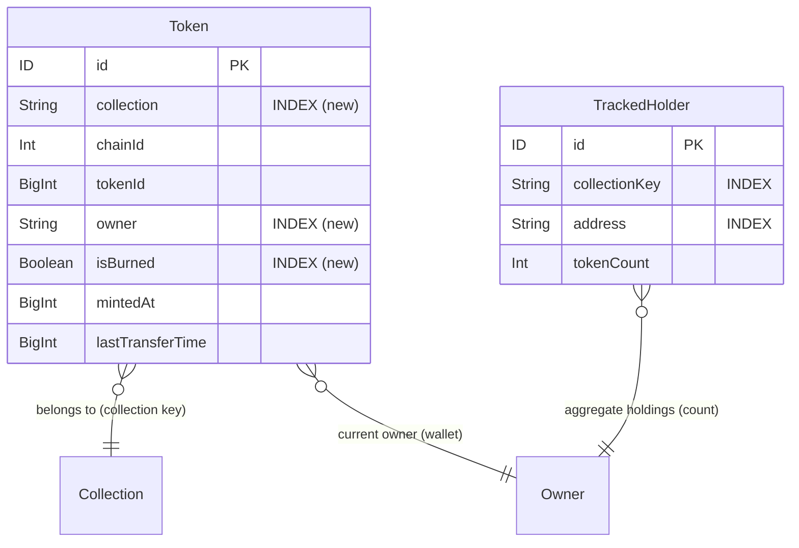

---
hivemind:
  schema_version: "1.0"
  artifact_type: technical-rfc
  product_area: "sonar-api — EVM Collection Onboarding Contract v1 (canonical NftActivity adoption + Token ownership index)"
  workstream: delivery
  priority: high
  learning_status: directionally-correct
  source: team-internal
---

# SDD — EVM Collection Onboarding Contract v1

> **Software Design Document** · **Status**: Draft · **Date**: 2026-07-07 · **Repo**: 0xHoneyJar/sonar-api (thj-envio / freeside-sonar)
> **Phase**: `/architect` output → feeds `/sprint-plan`. **Author**: Architecture Designer Agent.
> **PRD Reference**: `grimoires/loa/prd.md` (EVM Collection Onboarding Contract v1 — traces FR-1..FR-6, §7 risks, §9 OQs).
> **Sibling SDD** (parallel track, NOT superseded): `grimoires/loa/sdd-belt-zero-downtime.md` (EVM belt zero-downtime re-platform).
> **Agent door**: `grimoires/loa/ARRIVAL.md` — load order + closed questions before expanding context.
> **Prior art (authoritative handoff)**: `grimoires/loa/runbooks/canonical-s5-s6-handoff.md` (the S1–S4 merged/inert
> state + S5/S6 procedure); reindex precedent `runbooks/candies-holder-balance-reindex.md` +
> `runbooks/apiculture-green-belt-reindex.md`.
> **Doctrine**: contract-first — *schema-is-not-the-contract* (shape **+** semantics **+** invariants **+** version)
> and *contracts-as-bridges* (a versioned seam with an *executable* parity gate, not prose).

---

## Table of Contents

1. [Project Architecture](#1-project-architecture)
2. [Software Stack](#2-software-stack)
3. [Database Design](#3-database-design)
4. [UI Design](#4-ui-design) (N/A — backend indexer; Read Surfaces & Consumer Planes)
5. [API Specifications](#5-api-specifications) (Contract & API Specifications)
6. [Error Handling Strategy](#6-error-handling-strategy)
7. [Testing Strategy](#7-testing-strategy)
8. [Development Phases](#8-development-phases)
9. [Known Risks and Mitigation](#9-known-risks-and-mitigation)
10. [Open Questions](#10-open-questions)
11. [Appendix](#11-appendix)

---

## 1. Project Architecture

### 1.1 System Overview

v1 is **not a green-field contract design**. Per the PRD: *"It is: adopt the contract that exists (complete its
go-live handshake) and build the one genuine gap (the #153 Token index)"* (prd:80-82). The canonical Effect-Schema
layer (`src/canonical/`) is **built, FAGAN-reviewed, merged, and shipped inert** (`canonical-s5-s6-handoff.md`:
S1–S4 "all FAGAN-approved, all INERT"). The design work is therefore: (a) land one index fresh on main, (b) run
the executable consumer handshake, (c) satisfy the go-live prerequisites and flip the gate, (d) document the
onboarding lookup.

**The central architectural clarity this SDD introduces: onboarding a collection resolves against TWO distinct
contract planes, not one.** The PRD names the canonical `NftActivity` stream as "THE onboarding contract" (G1),
but the blocked consumer inventory-api#27 does **not** read that stream — it reads an *ownership read model*. Keeping
these planes explicit is what makes "onboard collection N+1" a lookup instead of archaeology:

| Plane | Contract surface | Transport | Primary consumer | v1 status |
|-------|------------------|-----------|------------------|-----------|
| **P1 — Ownership read model** | `type Token` (owner→tokenIds) | Hasura GraphQL (pull) | **inventory-api** (#27) | **Build the index (FR-2)** |
| **P2 — Activity event stream** | canonical `NftActivity` (sealed schema) | NATS `nft.activity.recorded.*` (push) | **score-mibera** (#151/#115) | **Adopt via S5/S6 handshake (FR-1/3/4); price the sale across the ramp (FR-6)** |

Both planes are *versioned seams*. P1's owner→tokenIds is a Hasura entity query; P2's activity is a sealed,
`schema_version`-carrying event. A per-collection onboarding descriptor (FR-5) is the third artifact that binds
config → both planes.

**FR-6 is a P2 *value-feeder*, not a new plane.** It makes the P2 `NftActivity.value` field actually non-null for
priced EVM sales across the ~100-collection ramp — the `evm_collection_event` twin of `svm_collection_event.price`.
It does **not** introduce a new contract surface: the sale shape already exists (`verb="sale"` + `value` wei +
`decimals`, §5.1); FR-6 only ensures the raw priced-sale *fact* is produced (Seaport decode) and *reaches* the
mapper (S4 projection) for collections like Azuki whose price is null today. It is a **copy-adapt** of the already-
written `src/handlers/seaport.ts` decode (native + wrapped-native → `amountPaid`), not a design (prd:207-210).

### 1.2 Architectural Pattern

**Pattern:** Event-driven indexer with a dual-plane read contract (pull read model + push event stream), fronted by
a capability-gated emission path.

**Justification:** The estate is already an Envio event-sourced indexer (`envio@3.2.1`) writing to belt Postgres,
exposed via Hasura GraphQL (grounded: sibling `sdd.md`:31-42 current topology). P1 (ownership) is a natural Hasura
read model — an `@index`-backed entity query, matching every indexed peer entity (`Holder`, `TrackedHolder`,
`AddressType` at `schema.graphql:287,294,305`). P2 (activity) is already an event stream under a distinct publisher
identity (`emit.ts`: `emitted_by="sonar-canonical"`, separate hash chain). Choosing anything else would rebuild
what exists. **Boring-technology-when-appropriate** (decision framework #4): no new pattern, no new dependency.

### 1.3 Component Diagram

```mermaid
graph TD
    subgraph Indexer["sonar-api Envio indexer (envio@3.2.1)"]
        H[tracked-erc721.ts handler<br/>Transfer → hold721 + Action overlays]
        TOK[(Token entity<br/>schema.graphql:350<br/>owner/collection/isBurned)]
        H --> TOK
    end

    subgraph Canonical["src/canonical/ (INERT, gate OFF)"]
        ME[map-evm.ts<br/>legs → NftActivity]
        MS[map-svm.ts<br/>CollectionEvent → NftActivity]
        PAR[parity.ts<br/>S5 executable gate]
        EM[emit.ts<br/>makeCanonicalEmitterIfEnabled]
        ME --> EM
        MS --> EM
    end

    PG[(belt Postgres)]
    HAS[belt-hasura<br/>GraphQL]
    NATS[NATS<br/>nft.activity.recorded.*]

    TOK --> PG --> HAS
    EM -. gate OFF until S6 .-> NATS

    HAS -->|P1: getNftsForOwner| INV[inventory-api #27]
    NATS -->|P2: subscribe| SCORE[score-mibera / score-api]
    HAS -->|coverage watermark FR-5b| DASH[freeside-dashboard]

    EV[@0xhoneyjar/events<br/>sealed NftActivitySchema] -.contract.-> ME
    EV -.contract.-> MS
    EV -.contract.-> EM
```

### 1.4 System Components

#### Token ownership read model (P1 — the FR-2 build)
- **Purpose:** Serve enumerable owner→tokenIds per collection for inventory-api#27.
- **Responsibilities:** Maintain one `Token` row per `(collection, chainId, tokenId)` with the current `owner`,
  `isBurned`, `mintedAt`, `lastTransferTime`; provide `@index`-backed filtering on `owner`, `collection`, `isBurned`.
- **Interfaces:** Hasura GraphQL query (`Token(where:{owner, collection, isBurned})`).
- **Dependencies:** Envio handler write path (already emits `Token` transitions), belt Postgres, belt-hasura, a scoped reindex to populate the new indexes.

#### Canonical normalizer + emitter (P2 — the FR-1/3/4 adopt)
- **Purpose:** Produce a chain-agnostic, versioned `NftActivity` stream that answers #151 (verb vocabulary) and #115 (sale value) by construction.
- **Responsibilities:** Pure mapping (`map-evm.ts`/`map-svm.ts`, `Either<NftActivity, SchemaInvalid>`); capability-gated NATS emission under a distinct publisher identity; NEVER-DROP (a mapping failure is an observable `Either.Left`, never a silent drop).
- **Interfaces:** NATS subject `nft.activity.recorded.<collection_key>.v1`; the S5 parity gate as a pure function.
- **Dependencies:** `@0xhoneyjar/events` sealed `NftActivitySchema` (upstream package — a contract change is a coordinated package bump, prd:230); the S4 Hasura adapter that projects native entities into mapper input shapes.

#### S5 parity gate (`parity.ts` — the FR-3 handshake, already runnable)
- **Purpose:** Turn "does canonical lose nothing the consumer relies on?" into a test, not a checklist.
- **Responsibilities:** Compare canonical vs legacy key-sets by `(tx, asset_ref, verb)`; report `legacyOnly` (parity failures), `canonicalOnly` (over-emits), and `verbDisagreements` (misclassifications). **Presence parity only** (`valueParityChecked: false`) — value parity is a separate step (FR-3b).
- **Interfaces:** `parityReport(canonical, legacy)`; CLI `scripts/s5-parity-dryrun.ts` (exit 0/1/2).

#### Seaport priced-sale decode (FR-6 — the P2 `value` feeder)
- **Purpose:** Produce a classified, *priced* `MintActivity` SALE/PURCHASE row for every indexed EVM collection so
  `map-evm.ts` surfaces a non-null canonical `value` — closing the "Azuki 107k transfers, 0 priced sales" gap
  (prd:198-205).
- **Responsibilities:** On `Seaport.OrderFulfilled`, decode the offer/consideration split (listing vs accepted-bid —
  already written, `seaport.ts:94-139`), sum **native + wrapped-native** into `amountPaid` (`seaport.ts:103-114`),
  write a `MintActivity` SALE (seller) + PURCHASE (buyer) row carrying `chainId` + the real 0x `contract`
  (`seaport.ts:151-186`). Extend coverage to **mainnet (chain 1) + mainnet WETH**, wiring Azuki.
- **Interfaces:** the shared `TRACKED_COLLECTIONS` map in `seaport.ts` (the task's "SEAPORT_CONFIG" — no symbol of
  that name exists; `TRACKED_COLLECTIONS` is the real identifier, `seaport.ts:37`), keyed by lowercased collection
  address → `{chainId, wrappedNativeToken}`; the Envio `Seaport` contract binding per chain in `config.yaml`.
- **Dependencies:** a chain-1 `Seaport` contract binding in `config.yaml` (absent today — chain 1 has Azuki as
  `TrackedErc721` at `config.yaml:596` but no Seaport node); `config.mibera.yaml` parity + `BELT_CONTRACTS` gate
  (sprint-bug-172); the S4 projection carrying `chainId` (§1.5, OQ-5). **Scope: ETH/WETH-only v1** (~71% coverage —
  null/skip aggregator sweeps + non-ETH ERC-20, FR-6c/N5).

#### Per-collection onboarding descriptor + coverage watermark (FR-5 — the doc/read surface)
- **Purpose:** The single lookup that replaces per-collection archaeology (covers #120, #95, #121, #135).
- **Responsibilities:** Define config shape + a checklist that would have caught #120; serve a coverage watermark consumers query for "collection X backfilled to block N?"; document the ~100-collection capacity envelope.

### 1.5 Data Flow

**P1 (pull, ownership):** `Transfer` event → `tracked-erc721.ts` writes the `Token` transition (owner reassignment /
`isBurned` on a burn) → belt Postgres → belt-hasura → `getNftsForOwner(owner, collection)` filters on the new
indexes → non-empty `nfts[]` (FR-2c acceptance = inventory-api#27).

**P2 (push, activity):** native entities (`MiberaTransfer`, `MintActivity` SALE/PURCHASE, `NftBurn`) → S4 Hasura
adapter normalizes into mapper input shapes → `map-evm.ts`/`map-svm.ts` → `Either<NftActivity, SchemaInvalid>` →
(post-S6) `makeCanonicalEmitterIfEnabled` → NATS `nft.activity.recorded.<collection_key>.v1` → score-mibera dedups
by `(tx, asset_ref, verb)`.

**Sale derivation (P2, grounded, validated):** per the handoff runbook, the EVM sale resolution is **data-derived**:
`MintActivity` emits a `SALE` row (`user`=seller) and a `PURCHASE` row (`user`=buyer) for the same `(tx, tokenId)`,
both carrying `amountPaid` and the real 0x `contract`. The S4/S6 adapter MUST join **`MintActivity × MiberaTransfer`**
(mibera-specific), NOT the generic `Transfer` table (which shares zero `(tx,tokenId)` with mibera sales → 100% silent
join-miss, FAGAN MINOR-1). Validated: 1,984/1,984 complete sales → valid `verb=sale`, 0 join-misses
(`canonical-s5-s6-handoff.md`).

**Priced-sale ingress for the ramp (P2, FR-6 — how Azuki price becomes canonical `value`):** the `Seaport.OrderFulfilled`
handler (`seaport.ts`) is the *producer* of the `MintActivity` SALE row for any collection in `TRACKED_COLLECTIONS`.
Once Azuki (chain 1) is wired (FR-6a/b), a mainnet OpenSea sale writes a priced `MintActivity{activityType:SALE,
chainId:1, contract:0xed5af…, amountPaid}` row. The S4 adapter projects that SALE row into an `EvmSaleRow`
(`priceWei`), which `mapEvmLegs` matches to the carrier transfer leg → `verb=sale` with `value=amountPaid` +
`decimals=18` (`map-evm.ts:152-158`). So the chain from raw OpenSea event → canonical `value` is:
`OrderFulfilled → MintActivity SALE (chainId-tagged) → S4 EvmSaleRow → map-evm carrier match → NftActivity.value`.

**S4 adapter is contract-scoped, not chain-hardcoded (resolves the FR-6 open question, OQ-5).** `map-evm.ts` is pure
and per-collection — `EvmCollectionContext` carries `{collectionKey, chainId, contract}` (`map-evm.ts:85-93`) — so it
prices whatever `(legs, sales)` the S4 adapter feeds it. The S4 SALE-row projection is keyed by the collection's
**contract address** (from the FR-5 onboarding descriptor), so Azuki's chain-1 SALE rows are picked up **for free**
once the handler produces them and Azuki is onboarded with `{chainId:1, contract:0xed5af…}`. **No mainnet-specific
SALE-row wiring is added *inside* S4** — the prerequisite is upstream (the handler + config binding, FR-6a/b).
**Load-bearing caveat:** the `MintActivity.id` (`${txHash}_${tokenId}_${seller}_SALE`, `seaport.ts:151`) does **not**
encode chainId, and the Base Seaport binding was explicitly DEFERRED "until downstream repos add chainId filters"
(`config.yaml:685-689`). Extending Seaport to chain 1 re-triggers that exact condition, so the S4 projection **MUST**
select/disambiguate `MintActivity` rows by the `chainId` column (present at `seaport.ts:165`) and carry it into
`metadata.chain_id` — the chainId-filter work is the un-block gate, not optional (R-9).

### 1.6 External Integrations

| Service | Purpose | API Type | Notes |
|---------|---------|----------|-------|
| belt-hasura | P1 ownership read model + coverage watermark | GraphQL | STABLE consumer alias (belt zero-downtime SDD §7.4) |
| NATS | P2 activity event transport | Pub/Sub | subject `nft.activity.recorded.<collection_key>.v1` |
| `@0xhoneyjar/events` | Sealed `NftActivitySchema`, emitter, signer, prev-hash chain | npm package | contract change = coordinated package bump (loa-freeside) |
| inventory-api | P1 consumer (#27) | GraphQL client | acceptance target for FR-2 |
| score-mibera / score-api | P2 consumer (first migration) | NATS subscriber | S5/S6 handshake counterparty |

### 1.7 Deployment Architecture

Both planes deploy into the **existing belt topology** — no new services (PRD N3: no durable prev-hash store as new
infra unless S6 selects it). P1 is a schema change + scoped reindex against belt Postgres/Hasura, coordinated with
the belt zero-downtime cutover mechanics (green-build → reindex from genesis → auto-track at cutover, per the
reindex runbooks). P2 flips a capability gate (`SONAR_CANONICAL_EMIT_ENABLED`) at the composition root after S5/S6.

### 1.8 Scalability Strategy

- **Driver:** score-api ramp to **~100 collections** (#121/#135). At that cardinality per-collection archaeology
  does not survive (prd:56-58).
- **P1 horizontal:** `@index` on `owner`/`collection`/`isBurned` keeps `getNftsForOwner` a bounded index scan per
  collection rather than a table scan. **OQ-2:** whether `@index` alone enumerates at scale, or a derived
  owner→tokenIds projection entity is needed, is decided by the FR-5c capacity spike (§10). Design default:
  `@index`-only (mirrors indexed peers); projection is a v2 lever pulled only if query headroom fails.
- **P2:** subject is partitioned per `collection_key` (`nft.activity.recorded.<collection_key>.v1`), so per-collection
  fan-out is a natural NATS subject shard.
- **Capacity envelope (FR-5c):** a documented answer (per-collection cost, indexer/query headroom) — committed as a
  deliverable, not to specific numbers (prd:194-196; BOEHM-shaped spike).

### 1.9 Security Architecture

- **Distinct publisher identity (F1, hard invariant):** canonical emits under `emitted_by="sonar-canonical"`,
  `signing_key_id="sonar-canonical-1"` → a **separate hash chain** from the sonar-api publisher. NEVER reuse the
  sonar-api signer/identity (a shared chain interleaves two producers and forks — `emit.ts`:6-13).
- **Distinct signing seed (S6):** seed from `SONAR_CANONICAL_SIGNING_SEED_HEX`; NEVER reuse `SONAR_SIGNING_SEED_HEX`.
  The `keyId` guard in `makeCanonicalEmitter` is label-only — it cannot detect wrong key *material* under the right
  id; the consumer's signature verifier is the loud backstop (`emit.ts`:36-38).
- **Capability gating:** the live emitter is constructable ONLY via `makeCanonicalEmitterIfEnabled` (null when the
  gate is off) — the live path is *unconstructable* while disabled (`emit.ts`:115-126). F7 is a capability, not a
  convention a caller can forget.
- **Zone:** schema + mapper code is App zone (`src/`, `schema.graphql`) → confirm writes; runbook/docs are State zone.

---

## 2. Software Stack

**Constraint (PRD §6):** *"no new validation dependency"* — `src/canonical/` is the reference idiom; new contract
code follows it. All versions below are **already in the estate** (`package.json`).

### 2.1 Language & Runtime

| Category | Technology | Version | Justification |
|----------|------------|---------|---------------|
| Language | TypeScript | `^5.7.3` | Estate standard (`package.json:36`) |
| Indexer framework | Envio | `3.2.1` | The event-sourced indexer already running (`package.json:49`); `@index` + reindex are its native primitives |
| Schema / validation | `@effect/schema` | `^0.75.0` | Sealed `NftActivitySchema` decode path; `src/canonical/` idiom (`package.json:42`) |
| Effect runtime | `effect` | `^3.10.0` | `Either`, `Data.TaggedError` ADT — confined to `src/canonical/` (`package.json:48`) |
| Contract package | `@0xhoneyjar/events` | (estate-pinned) | Upstream sealed `NftActivitySchema`, emitter, signer, prev-hash chain (`package.json:61`) |

**Key libraries (already in use):**
- `@effect/schema` `Schema as S`, `TreeFormatter` — decode + typed parse-error formatting (`map-evm.ts:53`).
- `effect` `Either` (never-drop channel), `Data.TaggedError` (the `CanonicalError` ADT, `errors.ts`).

### 2.2 Data / Transport

| Category | Technology | Purpose |
|----------|------------|---------|
| Read model DB | belt Postgres | P1 `Token` entity storage |
| GraphQL gateway | belt-hasura | P1 ownership query + FR-5b coverage watermark; STABLE alias |
| Event transport | NATS | P2 `nft.activity.recorded.*` |
| Prev-hash store | `InMemoryPrevHashStore` (Redis NOT in estate) | Per-process chain tip; restart re-genesis caveat (S6 prereq #1) |

### 2.3 Testing / DevOps

| Category | Technology | Version | Purpose |
|----------|------------|---------|---------|
| Test runner | Vitest | `^3.2.4` | Unit (mappers), parity, contract tests (`package.json:37`) |
| S5 dry-run CLI | `scripts/s5-parity-dryrun.ts` (tsx) | — | The executable go/no-go gate |
| Contract CI guard | `verify:action-contract` | — | Hard-fails on `action` projection drift post-go-live |

---

## 3. Database Design

### 3.1 Database Technology

**Primary store:** belt Postgres (managed by Envio + belt-hasura). **The P1 change is an Envio `schema.graphql`
entity-index change**, not a hand-written DDL — Envio owns codegen and table creation. The DDL below is the
*effective* shape for review.

### 3.2 Schema Design — the FR-2 change

**Current** (`schema.graphql:350`, the gap — NO `@index`):

```graphql
type Token {
  id: ID!
  collection: String!
  chainId: Int!
  tokenId: BigInt!
  owner: String!
  isBurned: Boolean!
  mintedAt: BigInt!
  lastTransferTime: BigInt!
}
```

**Target** (FR-2a — add `@index` on the three fields inventory-api#27 filters on, matching the indexed peers at
`schema.graphql:287,294,305`):

```graphql
type Token {
  id: ID!
  collection: String! @index
  chainId: Int!
  tokenId: BigInt!
  owner: String! @index
  isBurned: Boolean! @index
  mintedAt: BigInt!
  lastTransferTime: BigInt!
}
```

**Effective Postgres shape** (what Envio codegen produces for review — names illustrative):

```sql
-- Envio-managed table (do not hand-write; shown for review of the index intent)
CREATE INDEX idx_token_owner      ON "Token" (owner);
CREATE INDEX idx_token_collection ON "Token" (collection);
CREATE INDEX idx_token_isburned   ON "Token" (is_burned);
-- inventory-api#27's query filters (owner AND collection [AND isBurned=false]) → index scan, not table scan.
```

> **OQ-2 (§10):** if a composite `(collection, owner)` index or a derived `OwnerTokens` projection entity is required
> for enumerability at ~100-collection scale, that is decided by the FR-5c spike. v1 default: the three single-field
> `@index` declarations above (the peer-entity pattern).

### 3.3 Entity Relationships



**Reconciliation invariant (FR-2c):** `holdings.tokenCount` (aggregate, from `TrackedHolder`) MUST equal
`len(getNftsForOwner(owner, collection).nfts[])` (enumerable, from the indexed `Token`). Today the aggregate is
correct while the enumerable list is empty (prd:47-49) — this invariant is the acceptance test.

### 3.4 Migration Strategy — the reindex runbook (FR-2b)

**Grounded in the reindex precedent** (`candies-holder-balance-reindex.md`, `apiculture-green-belt-reindex.md`):

1. **Fresh on main (FR-2 mandate, R-1 mitigation):** re-implement the index change fresh — do NOT cherry-pick the
   diverged belt-factory branch (avoids reintroducing stale reconcile assumptions, prd:242).
2. **Additive → from-genesis reindex → auto-track at cutover** (the proven shape). A from-genesis reindex
   `DROP ... CASCADE`s the schema — which **drops the `Token` table**; the reindex recreates it populated + indexed.
3. **Scoped, not a full 6-chain re-backfill** (N4): coordinate the reindex window with the belt zero-downtime cutover
   mechanics (STABLE Caddy alias → live traffic never points at the surface being rebuilt; sibling SDD §7.4).
4. **Operator-led — do NOT run a live reindex from an agent session** (hard rule, `candies` runbook:24). The runbook
   is committed as an artifact; execution is operator-gated on a chosen window.

**Verification queries** (the reindex is correct iff these hold — mirror the candies runbook pattern):
`Token` row count > 0 for the target collection; `getNftsForOwner(Mibera owner)` non-empty; reconciliation invariant
(§3.3) holds.

### 3.5 Data Access Patterns

| Query | Plane | Frequency | Optimization |
|-------|-------|-----------|--------------|
| `getNftsForOwner(owner, collection)` | P1 | High (per inventory read) | `@index` on `owner` + `collection` |
| Coverage watermark "collection X → block N?" | FR-5b | Med (consumer readiness polls) | single read model row per (collection, chain) |
| `(tx, asset_ref, verb)` dedup on subscribe | P2 | High (per activity) | consumer-side dedup key (handled by score-mibera) |

### 3.6 Coverage watermark read model (FR-5b — OQ-1)

`schema.graphql` today has **no** `sync_status` / watermark entity, and the belt SDD carries only per-chain coverage
*probes*, not a formal watermark surface (grounded: grep found none in `schema.graphql`; belt `sdd.md`:148,228). So
there is currently **zero** watermark contract, not two. **Design recommendation (to resolve OQ-1):** define **ONE**
coverage watermark read model keyed by `(collectionKey, chainId) → lastIndexedBlock`, co-owned with the belt PRD, so
consumers query a single surface. Do NOT introduce a second onboarding-specific watermark. **[VERIFY with belt-PRD
owner before SDD is Approved — prd OQ-1.]**

---

## 4. UI Design

> **Read Surfaces & Consumer Planes.** UI Design is **N/A** for this system.

**There is no UI in this system.** sonar-api is a backend indexer + contract layer; the "interface" is the two
consumer planes (§1.1) and their query/subscription contracts. The only human-facing surface is
freeside-dashboard's read of the coverage watermark (FR-5b), which consumes the same GraphQL read model as any other
client — no bespoke UI is designed here. This section documents the **consumer-facing contracts** in lieu of pages.

### 4.1 P1 consumer contract — inventory-api (#27)

```graphql
# getNftsForOwner — the FR-2c acceptance query
query {
  Token(where: { owner: { _eq: $owner }, collection: { _eq: $collection }, isBurned: { _eq: false } }) {
    tokenId
    chainId
    mintedAt
    lastTransferTime
  }
}
# ACCEPTANCE: returns the correct non-empty token list; len == holdings.tokenCount.
```

### 4.2 P2 consumer contract — score-mibera

- **Subscribe:** `nft.activity.recorded.<collection_key>.v1`.
- **Dedup identity:** `(tx, asset_ref, verb)` (the §4 consumer dedup, `parity.ts:36-41`).
- **Cutover during deprecation overlap:** subscribe `nft.activity.recorded.*` + unsubscribe `nft.mint.detected`
  atomically; dedup by the key above during the ≥30d overlap (`canonical-s5-s6-handoff.md` S6 step 5).

### 4.3 Onboarding operational contract — the "one lookup" (FR-5)

The single doc an operator uses to onboard collection N+1 (replaces per-collection reverse-engineering):

| Field | Meaning | Catches |
|-------|---------|---------|
| `chain` / `chainId` | e.g. Berachain 80094 | #95 (main Mibera 0x6666 on Berachain) |
| `address(es)` | collection contract 0x (lowercased into metadata) | #120 (Azuki 0 holders post-config) |
| `mode` | tracked-vs-holder | config-class mistakes |
| `standard` | 721 / 1155 | N2 boundary (no cNFT/compressed) |
| `collection_key` | topic-segment slug `/^[a-z][a-z0-9-]*$/` (slugify the name) | mapper rejects non-slug (adapter must slugify — runbook finding) |
| verb vocabulary | `mint`/`burn`/`sale`/`transfer` (by construction) | #151 (no per-collection excavation) |
| sale `value`/`decimals` | wei decimal string + `decimals:18` (versioned) | #115 |

---

## 5. API Specifications

> **Contract & API Specifications** — the versioned contract surfaces (P1 GraphQL, P2 NATS, S5 gate, S6 prereqs).

### 5.1 The canonical `NftActivity` contract (P2 — FR-1)

The sealed Effect-Schema `NftActivity` (from `@0xhoneyjar/events`) IS the onboarding contract. Fields the mappers
populate (grounded in `map-evm.ts:165-184`):

| Field | Type | Semantics |
|-------|------|-----------|
| `verb` | `"mint" \| "burn" \| "sale" \| "transfer"` | The #151 vocabulary, *typed* — mint = Transfer from zero, burn = to zero, sale = carrier leg matched to a marketplace SALE, transfer = any other leg |
| `chain` | `"evm" \| "svm"` | chain-agnostic target |
| `collection_key` | slug | topic-segment; drives the NATS subject |
| `asset_ref` | string | tokenId |
| `from` / `to` | string \| null | resolved owner-level parties (sale = resolved seller/buyer, not raw routed legs) |
| `value` / `decimals` | string \| null | #115 sale price — wei DECIMAL STRING (uint256 > 2^53, never a float) + `decimals:18` |
| `tx` | string | tx hash |
| `timestamp` | ISO-8601 | (EVM: epoch/range validation owned by S4 adapter — MINOR-4) |
| `metadata` | object | `{chain, chain_id, contract, token_id, log_index, block_number}` — pins the raw leg for F9 re-derivability |

**Versioning (FR-1a):** every activity carries `schema_version`; a sale-derivation heuristic change re-runs the join
under a NEW version (runbook), never an in-place mutation. The derivation is re-derivable from
`(tx, log_index, token_id)` (`map-evm.ts:32-35`).

**Producer identity (FR-1b):** `emitted_by="sonar-canonical"`, separate hash chain (`emit.ts`:56-58).

### 5.2 NATS subject grammar

```
nft.activity.recorded.<collection_key>.v1
# built from the payload's own collection_key (always a sendable specifier — the charset IS the topic grammar).
# emit.ts:99-104
```

### 5.3 The S5 parity gate contract (FR-3)

```
parityReport(canonical: NftActivity[], legacy: ParityKey[]) -> ParityReport
```

| Field | Go/no-go meaning |
|-------|------------------|
| `parityHolds` | **HARD GATE** — true iff `legacyOnly` is empty (canonical loses nothing the consumer relies on) |
| `legacyOnly` / `legacyOnlyByVerb` | parity FAILURES — data the consumer relies on that canonical lost |
| `verbDisagreements` | **read FIRST** — a `(tx,asset_ref)` classified differently each side (e.g. a demoted sale); a real loss, named so it can't hide among tolerable over-emits (MAJOR-1) |
| `canonicalOnly` / `canonicalOnlyByVerb` | producer EXTRAS — the known MAJOR-3 market-routing-hop `verb=transfer`; do NOT fail parity; DECIDE tolerate/suppress with real topology (FR-3c) |
| `valueParityChecked: false` | **presence parity ONLY** — re-derived sale `from`/`to`/`value` is a SEPARATE pass (FR-3b) |
| `matched` / `canonicalCount` / `legacyCount` | guard a vacuous GREEN — a trustworthy GREEN needs `matched > 0` + complete inputs |

CLI: `npx tsx scripts/s5-parity-dryrun.ts canonical.json legacy.json` — exit 0 = parity holds (real overlap) · 1 = FAILED or vacuous · 2 = usage/IO.

### 5.4 S6 go-live prerequisites (FR-4 — land at the composition root BEFORE flipping the gate)

1. **FR-4a** — Durable prev-hash store **OR** a consumer-side chain-reset handshake (InMemory store re-genesis-es the
   chain on restart → a verifying consumer sees `prev-hash-broken` every restart; the canonical chain's value IS
   verifiability). **N3:** v1 does NOT build durable infra — S6 checklist SELECTS in-memory + consumer chain-reset
   handshake unless the consumer requires durability.
2. **FR-4b** — Build the live emitter ONLY via `makeCanonicalEmitterIfEnabled` (null when off).
3. **FR-4c** — Distinct seed `SONAR_CANONICAL_SIGNING_SEED_HEX`.
4. **FR-4d** — `recovery` config (maxRetries + deadLetter + onAlert) → a NATS blip is an observable dead-letter, not a silent `Left`.

### 5.5 Uniform priced EVM sale decode (FR-6 — mainnet Seaport → priced `MintActivity`)

FR-6 has **no new contract surface** — the canonical sale shape (`verb="sale"` + `value` wei + `decimals`) is FR-1's
already-sealed field set (§5.1). What changes is two config/handler edits (App zone) plus the belt-parity gates. This
is a **copy-adapt** of the existing decode, which already sums native + wrapped-native (`seaport.ts:103-114`).

**FR-6a — extend `TRACKED_COLLECTIONS` to mainnet, and add the chain-1 Seaport binding.**

`src/handlers/seaport.ts` `TRACKED_COLLECTIONS` (the task's "SEAPORT_CONFIG"; today 80094 Mibera + three 8453 Base
entries, `seaport.ts:37-56`) gains the mainnet WETH + Azuki entry:

```ts
// Ethereum mainnet — Azuki (chain 1), mainnet WETH
"0xed5af388653567af2f388e6224dcc93746104133": {
  chainId: 1,
  wrappedNativeToken: "0xc02aaa39b223fe8d0a0e5c4f27ead9083c756cc2", // mainnet WETH (LOWERCASED — map is keyed/compared lowercase)
},
```

> **Grounding note (lowercasing):** `TRACKED_COLLECTIONS` lookups compare `.toLowerCase()` (`seaport.ts:84,110,123`).
> The PRD gives WETH checksummed (`0xC02aaA39…`, prd:210); it MUST be stored lowercased or the `wrappedNativeToken`
> equality at `seaport.ts:110` silently never matches → WETH sales sum to 0 → the priced-sale is dropped for missing
> `amountPaid > 0n` (`seaport.ts:146`). The Azuki key is likewise lowercased.

The Envio `Seaport` contract binding is **absent on chain 1** today (chain 1 has Azuki as `TrackedErc721` at
`config.yaml:596`, but no `Seaport` node — contrast Berachain 80094 at `config.yaml:901-904`). FR-6a adds a
`Seaport` binding under the `- id: 1` network with the Seaport v1.6 address `0x0000000000000068F116a894984e2DB1123eB395`
and a `start_block` (Azuki deployment `14162194` or later — no relevant Azuki trades predate the collection).

**FR-6a belt-parity gates (mandatory — grounded in sprint-bug-172 / #118):** adding a chain-level binding to
`config.yaml` without (1) `config.mibera.yaml` parity, (2) a `BELT_CONTRACTS` gate entry, and (3) an explicit
`start_block` is *silent belt config drift CI never catches*. So FR-6a MUST also: mirror the binding into
`config.mibera.yaml` (which already carries chain-1 Azuki at `config.mibera.yaml:345`); add the Seaport@1 entry to
`BELT_CONTRACTS` so `verify:belt-config` catches drift; extend the `test/azuki-chain1-tracked-erc721.test.ts` gate-
coverage pattern. Post-merge is a **KF-013** (`ENVIO_RESTART`) redeploy on `belt-indexer-selfhost` + a scoped chain-1
Azuki reindex from `start_block` (operator-run, same discipline as §3.4 — do NOT run a live reindex from an agent).

**FR-6b — Azuki produces a priced SALE that surfaces as canonical `value`.** Acceptance = an Azuki `OrderFulfilled`
writes `MintActivity{SALE, chainId:1, amountPaid>0}`, and `map-evm.ts` surfaces it as `NftActivity.value` (non-null;
today null — the gap #115 comment 4911466984 reports). Requires the S4 projection to be chainId-aware (§1.5, R-9).

**FR-6c — ETH/WETH-only v1 (~71% coverage, ACCEPTED).** The decode counts only `ITEM_TYPE_NATIVE` (ETH) and the
one configured `wrappedNativeToken` (WETH); a sale settled purely in a non-ETH ERC-20 sums to `amountPaid=0n` and is
**skipped** (`seaport.ts:146` — not emitted as a zero-priced sale). Aggregator-sweep decomposition and non-ETH
currencies are a later `schema_version` bump (N5), not v1.

**FR-6d — boundary #85 unchanged.** The indexer emits only the event *fact* — "sale settled for X wei of token Y on
marketplace M". No floor/filter/scoring; score-api owns all downstream interpretation. FR-6 adds no scoring surface.

---

## 6. Error Handling Strategy

### 6.1 NEVER-DROP discipline (the cardinal sin)

The `src/canonical/` layer confines Effect and never throws across its boundary (`errors.ts`). A mapping failure is a
**typed `Either.Left`**, never a silent drop (PRD §6). The full error union (`CanonicalError`, `errors.ts`):

| Variant | Raised when |
|---------|-------------|
| `SchemaInvalid` | candidate failed `NftActivitySchema` decode (bad/drifted source) — Sprint-2 mappers exercise only this |
| `SourceUnavailable` | a chain source (Hasura/Helius) unreadable |
| `SignFailed` | canonical signer failed |
| `NatsUnreachable` | NATS unreachable at emit |
| `ChainBroken` | prev-hash tip diverged (an emit would fork the chain) |
| `HasuraWriteFailed` | the `action` projection write failed |

### 6.2 Known over-emit (MAJOR-3) — the SAFE direction

A non-carrier leg of a matched `(tx,tokenId)` is a market-routing hop OR a genuine retransfer — **indistinguishable
from legs alone** without owner-topology — so it is emitted as `verb=transfer` (VISIBLE, not silent). Silent
suppression here would be unrecoverable loss on multi-leg pre/post chains; principled suppression is deferred to the
S5 handshake against real mibera topology (`map-evm.ts:14-23`). The parity gate surfaces + quantifies these
(`canonicalOnly`) so the decision is explicit (FR-3c).

### 6.3 Observability gaps to wire

- **Orphan sales (MINOR-3):** `findOrphanSales` returns sale rows with no matching non-zero leg in the batch (a sale
  whose Transfer fell outside the window). The S4 layer SHOULD log/reconcile `sales.length - emitted_sales`
  (`map-evm.ts:250-266`).
- **Dead-letter (FR-4d):** the `recovery` config makes a NATS blip observable, not a dropped `Left`.

---

## 7. Testing Strategy

### 7.1 Test pyramid

| Level | Target | Tool | What |
|-------|--------|------|------|
| Unit | mappers pure-function coverage | Vitest | `map-evm`/`map-svm` leg→verb precedence, carrier pick determinism (min-logIndex), `canonTokenId` join, zero-address mint/burn |
| Contract | S5 presence parity | Vitest + `parity.ts` | `parityReport` on curated key-sets; `legacyOnly` empty; `verbDisagreements` detection |
| Value-parity (FR-3b) | sale from/to/value | script pass over `matched` | re-derived seller/buyer/price byte-identical to score-api `fetchMiberaBuyers/Sellers` — a `verbDisagreement` (demoted sale) is a HARD block |
| Live dry-run | producer real-data | `validate:evm-canonical` / `validate:evm-sales` | already GREEN: 20,000/20,000 legs + 1,984/1,984 sales map cleanly (handoff runbook) |
| Reindex verification | P1 correctness | SQL queries (§3.4) | `Token` count > 0, `getNftsForOwner` non-empty, reconciliation invariant |

### 7.2 Goal-driven acceptance mapping (per Karpathy #4)

- "Land the index" → **`getNftsForOwner(Mibera)` returns the correct non-empty list AND `len == holdings.tokenCount`** (FR-2c).
- "Migrate the consumer" → **`parity.ts` shows `legacyOnly` empty (real overlap, `matched > 0`) AND the value-parity pass passed AND the gate is flipped ON with FR-4 prereqs met** (FR-3/Acceptance-2).
- "Onboarding documented" → **a single doc reproduces onboarding collection N+1 without grammar excavation** (Acceptance-3).

### 7.3 CI

`verify:action-contract` hard-fails on `action`-projection drift once promoted `pending-exposure → live` (post-S6).
S5 dry-run is run **before any backfill** (handoff runbook), not after.

---

## 8. Development Phases

> Ordering rationale: **FR-2 is independent, urgent, and unblocks a shipped consumer (inventory-api#27)** — it goes
> first. FR-3/FR-4 are **cross-building** (need the score-mibera consumer + real data + live secrets), per the handoff
> runbook they *could not be auto-completed from a sonar session* — they follow, operator-paired. FR-1 is "by
> construction" (already merged inert) → it is a *documentation designation*, folded into Phase 4. FR-5 documents
> throughout. **FR-6** (priced sale decode) is an independent copy-adapt that produces the raw priced rows the S4
> adapter needs, so it lands as Phase 1.5 — before Phase 2, whose adapter surfaces the `value` canonically.

### Phase 1 — Land the Token ownership index (FR-2) · unblocks inventory-api#27
- [ ] Add `@index` on `Token.owner`/`collection`/`isBurned` fresh on main (§3.2); Envio codegen.
- [ ] Author the scoped reindex runbook (§3.4) — additive → from-genesis → auto-track at cutover; operator-gated.
- [ ] Verification queries + reconciliation invariant (§3.3) pass on a green build.
- [ ] Acceptance: `getNftsForOwner(Mibera)` non-empty in prod after the operator-run reindex.

### Phase 1.5 — Priced EVM sale decode (FR-6) · independent, unblocks Azuki price for score-api
> Copy-adapt of the existing Seaport decode; lands near Phase 1 (same config+reindex shape). The priced `value`
> only *surfaces* canonically once the Phase-2 S4 adapter exists — but the raw priced `MintActivity` rows it needs
> must be produced first, so this phase precedes the S4 build.
- [ ] Add the mainnet Azuki + WETH (LOWERCASED) entry to `TRACKED_COLLECTIONS` (§5.5 FR-6a).
- [ ] Add the chain-1 `Seaport` binding to `config.yaml` **and** `config.mibera.yaml`; add Seaport@1 to `BELT_CONTRACTS`; extend `test/azuki-chain1-tracked-erc721.test.ts` gate coverage; `verify:belt-config` green (sprint-bug-172).
- [ ] Verify the active registration path fires the handler for chain-1 Azuki (R-11: belt `EventHandlers.mibera.ts:51` imports `handleSeaportOrderFulfilled`, but `seaport.ts` self-registers via `indexer.onEvent` with no such export on this branch — reconcile before relying on it).
- [ ] Operator-run: KF-013 `ENVIO_RESTART` redeploy + scoped chain-1 Azuki reindex from `start_block`.
- [ ] Acceptance (FR-6b): an Azuki `OrderFulfilled` writes `MintActivity{SALE, chainId:1, amountPaid>0}`.

### Phase 2 — S5 consumer-parity handshake (FR-3) · cross-building, operator-paired
- [ ] Build the S4 EVM Hasura adapter (slugify name→`collection_key`; name→address for `metadata.contract`;
      bigint→string + logIndex; **join `MintActivity × MiberaTransfer`**, never generic `Transfer`; **contract-scoped
      SALE projection that filters/carries `chainId`** so Azuki chain-1 sales surface without cross-chain contamination — §1.5/R-9/OQ-5).
- [ ] Confirm FR-6 priced Azuki `value` surfaces non-null end-to-end through the new adapter.
- [ ] Produce `canonical.json` (mapper over a slice) + `legacy.json` (score-mibera tuples for the same slice).
- [ ] Run `s5-parity-dryrun.ts` — require `legacyOnly` empty + `matched > 0`; read `verbDisagreements` first.
- [ ] **Separate value-parity pass** over `matched` sales (FR-3b); a demoted sale blocks.
- [ ] DECIDE `canonicalOnly` routing-hop over-emits with real topology (FR-3c) — documented decision, not silent surplus.

### Phase 3 — S6 go-live prerequisites + flip the gate (FR-4)
- [ ] FR-4a prev-hash: SELECT in-memory + consumer chain-reset handshake (N3) OR durable store if consumer requires.
- [ ] FR-4b/c/d: `makeCanonicalEmitterIfEnabled` only; distinct `SONAR_CANONICAL_SIGNING_SEED_HEX`; `recovery` config.
- [ ] Apply `action-projection.sql` + promote `canonical_action` `pending-exposure → live`.
- [ ] Full EVM+SVM backfill → canonical (content-addressed `event_id` → idempotent); reconcile counts.
- [ ] Flip `SONAR_CANONICAL_EMIT_ENABLED=true` for score-mibera; schedule `nft.mint.detected` deprecation (≥30d overlap).

### Phase 4 — Onboarding operational contract (FR-5) + FR-1 designation
- [ ] Config-shape descriptor + checklist (catches #120/#95); FR-1 designation doc (schema + verb vocabulary + versioning rule).
- [ ] Coverage watermark read model (§3.6) — ONE surface, reconciled with belt (OQ-1).
- [ ] Capacity envelope (FR-5c) — BOEHM-shaped spike; commit the envelope, not fixed numbers.
- [ ] Reclassify raw `Action` table as *legacy* (still serving un-migrated consumers — N1).

---

## 9. Known Risks and Mitigation

> Traces PRD §7. Probability/impact are the design's assessment.

| Risk | Prob | Impact | Design Mitigation |
|------|------|--------|-------------------|
| **R-1 Branch divergence on #153** — cherry-picking the diverged belt-factory index reintroduces stale reconcile assumptions | Med | High | FR-2 mandates **re-implement fresh on main**; the reindex runbook is the reconcile path, not a merge (§3.4) |
| **R-2 Value-parity divergence on sales** — re-derived seller/buyer/price diverges from legacy `fetchMiberaBuyers/Sellers`; the consumer *scores* on those values; GREEN presence-parity hides it | Med | High | FR-3b makes value-parity a **separate, explicit** go-live step; `verbDisagreements` (demoted sale) is a HARD block (§5.3) |
| **R-3 Over-emit surplus (MAJOR-3)** — extra `verb=transfer` routing hops → consumer double-counts | Med | Med | FR-3c: quantify by verb via `parity.ts`, DECIDE tolerate/suppress with real topology BEFORE go-live (§6.2) |
| **R-4 Prev-hash re-genesis on restart** — in-memory store re-genesis-es the chain; a verifying consumer sees `prev-hash-broken` | Med | High | FR-4a: durable store OR consumer chain-reset handshake before flip; canonical's value IS verifiability (§5.4) |
| **R-5 Two watermark contracts** — belt `sync_status` vs a new onboarding watermark | Low | Med | §3.6: define ONE watermark read model; **OQ-1 [VERIFY]** with belt-PRD owner (neither exists yet → no collision to inherit) |
| **R-6 Reindex touches prod serving** — downtime during #153 landing | Med | High | Scoped reindex (FR-2b) behind the STABLE Caddy alias (belt §7.4); operator-run, not agent-run |
| **R-7 Generic `Transfer` join-miss** — S4 adapter joins the generic `Transfer` table → 100% silent sale join-miss | Med | High | Design mandate: join **`MintActivity × MiberaTransfer`** (§1.5); validated 1,984/1,984, 0 misses |
| **R-8 Enumerability at ~100 collections** — `@index`-only may not scale owner→tokenIds | Low | Med | FR-5c spike decides `@index`-only vs derived projection entity (OQ-2); default `@index`-only, projection is a v2 lever |
| **R-9 Cross-chain SALE contamination (FR-6)** — `MintActivity.id` omits chainId; Base Seaport was DEFERRED until downstream added chainId filters (`config.yaml:685`); mainnet re-triggers it | Med | High | S4 projection + all downstream consumers MUST filter/carry the `chainId` column (present `seaport.ts:165`); chainId-filter work is the FR-6 un-block gate, not optional (§1.5) |
| **R-10 Silent belt config drift (FR-6a)** — chain-1 binding added to `config.yaml` only; no `config.mibera.yaml` parity / `BELT_CONTRACTS` gate / `start_block` → prod indexing gap CI never catches | Med | High | sprint-bug-172 checklist: mirror to `config.mibera.yaml`, add `BELT_CONTRACTS` entry, extend `azuki-chain1` test, `verify:belt-config` green, KF-013 post-merge |
| **R-11 Seaport registration-path mismatch** — belt `EventHandlers.mibera.ts:51` imports `handleSeaportOrderFulfilled` but `seaport.ts` self-registers via `indexer.onEvent` with no export on this branch → handler may not fire for chain-1 Azuki | Med | High | Reconcile the registration path (Phase 1.5) before relying on FR-6; a decode that never runs is a silent 0-sales miss |
| **R-12 Checksummed WETH mis-config (FR-6a)** — PRD gives WETH checksummed (`0xC02aaA39…`); `TRACKED_COLLECTIONS` compares lowercase (`seaport.ts:110`) → WETH sales silently sum to 0, priced-sale dropped | Med | Med | Store WETH + Azuki keys LOWERCASED (§5.5); the `amountPaid>0n` guard (`seaport.ts:146`) makes the miss silent — a unit test on a WETH-settled Azuki fixture catches it |

---

## 10. Open Questions

| # | Question | Design default / recommendation | Owner | Status |
|---|----------|--------------------------------|-------|--------|
| OQ-1 | Does FR-5b coverage watermark reuse belt `sync_status` or a distinct read model? | **ONE** read model `(collectionKey, chainId)→lastIndexedBlock`, co-owned with belt (§3.6); neither exists today so no collision to inherit | belt-PRD owner + sonar | **Resolve before Approved** |
| OQ-2 | #153 index: `@index`-only, or a derived owner→tokenIds projection entity for scale? | `@index`-only (peer pattern); projection is a v2 lever pulled only if FR-5c query headroom fails | sonar + FR-5c spike | Open |
| OQ-3 | Capacity envelope: real per-collection cost + query headroom at ~100 collections? | BOEHM-shaped spike; commit the envelope, not fixed numbers | sonar (spike) | Open |
| OQ-4 | Consumer migration order after score-mibera (v2 boundary); does inventory-api read canonical or stay on the Token read model? | inventory-api stays on P1 (Token read model) — it needs enumerable ownership, not the activity stream; canonical migration order is v2 | sonar | Open (v2) |
| OQ-5 | Is the S4 SALE-row adapter chain-scoped — must mainnet SALE rows be added *there* for map-evm to surface Azuki's price as canonical `value`? | **Resolved: NO new mainnet wiring inside S4.** `map-evm` is pure + per-collection (`ctx.{chainId,contract}`); the S4 SALE projection is **contract-scoped** (keyed by the onboarding descriptor's address), so Azuki chain-1 rows are picked up for free once FR-6a/b produce them. The adapter MUST be chainId-aware (filter + carry `chainId`) to avoid cross-chain contamination (R-9); it must NOT hard-filter `chainId IN (80094,8453)`. The real prerequisite is upstream (Seaport handler + config binding), not S4. | sonar (FR-6) | **Resolved** |

---

## 11. Appendix

### A. Glossary

| Term | Definition |
|------|------------|
| P1 / ownership read model | `Token` entity (owner→tokenIds) served over Hasura GraphQL (pull) — inventory-api's plane |
| P2 / activity event stream | canonical `NftActivity` over NATS (push) — score-mibera's plane |
| Carrier leg | the deterministic MIN-logIndex non-zero matched leg of a `(tx,tokenId)` sale — exactly one `verb=sale` per sale |
| NEVER-DROP | a mapping failure is an observable `Either.Left`, never a silent drop (the cardinal sin) |
| S5 | the executable consumer-parity gate (`parity.ts`) — presence parity by `(tx,asset_ref,verb)` |
| S6 | go-live: the 4 prerequisites + flip `SONAR_CANONICAL_EMIT_ENABLED=true` |
| Presence parity | `legacyOnly` empty — canonical covers the consumer's tuples; NOT field-value fidelity |
| Value parity | a SEPARATE pass confirming re-derived sale `from`/`to`/`value` equals legacy (FR-3b) |
| INERT / deployed-but-unconsumed | merged + tested but gate OFF; nothing emits live ahead of a validated consumer (F7) |

### B. References

- PRD: `grimoires/loa/prd.md`
- Agent door: `grimoires/loa/ARRIVAL.md`
- Handoff runbook (authoritative S5/S6): `grimoires/loa/runbooks/canonical-s5-s6-handoff.md`
- Reindex precedent: `grimoires/loa/runbooks/candies-holder-balance-reindex.md`, `apiculture-green-belt-reindex.md`
- Sibling SDD (belt zero-downtime, §7.4 cutover): `grimoires/loa/sdd-belt-zero-downtime.md`
- Source: `src/canonical/{map-evm,map-svm,emit,parity,errors}.ts`; `src/handlers/tracked-erc721.ts`; `src/handlers/seaport.ts` (FR-6 decode + `TRACKED_COLLECTIONS`); `config.yaml` (chain-1 network `:558`, Base Seaport deferral `:685`, Berachain Seaport `:901`), `config.mibera.yaml`; `schema.graphql:350`
- FR-6 grounding: `test/azuki-chain1-tracked-erc721.test.ts`, `test/verify-belt-config.test.ts` (`BELT_CONTRACTS`), `grimoires/loa/feedback/sprint-bug-172.yaml` (belt config-drift checklist, KF-013)
- Contract package: `@0xhoneyjar/events` (sealed `NftActivitySchema`)
- Issues: #153, inventory-api#27, #151, #115 (+ comment 4911466984 → FR-6), #121, #135, #120, #95, #85 (event-fact boundary), #118 (belt config-drift)

### C. Change Log

| Version | Date | Changes | Author |
|---------|------|---------|--------|
| 1.0 | 2026-07-07 | Initial SDD from prd-evm-onboarding-contract.md — two-plane structure, FR-2 index design, S5/S6 phases | Architecture Designer |
| 1.1 | 2026-07-07 | Integrated FR-6 (uniform priced EVM sale decode, #115 comment 4911466984): §1.1 P2 value-feeder note, §1.4 Seaport decode component, §1.5 priced-sale ingress + S4 contract-scoping resolution, §5.5 FR-6a/b/c/d config+handler design, Phase 1.5, R-9..R-12, OQ-5 resolved. OQ-1 (watermark) preserved open. Belt SDD untouched. | Architecture Designer |

---

*Generated by Architecture Designer Agent*
