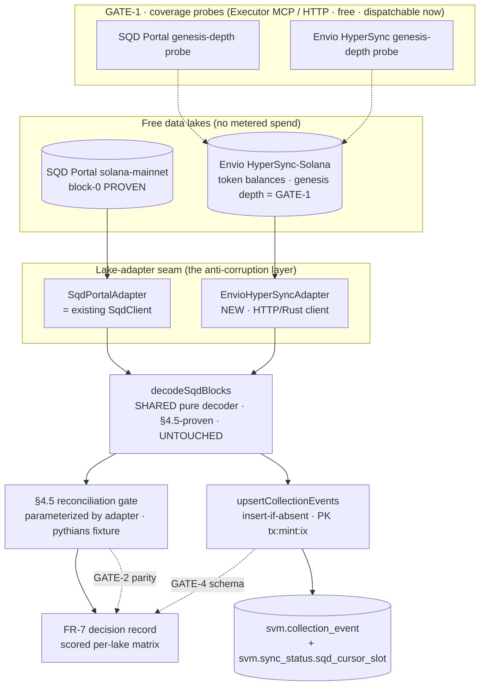
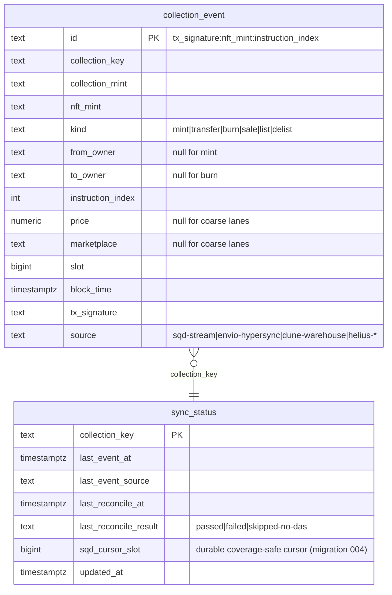
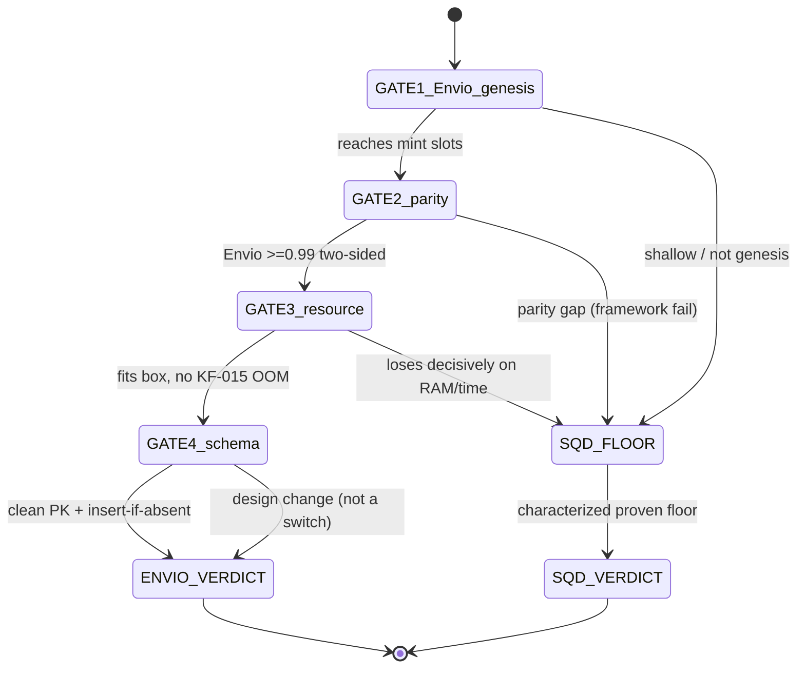

---
hivemind:
  schema_version: "1.0"
  artifact_type: technical-rfc
  product_area: "sonar-api — self-hosted deep-history SVM indexer (spike + full-sync skeleton)"
  workstream: delivery
  priority: high
  jtbd: {category: functional, description: "design the lake-adapter spike harness (SQD Portal vs Envio HyperSync, one shared §4.5-proven decoder) that produces the framework/lake decision record, plus the eventual full-sync batch-lane skeleton onto svm.collection_event"}
  learning_status: directionally-correct
  source: team-internal
trust_tier: operator-authored
read_state: unread
confidence: 0.75
decay_class: working
last_confirmed: 2026-07-06
operator_signed: self_attested
---

# Software Design Document: Self-Hosted Deep-History SVM Indexer

**Version:** 1.0 · **Date:** 2026-07-06 · **Author:** Architecture Designer Agent
**Status:** Draft · **PRD Reference:** `grimoires/loa/prd.md`
**Corrects/extends:** GATE-1 decision record `grimoires/loa/context/2026-07-06-gate1-envio-vs-sqd-coverage.md`; two-lane ADR `grimoires/loa/context/2026-07-05-warehouse-supply-lane-adr.md`
**Supersedes on disk:** the shipped SQD-substrate SDD (cycle svm-sqd-substrate, #140-#142) — that cycle's code is now the reusable substrate this design builds on.

---

## 0. Framing (read this first — it sets the whole design)

This is a **derisking SDD**. The deliverable is a **decision record** (PRD FR-7), not a production indexer.
Its acceptance criteria are **measured spike outputs**, not a presumed framework
(> PRD: *"this is a derisking PRD. Its acceptance criteria are spike results, not a presumed framework"*, prd.md:17-18).

The single load-bearing architectural insight (from GATE-1, corrected by evidence):

> **Our existing decoder is lake-agnostic at the token-balance-row level.**
> `decodeSqdBlocks` (sqd-collection-event-source.ts:100) consumes validated `ValidBalRow`s
> (sqd-collection-event-source.ts:49-57) — token-balance diffs, not SQD-Portal-specific bytes.
> Both candidate lakes (SQD Portal, Envio HyperSync-Solana) expose **token balances**
> (> GATE-1: *"Token balances are exactly the rows our SQD decoder consumes"*, gate1:26-30).
> Therefore the comparison is between two **lakes**, not two **decode stacks**.

**Consequence for this design:** we build ONE thin **lake-adapter seam** that normalizes each lake's
token-balance rows into the decoder's existing block/row shape, then drive the **same** `decodeSqdBlocks`
+ the **same** §4.5 reconciliation gate against each lake. **Do NOT design two decode stacks.** The
decoder is the shared parity harness. This is the anti-corruption layer of the whole spike.

Decision rule inherited from GATE-1 (gate1:61-67): **default Envio** (incumbency — the repo already
runs `envio` for the EVM belt-indexer, package.json:6-9) **if** it passes genesis-depth **AND** matches
SQD on parity/resource; **else SQD Portal** — the **proven floor** (our shipped lane, §4.5 1767/1767,
test/sqd-45-gate-integration.test.ts). Envio must *earn* the switch by matching-or-beating the floor.

---

## 1. Project Architecture

### 1.1 System Overview

Two things are designed here, in dependency order:

1. **The spike harness** (this cycle's build; throwaway-but-may-become-real per PRD §5): a lake-adapter
   interface + a per-lake parity/resource harness that emits GATE-1..4 measurements → the FR-7 decision record.
2. **The full-sync batch-lane skeleton** (next cycle, gated on the decision): the batch lane of the
   two-lane lambda (warehouse-supply ADR) — full-collection genesis sync → decode → `svm.collection_event`
   with insert-if-absent + durable cursor + §4.5 reconcile as the batch-lane acceptance gate.

### 1.2 Architectural Pattern

**Pattern:** Hexagonal (ports & adapters) over a shared pure-decode core; event-driven batch ingest.

**Justification:** The port is `LakeAdapter`; the two adapters (SQD Portal — exists; Envio HyperSync —
new) are interchangeable drivers of the **one** decode core. This is the only structure that lets the
**same** decoder + **same** §4.5 gate be the parity harness across both lakes (§0). It also matches the
existing seam the codebase already declared — `CollectionEventSource` "so the substrate (Helius today,
Geyser/HyperSync tomorrow) is swappable with zero writer/consumer change" (collection-event-source.ts:7-8,
51-55). We are cashing that seam in.

### 1.3 Component Diagram



### 1.4 System Components

#### C1 — `LakeAdapter` port (NEW · the seam · ~40 loc + types)
- **Purpose:** normalize any lake's token-balance rows into the decoder's existing block shape.
- **Responsibilities:** stream `LakeBlock[]` batches over `[fromSlot, toSlot]`; report `currentHeight()`;
  answer the GATE-1 genesis-depth probe (`earliestSlotFor`).
- **Interfaces:** consumed by the parity harness and the batch-lane skeleton.
- **Dependencies:** none (pure contract). The row shape it targets is `SqdBlock`/`SqdTokenBalanceRow`
  (sqd-collection-event-source.ts:29-45), promoted to lake-neutral names (`LakeBlock`/`TokenBalanceRow`).

#### C2 — `SqdPortalAdapter` (EXISTS · rename/wrap of `SqdClient`)
- **Purpose:** the proven-floor driver. `SqdClient.stream()` + `.currentHeight()` already conform to the
  port shape (sqd-client.ts:89-97, 120-202) — this is a thin conformance wrapper, **not** a rewrite.
- **Dependencies:** SQD Portal `finalized-stream` (open/unauthenticated; `SQD_API_KEY` honored if set).

#### C3 — `EnvioHyperSyncAdapter` (NEW · the thing the spike builds)
- **Purpose:** the challenger driver. Consumes HyperSync-Solana **directly** (HTTP or Rust client),
  maps its token-balance rows → `TokenBalanceRow`, transactions → `header`+`signatures[0]`.
- **Critical constraint — avoid the metered anti-pattern:** use **HyperSync direct** (the free lake),
  **NOT** the RPC-based `onSlot` slot-handler path. Per GATE-1: HyperSync is "consumed directly (Rust
  client or HTTP)" (gate1:29). The RPC slot-handler is the metered anti-pattern the PRD forbids
  (prd.md CONSTRAINTS; [[metered-provider-spike-protocol]]).
- **Field mapping [MEASURED in GATE-1/GATE-2 — do NOT presume]:** HyperSync's exact token-balance column
  names (account / pre_mint / post_mint / pre_owner / post_owner / pre_amount / post_amount /
  transaction_index) are **confirmed by the spike**, then mapped 1:1 into `TokenBalanceRow`. Anti-inference:
  the adapter's mapping table is a measured artifact, not an assumed one.

#### C4 — `decodeSqdBlocks` (EXISTS · SHARED · DO NOT MODIFY)
- **Purpose:** the parity harness itself. Token-balance-diff → mint/transfer/burn with order-independent
  net-custody attribution + null-owner doctrine + first-appearance-mint rule
  (sqd-collection-event-source.ts:100-244). §4.5-proven. Order-independent by design (comment lines 205-215).
- **Contract it imposes on adapters:** `seenMints` first-appearance state is caller-owned and must be
  pre-seeded from DB on resume (line 92-98) — the batch lane honors this exactly as `sqd-loader.ts:110` does.

#### C5 — Parity/resource harness (NEW · throwaway spike code)
- **Purpose:** run the §4.5 gate once per adapter (GATE-2), and run a canary full-sync per adapter
  measuring wall-clock / peak RAM / storage / request-count (GATE-3).
- **Interfaces:** generalizes `test/sqd-45-gate-integration.test.ts` to take a `LakeAdapter` parameter.

#### C6 — Batch-lane skeleton (NEXT cycle · designed here, §8)
- **Purpose:** the eventual production full-sync — `runSqdLoader` (sqd-loader.ts:96) generalized to
  `runLakeSync(adapter)`, same insert-if-absent + durable-cursor + §4.5 discipline.

### 1.5 Data Flow

`lake` → `adapter.stream()` → `LakeBlock[]` → `decodeSqdBlocks(blocks, memberSet, seenMints)` →
`CollectionEvent[]` → (GATE-2) reconcile `eventId(e)` set vs the pythians fixture **OR** (GATE-3/batch)
`upsertCollectionEvents(…, {ifAbsentOnly:true})` → `svm.collection_event` + `sqd_cursor_slot` write.

### 1.6 External Integrations

| Service | Purpose | API Type | Cost | Documentation |
|---------|---------|----------|------|---------------|
| SQD Portal `solana-mainnet` | proven-floor token-balance lake | HTTP JSONL stream | **free** | `portal.sqd.dev` (sqd-client.ts:17) |
| Envio HyperSync-Solana | challenger token-balance lake | HTTP / Rust client | **free** | `docs.envio.dev/docs/HyperIndex/solana` (gate1:23) |
| Helius DAS | member-mint resolution ONLY (ownership trust root) | REST | metered (existing free tier) | KF-018 — DAS stays ownership trust root |
| Hasura / Postgres | `svm.collection_event` + `svm.sync_status` writes | GraphQL | self-hosted | collection-event-writer.ts:21 |

> **Note:** DAS is *not* a history source here — it resolves membership and remains the ownership trust
> root (KF-018; PRD §5 *"§4.5 as the acceptance oracle — deep history is range-complete decode, never an
> ownership-completeness claim"*). Deep-history custody comes from the free lakes only.

### 1.7 Deployment Architecture

- **Spike execution split (operator-confirmed, PRD §4):**
  - **GATE-1 coverage probes** → Executor MCP (remote TS sandbox) / plain HTTP — **no local FS, no
    indexer runtime** — dispatchable *now* as runnable probes.
  - **GATE-2/3 resource+parity** → **local box** (real sync against real hardware to measure RAM/time/
    storage) — packaged as **beads for a box** per the /simstim dispatch contract.
- **Production target (post-decision):** Railway (belt-indexer incumbent, KF-013/KF-015 context) unless
  GATE-3 extrapolation disproves it at 100-collection scale (prd.md:141-142).

### 1.8 Scalability Strategy

- **Marginal cost of the next collection ≈ 0** is the north star (prd.md:44-50): sync-time + storage on
  the same box, vs metered reads that scale linearly-and-punishingly.
- **RAM is bounded by design, not by history:** the streaming decode holds only one `LakeBlock[]` batch
  at a time; the **only** cross-batch state is `seenMints` (a `Set<string>` of distinct mints, bounded by
  |collection| ≈ 3.7k–10k, **not** |events|). This is the structural reason we expect to sidestep the
  KF-015 Envio-Hyperindex-Node OOM — **we run the HyperSync lake adapter, not the Node Hyperindex runtime
  that OOM'd** (KF-015). GATE-3 measures peak RAM to confirm the reasoning holds in practice.
- **Extrapolation target:** 20 collections now → 100 ceiling (prd.md:151).

### 1.9 Security Architecture

- **No secrets on the hot path:** both lakes are open/free; `SQD_API_KEY` optional. No new metered
  provider without operator approval (prd.md:131-134; [[metered-provider-spike-protocol]]).
- **Rows are UNTRUSTED substrate:** field-validate before decode, reject-don't-coerce
  (`validateBalRow`, sqd-collection-event-source.ts:59-75); malformed-rate escalation at >10%
  (lines 90, 150-153). The Envio adapter inherits this by normalizing INTO the same validated path.
- **Cheap-and-loud failure (PRD §5):** bounded canary, progress logging that survives pipes, no 4-hour
  silences; request caps as a grant-not-right guard (sqd-client.ts:133-137).

---

## 2. Software Stack

### 2.1 Runtime & Language

| Category | Technology | Version | Justification |
|----------|------------|---------|---------------|
| Language | TypeScript / Node.js | Node 20.x (`@types/node` 20.8.8, package.json) | Repo standard; the decoder + writer + gate are already TS |
| Test runner | Vitest | repo-pinned (`vitest run`, package.json:test) | The §4.5 gate is a Vitest integration test (test/sqd-45-gate-integration.test.ts) |
| Lake client (SQD) | native `fetch` | Node 20 built-in | Existing `SqdClient` idiom (sqd-client.ts) — no dependency added |
| Lake client (Envio) | HyperSync HTTP **or** `@envio-dev/hypersync-client` (Rust-backed) | **[MEASURED in GATE-1]** | Prefer HTTP to match the zero-dependency SQD idiom; the Rust client is the fallback if HTTP throughput loses on GATE-3. Ladder rung: try HTTP first (stdlib `fetch`), add the client dep only if measured throughput requires it. |
| Framework (EVM incumbent) | Envio Hyperindex | 3.2.1 (KF-015/KF-016 context; package.json `envio` scripts) | Context only — the **incumbency** argument for Envio. The SVM path uses HyperSync **direct**, not Hyperindex. |

### 2.2 Backend Technologies (reused, not rebuilt)

| Component | Source | Status |
|-----------|--------|--------|
| Decode core | `src/svm/sqd-collection-event-source.ts` | reuse UNCHANGED |
| Writer / PK | `src/svm/collection-event-writer.ts` (`eventId`, `upsertCollectionEvents`) | reuse UNCHANGED |
| Cursor / freshness | `src/svm/sync-status.ts` (`sqd_cursor_slot`, migration 004) | reuse; semantic rename considered (GATE-4) |
| Member resolution | `src/svm/nft-collection-source.ts` (DAS) | reuse UNCHANGED |
| Registry | `src/svm/collection-registry.ts` (pythians, smb_gen2 present) | reuse UNCHANGED |
| §4.5 gate | `test/sqd-45-gate-integration.test.ts` | generalize to take `LakeAdapter` |

**Key libraries added:** ideally **none** (HTTP path). At most one: the HyperSync Rust-backed client,
**only if** GATE-3 throughput demands it (declared as a measured decision, not a default).

---

## 3. Database Design

### 3.1 Technology
**Primary:** PostgreSQL via Hasura (self-hosted belt-hasura). No schema *rewrite* — this design **converges
onto the existing tables** (GATE-4).

### 3.2 Schema (existing — the convergence target)



- **PK contract (GATE-4):** `{tx_signature}:{nft_mint}:{instruction_index}` (`eventId`,
  collection-event-writer.ts:57-59), constraint `collection_event_pkey` (line 23). Identical across
  all supply lanes by construction (warehouse-supply ADR invariant #1).
- **Merge policy (GATE-4):** insert-if-absent (`update_columns: []`, collection-event-writer.ts:31-35) —
  the coarse deep-history lane **never clobbers** a richer Helius-classified row sharing the PK. This is
  the ADR's coarse-never-clobbers invariant.

### 3.3 Migration Strategy

- **GATE-4 is a design decision, not a framework switch** (prd.md:129). Two schema-convergence items:
  1. **`source` value for the winning lake:** if Envio wins, `EventSource`
     (collection-event-writer.ts:37) gains `"envio-hypersync"` and the `sync_status_source_check`
     CHECK is widened by an idempotent **migration 005** (exact precedent: migration 003 widened it for
     `sqd-stream`, `migrations/svm/003_sync_status_sqd_source.sql`).
  2. **Cursor column naming:** `sqd_cursor_slot` (migration 004) is currently SQD-named. If Envio wins,
     either (a) reuse it as the lake-neutral cursor (zero migration, documented rename), or (b) add
     `lake_cursor_slot` in migration 005. **Recommendation:** (a) for the spike; revisit at production
     deploy. This is a naming decision the batch lane records, never a decode change.
- **No new tables.** The whole point of GATE-4 is that decoded rows land in the *existing* schema.

### 3.4 Data Access Patterns

| Query | Frequency | Optimization |
|-------|-----------|--------------|
| resume cursor read (`sqd_cursor_slot`) | 1/sync-run | PK lookup on `sync_status` (sqd-loader.ts:38-56) |
| known-mints seed for `seenMints` | 1/sync-run | `distinct_on: nft_mint` (sqd-loader.ts:58-65) |
| insert-if-absent batch upsert | N/500 per sync | de-dupe by PK first (collection-event-writer.ts:87-91) |

### 3.7 Backup/Recovery
Inherited from the existing warehouse; the batch lane is **rerun-safe** (insert-if-absent + durable
coverage-safe cursor), so recovery = re-run from `sqd_cursor_slot` (sqd-loader.ts:38-56, 175-209).

---

## 4. Spike Surfaces & Dispatch (repurposed "UI Design")

There is no UI. The operator-facing surface is **dispatch** — which measurements run where, per the
/simstim contract ("full simstim, dispatch what runs; heavy local syncs packaged as beads for a box,
runnable probes dispatched").

### 4.1 Dispatch map

| Gate | Surface | Dispatch form | Metered? |
|------|---------|---------------|----------|
| GATE-1 genesis depth | Executor MCP / HTTP | **runnable probe — dispatch now** | free |
| GATE-2 decode parity | local box | **bead for a box** (needs the fixture + Vitest) | free |
| GATE-3 full-sync resource | local box | **bead for a box** (real RAM/time/storage) | free |
| GATE-4 schema convergence | local box (or dry-run) | **bead** (dry-run upsert against a scratch schema) | free |
| FR-7 decision record | in-session synthesis | agent-authored from gate outputs | — |

### 4.2 GATE sequence (state machine)



> SQD is the **proven floor** at every branch — a gate failure falls to SQD, it does not fail the cycle
> (gate1:61-67). The cycle only fails if SQD *also* regressed, which the shipped §4.5 gate would catch.

---

## 5. Interfaces & Decision-Record Schema (repurposed "API Specifications")

### 5.1 The `LakeAdapter` port (the seam)

```typescript
// src/svm/lake-adapter.ts  (NEW — the ONLY new production-shaped seam)
import type { SqdBlock, SqdTokenBalanceRow } from "./sqd-collection-event-source";

// Lake-neutral aliases of the decoder's existing shapes (§0). The decoder is unchanged;
// only the NAMES generalize so "SqdBlock" doesn't imply an SQD-only contract.
export type LakeBlock = SqdBlock;
export type TokenBalanceRow = SqdTokenBalanceRow;

export interface LakeStreamStats {
  requests: number;      // request-count is the density-wall metric (GATE-3)
  blocks: number;
  balanceRows: number;
  stoppedAtCap: boolean;
  lastSlot: number;
}

export interface GenesisDepthProbe {
  reachesGenesis: boolean;       // GATE-1 pass condition
  earliestSlotObserved: number;  // vs each mint's known mint-slot
  gaps: Array<{ from: number; to: number }>;
}

export interface LakeAdapter {
  readonly name: "sqd-portal" | "envio-hypersync";
  currentHeight(): Promise<number>;
  /** Stream token-balance blocks over [fromSlot, toSlot], yielding batches. Caller owns decode state. */
  stream(
    mints: readonly string[],
    fromSlot: number,
    toSlot: number,
    stats: LakeStreamStats,
    log?: (m: string) => void,
  ): AsyncGenerator<LakeBlock[]>;
  /** GATE-1 cheap probe: does this lake reach the collections' mint slots before any full sync? */
  earliestSlotFor(mints: readonly string[]): Promise<GenesisDepthProbe>;
}
```

- `SqdClient` already satisfies `stream` + `currentHeight` (sqd-client.ts:120, 89). `SqdPortalAdapter`
  is a thin wrapper adding `name` + `earliestSlotFor`.
- `EnvioHyperSyncAdapter` implements the same three methods against HyperSync-direct.

### 5.2 The parity harness (generalized §4.5 gate)

```typescript
// signature only — body is test/sqd-45-gate-integration.test.ts with `client` → `adapter`
async function runParityGate(adapter: LakeAdapter, fixture: GateFixture): Promise<{
  lake: LakeAdapter["name"];
  fixture_count: number;
  matched: number;
  divergences: number;
  unexpected_count: number;   // two-sided: surplus fails too (test line 157, 188)
  match_rate: number;         // PASS iff >=0.99 AND divergences<=1% AND unexpected===0 (test line 178)
  requests: number;
  status: "PASS" | "FAIL";
}>;
```

The metric contract is **identical** to the shipped gate (test/sqd-45-gate-integration.test.ts:166-189)
— two-sided, 0.99 floor, 1%-divergence ceiling, cap-must-not-fire (else divergences are truncation, line 185).

### 5.3 FR-7 Decision Record schema (the deliverable)

Written to `grimoires/loa/context/2026-07-06-lake-decision-record.md` (feeds `/architect` of the next cycle):

```json
{
  "decision": "envio | sqd",
  "decided_at": "ISO-8601",
  "default_rule": "Envio if genesis-depth PASS AND parity/resource match-or-beat SQD; else SQD floor",
  "gates": {
    "GATE-1_genesis_depth": {
      "sqd":   { "reachesGenesis": true,  "earliestSlotObserved": 0, "gaps": [] },
      "envio": { "reachesGenesis": null,  "earliestSlotObserved": null, "gaps": [] },
      "pass":  null, "evidence": "probe run id / slots"
    },
    "GATE-2_parity": {
      "sqd":   { "match_rate": 1.0, "divergences": 0, "unexpected": 0, "status": "PASS" },
      "envio": { "match_rate": null, "divergences": null, "unexpected": null, "status": null },
      "pass":  null, "evidence": "gate json per lake"
    },
    "GATE-3_resource": {
      "canary": ["pythians", "smb_gen2"],
      "per_lake": {
        "sqd":   { "wall_clock_s": null, "peak_ram_mb": null, "storage_mb": null, "requests": null },
        "envio": { "wall_clock_s": null, "peak_ram_mb": null, "storage_mb": null, "requests": null }
      },
      "kf015_oom": false,
      "avoids_400k_density_wall": null,
      "pass": null
    },
    "GATE-4_schema": {
      "pk_collisions": 0, "clobbered_rich_rows": 0,
      "source_value": "envio-hypersync | sqd-stream",
      "cursor_column": "sqd_cursor_slot (reused) | lake_cursor_slot (new)",
      "pass": null
    }
  },
  "extrapolation": {
    "box_sizing": { "ram_gb": null, "storage_gb_at_20": null, "storage_gb_at_100": null,
                    "sync_hours_per_collection": null, "binding_resource": "ram|storage|wallclock" }
  },
  "cost_model": {
    "_boehm_note": "shape not magnitude — see grimoires/loa/context/2026-07-06-boehm-economics-svm-indexer.md; self-host-vs-metered is DECIDED (overdetermined), spike only CALIBRATES self-host params",
    "self_host_fixed_usd_mo": "~$10 co-located w/ belt-indexer (marginal box target ≈ $0) — CONFIRM co-location in GATE-3",
    "marginal_per_collection_usd": "≈ sync CPU-hours (free reads) + ~6MB storage → ~$0; calibrate m_sync, m_store",
    "metered_baseline_at_20": "reference only (~$600-800 mixed, one-time, RECURRING on re-sync)",
    "metered_baseline_at_100": "reference only (~$3,140 one-time + ongoing annuity)",
    "crossover": "NONE for event deep-history — self-host wins at N=1 w/ any blue-chip; ~26x/yr at N=100, gap widens (metered=unbounded OpEx annuity, self-host=bounded CapEx). DECIDED, not re-opened."
  },
  "go_no_go": "GO to production-deploy cycle | NO-GO (reason)"
}
```

Scoring (Boehm-corrected — cost axis DROPPED, both lakes cost the same, see economics doc §4):
a per-lake matrix on **coverage / parity / resource ONLY**; **Envio wins iff GATE-1 PASS AND (GATE-2 PASS
AND GATE-3 not-decisively-worse than SQD)**; otherwise **SQD** (the proven floor). GATE-4 never flips the
lake — it only sizes a migration (prd.md:129). The gated structure IS Boehm's spiral model (risk-driven
cycles, go/no-go per gate, SQD held as characterized fallback) — economics doc §5.

---

## 6. Error Handling Strategy

### 6.1 Failure classes (cheap-and-loud, per PRD)

| Class | Detection | Response |
|-------|-----------|----------|
| Envio genesis shallow | GATE-1 `reachesGenesis:false` / gaps | fall to SQD floor; record in FR-7; **no sync effort wasted** (probe is first + cheap) |
| Decode parity gap | GATE-2 `match_rate<0.99` OR `unexpected>0` | framework FAIL for that lake (not a silent divergence); fall to floor |
| Request cap hit mid-sync | `stats.stoppedAtCap` (sqd-client.ts:133) | STOP clean, hold cursor at `from` (DISS-001-residual, sqd-loader.ts:162-179); loud log |
| KF-015-class OOM | GATE-3 peak-RAM watch on the dense canary | GATE-3 FAIL → resize + document OR fall to floor (prd.md:128); **never** bump-and-pray (KF-015 reading guide) |
| Malformed lake rows | `validateBalRow` reject + >10% escalation (sqd-collection-event-source.ts:150-153) | reject-don't-coerce; escalate on rate spike (possible lake protocol change) |
| Auth appears on a "free" lake | `SqdAuthRequiredError` (sqd-client.ts:30-43) | throw immediately, surface block/timestamp for operator re-quote; do NOT retry into spend |

### 6.3 Logging
Progress logging that **survives pipes** (PRD: "no 4-hour silences") — per-chunk `[…] chunk i/N done ·
R reqs · E events` (sqd-loader.ts:147), request-count surfaced continuously (the density-wall telemetry).

---

## 7. Testing Strategy

### 7.1 What proves what

| Level | Target | Tool | Gate |
|-------|--------|------|------|
| Unit | Envio adapter row-mapping (HyperSync row → `TokenBalanceRow`) | Vitest, fixture rows | mapping is lossless + validated |
| Unit | `SqdPortalAdapter` conformance to `LakeAdapter` | Vitest | no behavior change vs `SqdClient` |
| Integration (GATE-2) | `runParityGate(envio, pythians)` AND `runParityGate(sqd, pythians)` | Vitest (`test:gate` idiom) | **≥0.99 two-sided, both lakes** |
| System (GATE-3) | canary full-sync pythians + **smb_gen2 (mandatory dense blue-chip)** | local box + `/usr/bin/time -v` / RSS sampler | RAM/time/storage measured, no OOM |

### 7.2 Guidelines

- **The decoder gets NO new tests from this cycle** — it is unchanged; its existing suite
  (`test/sqd-decode.test.ts`, `sqd-pk-convergence.test.ts`, the §4.5 gate) is the regression floor.
- **Two-sided reconciliation is non-negotiable** (a decoder inventing events fails as hard as one missing
  them — test line 154-157). Both lakes reconcile against the **same** committed pythians fixture (SHA256-
  verified, test line 79-83) so the comparison is apples-to-apples.
- **Vacuous-pass doctrine preserved:** below-floor/over-span fixtures hard-fail in CI, never PASS
  (test line 91-107) — a lake can't "pass" by reconciling an empty set.
- **Spike code is throwaway** but the adapter seam + harness may graduate; write them at production
  quality where they'd survive (PRD §5 CONSTRAINTS).

### 7.3 CI
The generalized gate runs the SQD lane in CI (proven, ~120 requests / ≤5 min, test line 63-64). The Envio
lane runs **locally/dispatched** (its endpoint behavior is being *measured*, not yet a CI dependency).

---

## 8. Development Phases

> **Process note (Karpathy #2 / simplicity):** the decode core, writer, cursor, gate, registry, and member
> source **all already exist and are §4.5-proven**. This cycle writes exactly **one new production-shaped
> seam** (`LakeAdapter` + `EnvioHyperSyncAdapter`) and **throwaway harness/probe code**. Resist rebuilding
> anything below the seam.

### Phase 1 — GATE-1 coverage probes (dispatch NOW · free · Executor MCP/HTTP)
- [ ] SQD genesis-depth probe for pythians + smb_gen2 mints (baseline; block-0 expected — gate1:34-37).
- [ ] Envio HyperSync-Solana genesis-depth probe (the **one open GATE-1 sub-question**, gate1:32,50-52).
- [ ] Emit the GATE-1 slice of the FR-7 record. **If Envio is shallow → stop, SQD floor, skip Phase 2-Envio.**

### Phase 2 — Lake-adapter seam + GATE-2 parity (local · bead)
- [ ] `src/svm/lake-adapter.ts` — the port + neutral type aliases (no decoder change).
- [ ] `SqdPortalAdapter` conformance wrapper of `SqdClient`.
- [ ] `EnvioHyperSyncAdapter` — HyperSync-direct (HTTP-first), measured field mapping.
- [ ] Generalize the §4.5 gate to `runParityGate(adapter, fixture)`.
- [ ] Run both lakes vs the pythians fixture → GATE-2 slice of FR-7.

### Phase 3 — GATE-3 canary full-sync + resource envelope (local box · bead)
- [ ] Full-collection genesis sync of **pythians** + **smb_gen2** per passing lake.
- [ ] Measure peak RAM (vs KF-015), wall-clock, storage, **request-count** (the density-wall metric).
- [ ] **Answer the derisking question:** does native full-sync avoid the ~400k mint-filtered-windowed
      density wall? Measure two sync strategies (§8.1) and record request-count for each.
- [ ] Extrapolate box sizing to 20 → 100; identify the binding resource.

### Phase 4 — GATE-4 schema convergence + FR-7 decision record (local/dry · bead + synthesis)
- [ ] Dry-run upsert decoded rows onto `svm.collection_event` (or a scratch schema): assert 0 PK
      collisions, 0 clobbered rich rows (insert-if-absent).
- [ ] Decide `source` value + cursor-column naming (migration 005 sketch if Envio wins).
- [ ] Cost model: self-host fixed + marginal-per-collection vs metered baseline at 20/100 (crossover).
- [ ] **Write FR-7 decision record** → `grimoires/loa/context/` → go/no-go for the production cycle.
- [ ] BB gate on any PR that lands the seam/harness.

### 8.1 Full-sync batch-lane skeleton (NEXT cycle — designed, not built here)

The batch lane of the two-lane lambda (warehouse-supply ADR). It is `runSqdLoader` (sqd-loader.ts:96)
generalized to `runLakeSync(adapter, opts)` with **zero change to the invariants**:

```
resolveCollection(key) ──► DAS members ──► seenMints seeded from DB known-mints (resume safety)
        │                                          │
        ▼ per adapter.stream(mints, from=sqd_cursor_slot, head)
   decodeSqdBlocks(block batch, memberSet, seenMints)   [SHARED · unchanged]
        │
        ▼ upsertCollectionEvents(events, key, mint, source, {ifAbsentOnly:true})   [coarse-never-clobbers]
        │
        ▼ writeSyncStatus({ sqdCursorSlot: coverage-safe min(completedChunkSlots) })   [durable cursor]
        │
        ▼ §4.5 runParityGate(adapter, bounded window)  ──►  batch-lane ACCEPTANCE (passed|failed|skipped-no-das)
```

**Density-wall design (the THE derisking question, prd.md:162):** the ~400k-request wall was specific to
**mint-filtered windowed** scanning (`tokenBalances:[{postMint:chunk},{preMint:chunk}]`, sqd-client.ts:68-72;
full history 128M slots ≈ 160k-380k Portal requests, test line 8-9). The skeleton exposes a **`SyncStrategy`**
choice measured in GATE-3:
- **Strategy A — mint-filtered windowed** (current `SqdClient` shape): server returns only member rows;
  request-count driven by server pagination over the full range.
- **Strategy B — full-block scan + local filter** (HyperSync's "fetch by slot and decode yourself" model,
  gate1:29-30): fewer/larger requests, more bytes, local membership filter in `validateBalRow`.
GATE-3 records request-count + wall-clock for both, per lake. **If Strategy B's native full-sync collapses
the request-count, that is the answer** (native full-sync avoids the density wall). This is measured, not
assumed (prd.md:162: "this is THE derisking question, measured not assumed").

**Durable cursor:** reuse `svm.sync_status.sqd_cursor_slot` (migration 004) — the coverage-safe min-cursor,
NOT MAX(slot) (sqd-loader.ts:38-56, 180-209). A capped run holds the cursor at `from` and says so loudly
(DISS-001-residual). Resume is rerun-safe because upserts are insert-if-absent.

---

## 9. Known Risks and Mitigation

| Risk | Prob | Impact | Mitigation |
|------|------|--------|------------|
| Envio HyperSync genesis-depth shallow / not block-0 | Med | High (kills the incumbency default) | **GATE-1 probe FIRST**, cheap, before any sync (prd.md:161); SQD floor ready |
| Density wall recurs on full-sync | Med | High | GATE-3 measures Strategy A **and** B request-count per lake; native full-sync (B) is the hypothesized escape (§8.1) |
| KF-015-class OOM on dense canary | Med | High | RAM is a GATE-3 pass/fail; we run the **lake adapter, not the Node Hyperindex runtime** that OOM'd; `seenMints` is the only unbounded state and it's bounded by \|mints\| (§1.8); measure to confirm |
| Envio field-mapping guessed wrong | Med | Med | Anti-inference: the mapping table is a **measured** GATE-1/2 artifact; parity gate catches any mis-map as divergence |
| Accidentally using RPC slot-handler (metered) | Low | High | Design pins **HyperSync-direct** (HTTP/Rust); `SqdAuthRequiredError`-style guard surfaces any spend door instead of retrying into it |
| Decoder assumed lake-agnostic but isn't | Low | High | GATE-2 two-sided parity on BOTH lakes against the SAME fixture is exactly the falsification test |
| Storage at 100 collections unaffordable | Low-Med | Med | GATE-3 extrapolates; storage is cheap vs metered reads but bounded in the cost model (prd.md:165) |

---

## 10. Open Questions

| Question | Owner | Resolves at | Status |
|----------|-------|-------------|--------|
| Does HyperSync-Solana reach genesis (block-0 / mint slots) for the target mints? | spike | GATE-1 | **OPEN** (the one open sub-question, gate1:32) |
| Exact HyperSync token-balance field names → `TokenBalanceRow` mapping | spike | GATE-1/2 | OPEN (measured, not presumed) |
| HTTP vs Rust-backed HyperSync client — which meets GATE-3 throughput? | spike | GATE-3 | OPEN (HTTP-first, dep only if measured need) |
| Does native full-sync (Strategy B) avoid the ~400k density wall? | spike | GATE-3 | **OPEN** (the core derisking question) |
| If Envio wins: reuse `sqd_cursor_slot` or add `lake_cursor_slot`? | operator | GATE-4 | OPEN (migration decision, not a decode change) |
| Is this derisking-additive or blocking score-api? (A1) | operator | any | ASSUMPTION: additive (prd.md:83-86) — if blocking, reprioritize fastest-to-first-collection |

---

## 11. Appendix

### A. Glossary
| Term | Definition |
|------|------------|
| Lake | A free, queryable columnar source of raw chain data (SQD Portal, Envio HyperSync) — charges nothing to read; you self-host the indexer |
| Lake-adapter | The port normalizing a lake's token-balance rows into the decoder's `TokenBalanceRow` shape |
| §4.5 gate | Range-complete decode reconciliation vs the committed pythians fixture; two-sided, ≥0.99 — the acceptance oracle |
| Density wall | The ~160k-380k request explosion of mint-filtered windowed full-history scans (test/sqd-45-gate-integration.test.ts:8-9) |
| Proven floor | SQD Portal — already shipped + §4.5-verified; the fallback that cannot regress silently |
| Genesis depth | Whether a lake's history reaches a collection's mint slots (GATE-1) |
| KF-015 | Envio Hyperindex **Node runtime** heap OOM — avoided by using HyperSync-direct, not the Node runtime |
| KF-018 | Deep history is range-complete decode, NEVER ownership completeness; DAS stays the ownership trust root |

### B. References
- PRD: `grimoires/loa/prd.md`
- GATE-1 decision record: `grimoires/loa/context/2026-07-06-gate1-envio-vs-sqd-coverage.md`
- Two-lane supply ADR: `grimoires/loa/context/2026-07-05-warehouse-supply-lane-adr.md`
- Decoder: `src/svm/sqd-collection-event-source.ts`
- §4.5 gate: `test/sqd-45-gate-integration.test.ts`
- Writer / PK: `src/svm/collection-event-writer.ts`
- Cursor + migration 004: `src/svm/sync-status.ts`, `migrations/svm/004_sync_status_sqd_cursor.sql`
- Envio HyperSync-Solana: `docs.envio.dev/docs/HyperIndex/solana`

### C. Change Log
| Version | Date | Changes | Author |
|---------|------|---------|--------|
| 1.0 | 2026-07-06 | Initial — lake-adapter spike harness + full-sync batch skeleton | Architecture Designer |

---
*Generated by Architecture Designer Agent · this is the ARCHITECTURE phase of an operator-approved /simstim run.*
