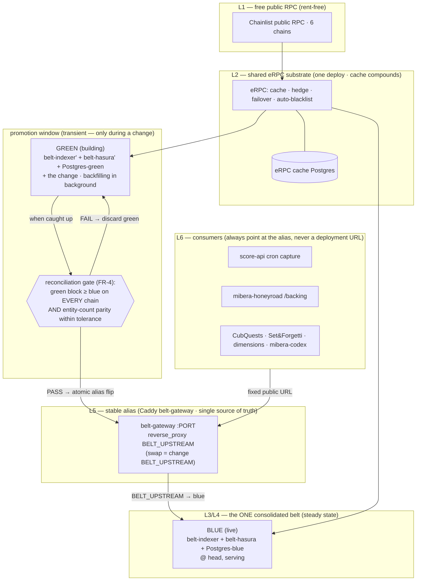
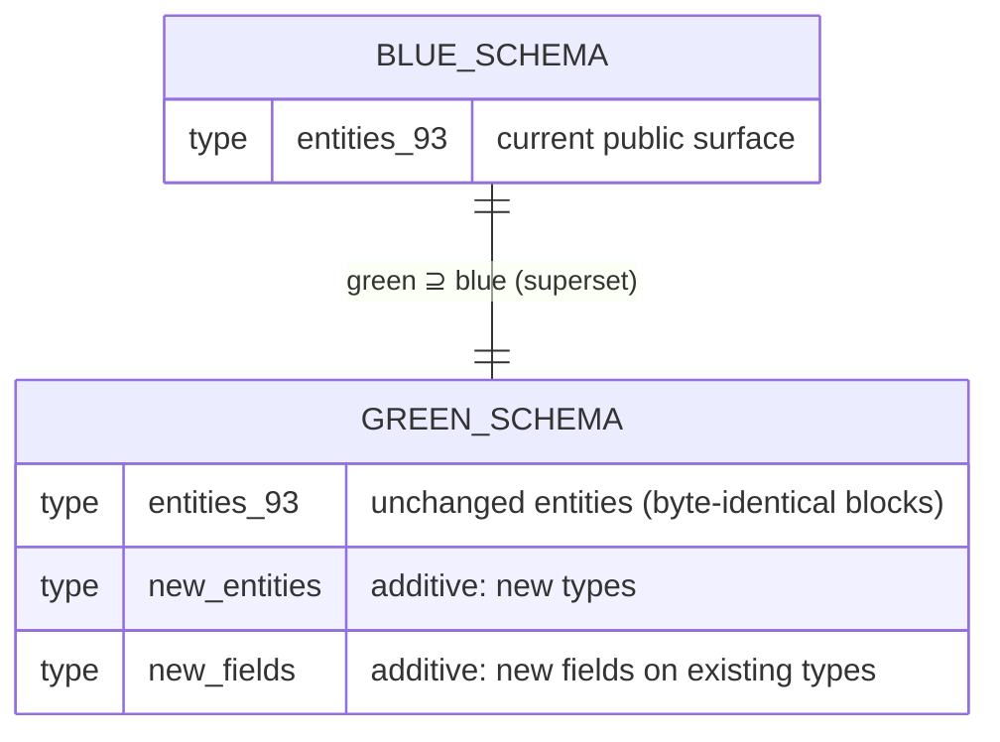
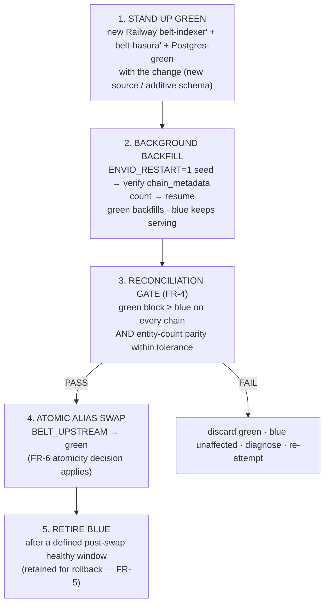
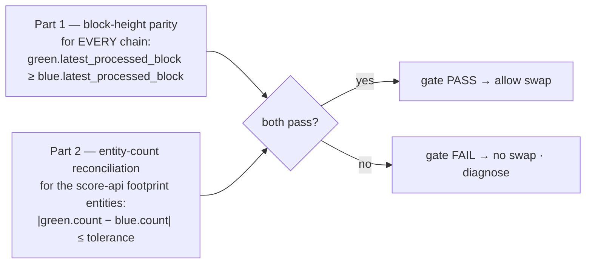
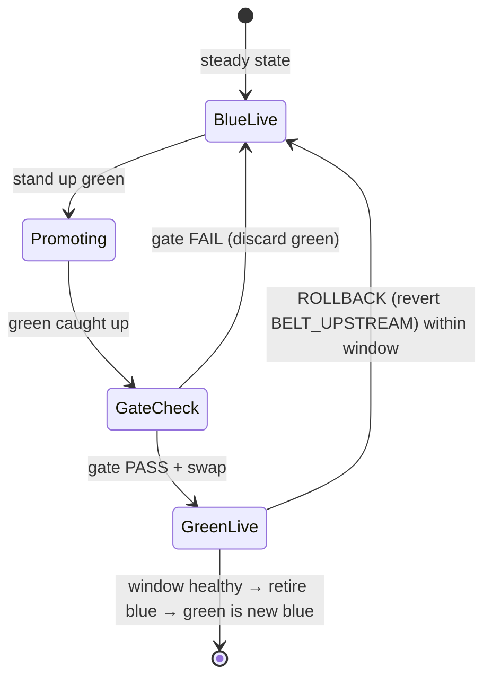
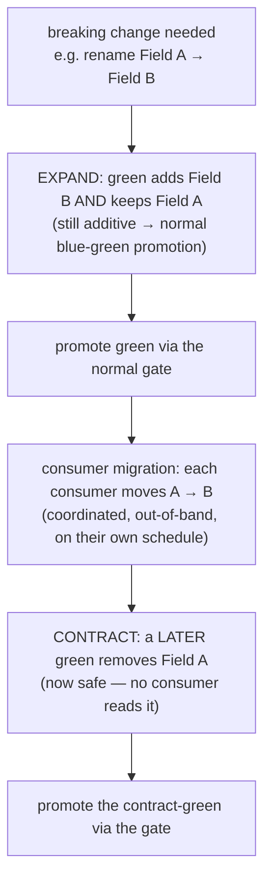

# Software Design Document — sonar-api Consolidated Belt + Blue-Green Promotion

**Version:** r7 (sonar-belt-factory) — **full rewrite** to track PRD r2 (one consolidated belt + blue-green promotion). Supersedes the r6 N-belt-factory SDD whose premise (12 physical belts + query-time federation) was RETIRED at the S0 calibration spike.
**Date:** 2026-05-22
**Author:** Architecture Designer Agent (ARCH: the-arcade + protocol + noether, craft lens)
**Status:** Flatline-remediated (r7) — 3-model review integrated as §17 R-A..R-G (CLI subscription, $0); OQ-1 resolved (Option B, §7.4)
**PRD Reference:** `grimoires/loa/prd.md` r2 (sonar-belt-factory)
**Supersedes:** `sdd.md` r6 — the L0–L6 N-belt federation framing. **What carries forward** (not redone): the eRPC L2 shared substrate, the `ENVIO_RESTART` re-init primitive (KF-013), the Caddy stable-alias gateway, the `verify-belt-config` fidelity gate, the score-api footprint reconciliation (AC-R7), and the KF-012 per-chain getLogs-liar verification discipline. **What is removed**: belt taxonomy (FR-1 in r6), per-belt blast-radius probe, BeaconV3 declaration (now reserve), the Effect serving/ports layer (now reserve), query-time federation (FR-7 in r6).

> **Grounding legend**: `[CODE:file]` = codebase reality · `> file:Lnn` = doc quote · `[KF-nnn]` = known-failure provenance · `(S0)` = S0 spike finding · `(PR#15)` = multi-model review finding · `[ASSUMPTION]` = ungrounded claim flagged for verification.

---

## Table of Contents

1. [Project Architecture](#1-project-architecture)
2. [Software Stack](#2-software-stack)
3. [Data Model & Schema (additive-only contract)](#3-data-model--schema-additive-only-contract)
4. [The Stable Alias (FR-2)](#4-the-stable-alias-fr-2)
5. [Blue-Green Promotion (FR-3 / FR-8)](#5-blue-green-promotion-fr-3--fr-8)
6. [The Promotion Gate — Reconciliation (FR-4)](#6-the-promotion-gate--reconciliation-fr-4)
7. [Swap Atomicity (FR-6)](#7-swap-atomicity-fr-6)
8. [Rollback (FR-5)](#8-rollback-fr-5)
9. [Additive-only schema + breaking-change path (FR-7)](#9-additive-only-schema--breaking-change-path-fr-7)
10. [score-api boundary & on-demand split reserve (FR-9 / FR-10)](#10-score-api-boundary--on-demand-split-reserve-fr-9--fr-10)
11. [Error Handling Strategy](#11-error-handling-strategy)
12. [Testing Strategy](#12-testing-strategy)
13. [Development Phases / Build Sequencing](#13-development-phases--build-sequencing)
14. [Risks & Mitigation](#14-risks--mitigation)
15. [Open Questions](#15-open-questions)
16. [Verification → Acceptance Criteria Mapping](#16-verification--acceptance-criteria-mapping)

---

## 1. Project Architecture

### 1.1 System Overview

`sonar-api` (alias: freeside-sonar) is the THJ sovereign on-chain indexer: **one consolidated Envio HyperIndex V3 belt** ingesting **41 contract definitions** across **6 chains** into **93 GraphQL entities** `[CODE:config.yaml — 41 contracts; schema.graphql — 93 types]`, served behind a **stable production alias** (the Caddy `belt-gateway`, already live `[CODE:Dockerfile.gateway, Caddyfile]`).

The structural pain is not the reindex — it is the **stale/down live endpoint during the reindex**:

> "adding any contract source forces a full reindex of all 6 chains (the '8-hour sync') … the bottleneck is architectural. The pain that reaches consumers is the **stale/down live endpoint during that reindex**, not the reindex itself." — `> prd.md:L33`

This cycle does **not** split the belt and does **not** federate. It makes belt updates **zero-downtime** by shipping every change (new source, additive schema field) via **blue-green promotion**: stand up a green deployment with the change, backfill it in the background while blue keeps serving, run a **reconciliation gate**, then **atomically swap the alias** blue→green and retire blue. The 8-hour reindex still happens — off the live path.

### 1.2 Architectural Pattern

**Pattern:** *Single hot-serving tier behind a stable alias, updated by blue-green deployment* — a serving-consistency discipline layered over an unchanged event-sourcing indexer. The analytics tier (ClickHouse/Dune via score-api cron) is a separate, downstream lambda-architecture leg (out of scope here).

**Justification (traces to PRD goals):**
- **G1 zero-downtime** demands that the 8-hour reindex never sit on the live path. Blue-green is the only mechanism that achieves this without a second indexer being *permanent*: green is transient, up only during a promotion window `> prd.md:L53,L94`.
- **G2 cost ceiling (< $100/mo)** is why r1's 12 physical belts were RETIRED: S0 measured 1 belt + shared infra ≈ **$84.40/mo** at 89% memory `(S0)`, and projected 12 belts at **~$280–450/mo** — infeasible against the hard < $100 bar `> prd.md:L54`. One belt + a *transient* green keeps steady-state under the ceiling; the 2× cost exists only during a promotion window `> prd.md:L62`.
- **G3 serving consistency** is achieved by a *real indirection* (proxy, single source of truth), not per-consumer config edits — the SCALE.md Guardrail-5 split-brain failure mode `> SCALE.md:L76,L332` is eliminated because consumers only ever know the alias URL.
- **No federation** — there is exactly one belt, so the r1 cross-belt UNION/dedup/ordering/pagination correctness problem (Flatline `SKP-002` CRITICAL on r1) is **gone by construction** `> arch-brief:L66`.

The pattern is deliberately **boring at the indexer layer** (Envio HyperIndex, unchanged — handlers, schema, eRPC routing all reused) and **disciplined at the promotion layer** (the reconciliation gate + atomic swap + rollback). We do not rewrite anything; we add an operational procedure plus the scripts that gate it.

### 1.3 Component Diagram — blue-green behind a stable alias



### 1.4 System Components

| Component | Layer | Own/Rent | Status this cycle |
|---|---|---|---|
| Free public RPC (Chainlist) | L1 | rent-free | unchanged (live) |
| **eRPC substrate** (shared, multi-chain) | L2 | own | **live** `[NOTES.md]`; reused as-is; cache shared blue↔green |
| **Consolidated belt** (blue) | L3/L4 | own | **live** — the shipped score-api-footprint belt; this IS the steady-state belt |
| **Green belt** (transient) | L3/L4 | own | **stood up per promotion**, retired after swap |
| **Stable alias** (Caddy `belt-gateway`) | L5 | own | **live** `[CODE:Dockerfile.gateway, Caddyfile]`; swap verified `> NOTES.md:265` |
| score-api (durable analytics) | L6 | own | **downstream, out of scope** — the safety net (FR-9) |

**The module boundary (the indexer is ONE freeside building):**

| | |
|---|---|
| **`is`** | Index the Mibera-ecosystem footprint into composed, queryable entities; serve them through **one stable GraphQL endpoint** with **zero-downtime** updates via blue-green promotion. `> arch-brief:L53` |
| **`is_not`** | Durable analytics store · ClickHouse · Dune · historical snapshots · system-of-record for scores (those are score-api's job). `> arch-brief:L54` |

### 1.5 Data Flow (a promotion)

```mermaid
sequenceDiagram
    participant Op as Operator
    participant Green as Green belt + Postgres-green
    participant Gate as Reconciliation gate
    participant GW as belt-gateway (alias)
    participant Blue as Blue belt (live)
    participant Cons as Consumers

    Note over Blue,Cons: steady state — consumers read the alias → blue
    Op->>Green: stand up green (belt-reinit.md) WITH the change
    Green->>Green: ENVIO_RESTART seed → resume → background backfill (blue untouched)
    Note over Blue,Cons: blue keeps serving a complete, consistent view
    Green->>Gate: green latest_processed_block reaches blue's head (per chain)
    Gate->>Blue: snapshot blue entity counts
    Gate->>Green: snapshot green entity counts
    Gate->>Gate: assert block ≥ blue on every chain AND counts within tolerance
    alt gate PASS
        Op->>GW: railway variables --set BELT_UPSTREAM=<green>
        GW->>GW: atomic flip — consumers now read green
        Note over Cons: 0 config changes · 0 5xx spike (FR-6 decision)
        Note over Blue: retained hot for rollback window, then retired
    else gate FAIL
        Op->>Green: discard green; blue keeps serving; diagnose
    end
```

---

## 2. Software Stack

| Layer | Technology | Version | Justification |
|---|---|---|---|
| Indexer | Envio HyperIndex | `3.0.0-alpha.17` (pinned) | Confirmed across every source of truth `(S0)`: `package.json`, `node_modules`, `npx envio --version`, git `08f3a99`. Data-source field is **`rpc`** (NOT `rpc_config`) `(S0/OQ-1)`. No version change this cycle. |
| RPC substrate | eRPC | `v0.0.64`-validated | Shared L2; live; cache compounds (first deploy on a chain pays cold-sync, subsequent rides the cache `> arch-brief:L99`). Blue and green share the warm cache, so a green build does NOT pay a fresh cold-sync on already-warm chains. |
| Persistence | PostgreSQL | Railway managed PG | One Postgres per belt deployment — blue and green have **separate** Postgres (structural DB isolation, FR-3 `> prd.md:L95`). eRPC cache PG is separate + shared. |
| Stable alias | Caddy + `caddy-ratelimit` | `caddy:2` (xcaddy + `github.com/mholt/caddy-ratelimit`) | `[CODE:Dockerfile.gateway]`. Reverse-proxy with per-IP rate limit (120/min) + 50KB body cap `[CODE:Caddyfile]`. The swap point is one env var. |
| Hosting | Railway | — | rent (paid hosting acceptable; the free-only constraint is the L1 data layer, not hosting). `freeside-sonar` project: `belt-indexer` + `belt-hasura` + `Postgres-3vIC` (per belt) + `belt-gateway` + `erpc` + `Postgres` (shared) `(S0 — Q-a confirmed topology)`. |
| Runtime | Node.js | `>=22.0.0` | envio@3.0.0-alpha.17 requirement (handler autoload uses `fs.promises.glob`) `[CODE:Dockerfile.belt]`. |
| Re-init primitive | `Dockerfile.belt` CMD | existing | `ENVIO_RESTART`-gated CMD: literal `=1` → `--restart` (fresh init), else resume. The KF-013 re-init dance `[CODE:Dockerfile.belt, KF-013]`. |
| Config fidelity gate | `scripts/verify-belt-config.js` | existing | Zero-dep YAML fidelity gate `[CODE:scripts/verify-belt-config.js]` — asserts the belt config is field-identical to `config.yaml` for its declared contracts. |
| Reconciliation gate | **NEW** — promotion-gate script | — | The FR-4 entity-count + block-height parity check (§6). The one net-new code artifact of substance this cycle. |

**Stack non-goals this cycle (PRD "Explicitly Out of Scope" `> prd.md:L163`):** 12 physical belts (RETIRED); query-time federation gateway; ClickHouse/Dune/score computation (score-api); packaged tenant installable; BeaconV3 declaration (now reserve, `> prd.md:L161`); the Effect serving/ports layer (now reserve). HyperSync stays **break-glass only** (sovereign-data thesis — eRPC for all chains `> prd.md:L135`).

---

## 3. Data Model & Schema (additive-only contract)

### 3.1 The belt is the OLTP event store; the public surface is its GraphQL schema

The belt's persistence is **Envio-managed PostgreSQL** — codegen produces the tables from `schema.graphql` (93 entity types) `[CODE:schema.graphql]`. The DDL is generated, not hand-authored; the design contract is the **GraphQL schema shape** the alias exposes, not the table layout.

### 3.2 Cross-cutting entity composition (intra-belt, unchanged)

Handlers compose freely **within the one belt** `> prd.md:L89` `[CODE:src/handlers/*, src/lib/*]`:
- **Per-event entities** (e.g. `HoneyJar_Transfer`, `MiberaTransfer`).
- **Running aggregates** (e.g. `PaddleSupplier` via get→update→set in a handler).
- **Cross-cutting normalized entities** — `Action` is written by **21 handlers** via `recordAction` `[CODE:src/lib/actions.ts]`; `Holder`/`Token` shapes via shared lib (`src/lib/erc721-holders.ts`, `src/lib/mint-detection.ts`).

Because there is **one belt**, `Action`/`Mint`/`Holder`/`Token` are single coherent tables — **no cross-belt merge, no fragment reassembly** (the r1 federation problem does not exist here).

### 3.3 The additive-only invariant (the load-bearing schema contract)



**Invariant (FR-7 `> prd.md:L106`):** green's schema MUST be a **superset** of blue's. Every entity + field a consumer reads on blue MUST still exist, same name, same type, on green. The alias swap is then transparent. Enforcement is a schema-diff gate in the promotion procedure (§6.2, §9). **`[ASSUMPTION]`** Envio codegen treats a new entity type / new field on an existing type as additive (no destructive table rewrite of existing entities) — confirm on the first real promotion (§15 OQ-3); the S0 evidence that a subset schema codegens cleanly `(S0 R-D)` strongly suggests a superset does too.

### 3.4 Migration strategy = blue-green, never in-place schema mutation

A schema change is NEVER applied in place on blue (resume keeps the old table shape — D6 `> belt-reinit.md:L103`). It ships on a **fresh green build** (`--restart` seeds the new schema), and the swap is the migration. This is the SCALE.md Guardrail-1 rule realized as the cycle's only update mechanism `> SCALE.md:L47`.

---

## 4. The Stable Alias (FR-2)

### 4.1 The contract (the alias already exists — this section specifies it)

The fixed public GraphQL endpoint is the Caddy `belt-gateway` `[CODE:Caddyfile]`:

```caddyfile
:{$PORT:8080} {
    request_body { max_size 50KB }          # coarse complexity guard (AC-12)
    rate_limit { zone perip { key {client_ip} events 120 window 1m } }   # per-IP 120/min
    reverse_proxy {$BELT_UPSTREAM} { header_up Host {upstream_hostport} }  # the swap point
}
```

| Property | Value | Source |
|---|---|---|
| Public URL | `https://belt-gateway-production.up.railway.app/v1/graphql` (stable, never changes) | `> NOTES.md:265` |
| Indirection type | **proxy, not DNS** — atomic by construction, not propagation-bound | `> arch-brief:L96` |
| Single source of truth | one Caddy config + one env var (`BELT_UPSTREAM`) — resolves Guardrail-5 split-brain | `> arch-brief:L97`; `> SCALE.md:L332` |
| Swap lever | `railway variables -s belt-gateway --set 'BELT_UPSTREAM=<green-internal-addr>'` | `> arch-brief:L99` |
| Swap verified | bad upstream → 502; revert → live data | `> NOTES.md:265` |
| Consumer config changes per swap | **0** (G3) — consumers only know the alias URL | `> prd.md:L63` |

### 4.2 Why proxy, not DNS

DNS swaps are propagation-bound (TTL-dependent, per-resolver caching → a split-brain window across consumers). A reverse-proxy swap is a single config change at one point with **no propagation window** — every request after the swap hits the new upstream; every request before hits the old. This is the structural answer to SCALE.md Guardrail-5's split-brain CRITICAL `> SCALE.md:L76` and PR#15 SKP-001/F-001 `> prd.md:L92`.

---

## 5. Blue-Green Promotion (FR-3 / FR-8)

### 5.1 The promotion procedure (5 steps)

Grounded in `belt-reinit.md` (green build) + the existing alias swap (NOTES:265):



### 5.2 Step 1–2: green-build orchestration (FR-8) — grounded in KF-013

Green is built fresh via the **generalized re-init runbook** `[CODE:grimoires/loa/runbooks/belt-reinit.md]`. The load-bearing operational fact `[KF-013]`:

> Envio's `isInitialized()` checks **table-existence not config-hash** → a plain redeploy RESUMES and silently skips new contracts. Force a fresh init: set `ENVIO_RESTART=1` → deploy (JS seeds schema + `chain_metadata`, then the Rust-CLI `persisted_state` upsert crashes 28P01 on fresh init — **`ENVIO_PG_SSL_MODE=false` does NOT fix this; that was a misdiagnosis, corrected in KF-013**) → **delete `ENVIO_RESTART` → redeploy → RESUME backfills** the seeded chains. The belt runs fine without `persisted_state`. `> belt-reinit.md:L9, L60-87`

**The verification gate inside step 2 (BB F-006, binding):** after the `ENVIO_RESTART=1` deploy, **before** removing the flag, assert `SELECT COUNT(*) FROM chain_metadata` equals the number of chains in the green config. A short count means JS crashed before seeding all chains → those chains are silently skipped on resume. On a short count, **re-deploy with `ENVIO_RESTART=1` until the count matches** — do NOT proceed `> belt-reinit.md:L70-76`. This is FR-8's "retry/escalation path if seeding is incomplete" `> prd.md:L110`.

**Green↔blue DB isolation is structural** (FR-3 `> prd.md:L95`): green is a *separate Railway service* with its *own Postgres*. A green `--restart` rewrites only green's tables; blue's `chain_metadata`/`checkpoints`/Postgres are a different database, mechanically untouched `> belt-reinit.md:L110`. This is what makes blue serve a complete, consistent view the entire time green builds (B4 `> arch-brief:L137`).

**eRPC cache reuse:** green routes through the same shared eRPC L2 as blue. Chains already warmed by blue (Bera/Base/OP/ETH) `> prd.md:L147` are served from the warm cache, so green's backfill is fast on those chains; only genuinely cold ranges pay fresh RPC.

### 5.3 Step 5: retire blue (retain for the rollback window)

Blue is **not deleted at swap** — it is retained hot for a defined post-swap healthy window (FR-5 `> prd.md:L101`). SCALE.md Guardrail-1 names a 7-day minimum hot-retention `> SCALE.md:L91`; this SDD adopts that as the default rollback grace window (operator-tunable). Only after the window closes with green healthy does blue's Railway service get torn down.

### 5.4 Batching cadence (NFR-Scalability `> prd.md:L125`)

Multiple source/schema additions batch into **one** green per promotion (one catch-up, one swap) rather than one promotion per change. This bounds the transient 2× cost window and the operator toil. Multi-team additions batch the same way (arch-brief Q5 `> arch-brief:L158`).

---

## 6. The Promotion Gate — Reconciliation (FR-4)

> **Block-height alone is insufficient** (PR#15 SKP-002 `> prd.md:L98`). A green that reached blue's head but dropped entities (e.g. KF-012 silent getLogs loss on a chain) would pass a naive height check and serve a lossy view after the swap. The gate is **two-part**.

### 6.1 The two-part gate



**Part 1 — block-height parity (per chain).** Query each deployment's `chain_metadata` (the SCALE.md probe `> SCALE.md:L31-39`): green's `latest_processed_block ≥ blue`'s on **every** chain. A green still backfilling any chain is not promotable `> prd.md:L64`.

**Part 2 — entity-count reconciliation (the AC-R7 footprint check).** The shipped belt's score-api footprint (verified live `[NOTES.md]`): `MiberaLoan 176 · MiberaTransfer 39,714 · MintActivity 10,000 · NftBurn 39 · BgtBoostEvent 1.47M · Erc1155MintEvent 7,607 · Action 2.07M · FriendtechTrade 1,317 · PaddleSupply 363 · MintEvent 3,588 · MiberaStakedToken 1,603 · TreasuryActivity 11,819`. Green's counts for each MUST match blue's within a reconciliation tolerance. This extends the existing AC-R7 reconciliation `> prd.md:L98`.

### 6.2 The gate script (the net-new code)

A script (e.g. `scripts/promotion-gate.js`, zero-dep to match `verify-belt-config.js`'s stated invariant) that:
1. Queries blue + green `chain_metadata` → asserts Part 1.
2. Queries blue + green for each footprint entity's count → asserts Part 2 within tolerance.
3. Additionally runs the schema-diff superset check (§9) — green's schema ⊇ blue's.
4. Exits 0 (PASS, swap allowed) or non-zero (FAIL, hold), and writes the result to `grimoires/loa/a2a/<sprint>/promotion-reconciliation.md`.

**Tolerance** is a configurable band (counts move slightly between two snapshots taken at different wall-clock instants as new blocks arrive). The tolerance must be tight enough to catch a dropped-entity class (KF-012) but loose enough to absorb normal head drift. **`[ASSUMPTION]`** a small relative band (e.g. ±0.5% on high-cardinality entities, exact match on low-cardinality like `MiberaLoan 176`) is appropriate — calibrate on the first real promotion (§15 OQ-2).

### 6.3 Gate enforcement

The gate is a **mandatory step in the promotion procedure** — no swap without a PASS. **`[ASSUMPTION]`** since promotion is operator-driven (not CI-triggered — there is no per-belt `config.<belt>.yaml` change event the way r6 had), the enforcement is a runbook+script discipline rather than a CI job. If the team later wires a "promote" command, the gate becomes that command's precondition (exit-non-zero blocks the swap).

---

## 7. Swap Atomicity (FR-6)

> The swap mechanism's downtime characteristic is an **explicit SDD decision** the operator must make (PR#15 SKP-001 sub-question `> prd.md:L104`). Three options, with the recommendation.

### 7.1 Current behavior

Today the swap = change `BELT_UPSTREAM` → **Railway redeploys the gateway** (~seconds blip). The Caddyfile has `admin off` `[CODE:Caddyfile]`, which **precludes** a graceful `caddy reload` in-process — so an env-var change forces a service redeploy, and during that redeploy the gateway is briefly unavailable (~seconds).

### 7.2 The three options

| Option | Mechanism | Downtime | Cost | Effort |
|---|---|---|---|---|
| **(A) Accept the blip** | Keep `admin off`; env-var → Railway redeploy | ~seconds 5xx during gateway redeploy | none | none |
| **(B) Caddy graceful reload** | Enable Caddy admin API; swap = `caddy reload` (drains in-flight, zero-drop) | **0** (graceful) | none | small (Caddyfile `admin` config + a reload step) |
| **(C) ≥2 gateway instances** | Run 2 gateway replicas behind Railway; rolling redeploy | **0** (rolling) | ~2× the (small) gateway cost | small (Railway replica config) |

### 7.3 Recommendation

**Option B (Caddy graceful reload)** is the recommended path for true zero-downtime (G1) at lowest cost: it directly closes the blip with no extra service, and `caddy reload` is the canonical zero-drop config-swap mechanism.

### 7.4 DECISION (operator, 2026-05-22): Option B — Caddy graceful reload

**Resolved: Option B.** S3 builds: Caddyfile `admin` enabled **bound localhost-only** (`admin localhost:2019` or unix socket — NEVER exposed; this is a hard build constraint), and the promotion swap step becomes a `caddy reload` (or admin-API config POST) instead of an env-var-triggered Railway redeploy. **Binding security requirement (from the §7.3 pushback):** the admin endpoint MUST NOT be reachable off-host; the S3 task includes a verification that the admin API is unreachable from outside the gateway container. If localhost-only binding proves infeasible on Railway during S3, fall back to Option C (≥2 replicas) — recorded as the S3 contingency, no re-decision needed.

> **Pushback (MAY-LATITUDE-5):** the weakest assumption here is that `admin off` is required. It was set deliberately in the Caddyfile `[CODE:Caddyfile]`; enabling the admin API widens the gateway's attack surface (the admin endpoint must be bound to localhost only, never exposed). Before choosing Option B, verify the admin API can be bound localhost-only on Railway and that the reload step has access to it. If that's fiddly, Option C (replicas) sidesteps the admin-API surface entirely at a small cost. Operator check: **is a ~seconds 5xx blip on a swap (which happens only during a promotion, rarely) actually a problem given score-api's cron fallback?**

---

## 8. Rollback (FR-5)

A bad promotion is reverted by setting `BELT_UPSTREAM` back to **blue** — proven reversible `> NOTES.md:265`. Because blue is retained hot through the rollback window (§5.3), the revert is instant (same swap mechanism, reverse direction) and lossless.



**Rollback triggers** (adapted from SCALE.md Guardrail-1 `> SCALE.md:L104-110`): a 5xx spike on the alias post-swap; a consumer reports missing entity fields; a post-swap reconciliation re-run shows green diverged; operator-detected data inconsistency in the first hour. On any trigger: revert `BELT_UPSTREAM`→blue, verify consumers green, keep the broken green for postmortem (don't fix-in-place).

---

## 9. Additive-only schema + breaking-change path (FR-7)

### 9.1 Additive changes (the common case)

Green ⊇ blue (§3.3). The schema-diff superset check (part of the gate, §6.2) enforces it: parse blue's `schema.graphql` entity/field set, parse green's, assert green is a superset. A non-superset green **fails the gate** — it must not be promoted behind the additive-only alias.

### 9.2 Non-additive changes (field rename / removal / retype) — the breaking-change path

Blue-green alone does NOT make a breaking change safe (B1 `> arch-brief:L127`): swapping to a green that removed a field a consumer reads would break that consumer at the swap instant. The path (FR-7 `> prd.md:L107`, arch-brief Q2 `> arch-brief:L149`):



This is the **expand/contract (parallel-change) pattern**: a breaking change is decomposed into two additive promotions bracketing a consumer-coordination step. The alias never serves a schema missing a field a live consumer depends on. (A versioned alias — a second proxy route for a v2 schema — is the heavier alternative if consumers can't migrate in a bounded window; recorded as the fallback, not the default.)

---

## 10. score-api boundary & on-demand split reserve (FR-9 / FR-10)

### 10.1 FR-9 — the lambda split (indexer serves; score-api owns durability)

| Tier | Owner | Responsibility |
|---|---|---|
| **Hot serving** | the indexer (this cycle) | serve a consistent GraphQL view with zero-downtime updates — **must not be lossy** |
| **Warm/cold analytics** | score-api (downstream, out of scope) | cron capture → ClickHouse/Dune + fallbacks; the **safety net** for indexer downtime |

The corrected emphasis (PR#15 SKP-001 `> prd.md:L113`): score-api's fallback is a *safety net for a brief swap blip*, **not a license for the indexer to be lossy**. The reconciliation gate (FR-4) is precisely what keeps the indexer non-lossy across a promotion. BB F-008 praised the lambda framing `> prd.md:L113`.

### 10.2 FR-10 — on-demand split capability (RESERVE — not built)

The S0-proven per-belt physical schema subset (Option A — codegen + tsc exit 0 on a representative belt) `(S0 R-D)` is **held in reserve** `> prd.md:L115`, not wired this cycle. It is the future mechanism for an **on-demand split** (a tenant needing isolation, or a single source needing instant-live without waiting for a full green). Documented capability, dormant code path. The future BeaconV3 declaration to `loa-freeside`'s `freeside-mcp-gateway` is the same reserve class `> prd.md:L145` — non-blocking for this cycle's zero-downtime goal.

---

## 11. Error Handling Strategy

| Failure class | Detection | Handling | Provenance |
|---|---|---|---|
| **Free RPC empty-200 on filtered eth_getLogs** (op-stack getLogs-liar) | eRPC per-upstream error metrics; **the FR-4 reconciliation gate catches the resulting entity-count gap** | eRPC `ignoreMethods: [eth_getLogs]` on the lying upstream + widened getLogs cluster + per-upstream rate-limit pacing; **verify per chain before trusting a new source's data** | `[KF-012]` — RESOLVED-VIA-CONFIG; **WILL recur on Base/new op-stack chains** `[NOTES.md]` |
| **Envio Rust-CLI 28P01 on fresh init** (persisted_state SCRAM-over-SSL) | green deploy crashes on `--restart` | the `ENVIO_RESTART`-seeds-then-resume pattern (§5.2); belt runs without `persisted_state`. **`ENVIO_PG_SSL_MODE=false` does NOT fix it (misdiagnosis); `=disable` is INVALID (crashes JS env-parse)** | `[KF-013]` — RESOLVED-VIA-WORKAROUND |
| **Green seeds incompletely** (JS crashes mid-seed → short `chain_metadata`) | the BB-F006 verification gate: `COUNT(*) chain_metadata` < config chain count | re-deploy `ENVIO_RESTART=1` until count matches; do NOT proceed to resume | `> belt-reinit.md:L70-76` |
| **Green never converges** (a chain's backfill slower than block production) | block-height parity (Part 1) never reached on that chain | hold the promotion; operator: RPC is fast enough (G4 measures full-corpus backfill wall-time once); if a chain genuinely can't keep up, escalate RPC tier | R6 `> prd.md:L192`; `> arch-brief:L132` |
| **Swap blip 5xx** | alias 5xx spike at swap instant | FR-6 decision (Option B graceful reload eliminates; Option A accepts; score-api fallback covers) | §7 |
| **Bad promotion (green diverged post-swap)** | rollback triggers (§8) | revert `BELT_UPSTREAM`→blue (instant, lossless, blue retained) | FR-5 |
| **eRPC degraded** (whole-chain cluster blacklisted) | eRPC health/metrics endpoint | L2 outage affects BOTH blue and green on that chain (shared substrate trade-off); degraded-mode direct-L1 fallback possible (slower, no cache, but live) | r6 §17 R-C |
| **Non-additive schema slips into a green** | the schema-diff superset check in the gate (§9.1) | gate FAILS; the change must go through the expand/contract path (§9.2) | FR-7 |

**The two-layer-silent-failure principle (carried forward):** the stack has TWO layers that fail silently — L2 eRPC and L3 the belt. A healthy belt fed by a degraded eRPC is still degraded. The reconciliation gate is the structural backstop: it compares green against blue *as observed*, so a silent loss on green surfaces as a count gap before the swap.

---

## 12. Testing Strategy

| Test layer | What it covers | Tool | Gate |
|---|---|---|---|
| **verify-belt-config** | The (green) belt config is field-identical to `config.yaml` for its contracts (address/start_block/field_selection) | `scripts/verify-belt-config.js` `[CODE]` | exit 0 required pre-deploy |
| **promotion gate — block-height parity** | green ≥ blue on every chain | `chain_metadata` probe in `promotion-gate.js` (§6.2) | all chains pass |
| **promotion gate — entity-count reconciliation** | green preserves the score-api footprint within tolerance (AC-R7) | per-entity count probe in `promotion-gate.js` | within tolerance |
| **schema-diff superset** | green's schema ⊇ blue's (additive-only) | schema-diff in `promotion-gate.js` (§9.1) | green is a superset |
| **chain_metadata seed-count verify** | green seeded ALL config chains before resume (no silent skip) | `COUNT(*) chain_metadata` vs config (§5.2) | count matches |
| **per-chain getLogs verification** | a new source's chain is not a getLogs-liar (KF-012) | per-chain `eth_getLogs` sanity vs reconciliation | no silent gap |
| **swap reversibility smoke** | bad upstream → 502, revert → live (FR-5/FR-6) | the existing swap smoke `> NOTES.md:265` | revert restores service |
| **zero-downtime swap probe** | the swap produces no 5xx spike on the alias (G1, FR-6) | poll the alias during a swap; assert no 5xx (or only the accepted Option-A blip) | per the FR-6 decision |

**Test-first discipline** applies to the new `promotion-gate.js` (the one substantive net-new artifact). The Envio handlers are reused unmodified (no new handler code → no new handler tests). There is currently only **1 indexer test** (`test/fatbera-core.test.ts`) for 84 handlers `[NOTES.md]` — a known coverage risk, but out of scope: this cycle adds no handler logic.

---

## 13. Development Phases / Build Sequencing

The infrastructure is mostly **already live** (the consolidated belt = blue; the Caddy alias; the eRPC L2; the re-init runbook). This cycle is predominantly **operational discipline + the reconciliation gate**, not greenfield build.

| Sprint | FR / Priority | What it builds | Gates |
|---|---|---|---|
| **S1** | FR-2 + FR-4 (P0) | Specify + smoke-test the alias contract (§4); author `promotion-gate.js` (block-height parity + entity-count reconciliation + schema-diff superset, §6) test-first | gate script exit 0 against blue-vs-blue (self-parity sanity); swap smoke (§4.1) |
| **S2** | FR-3 + FR-8 (P0) | Operationalize the green-build procedure (§5) on top of `belt-reinit.md`; the BB-F006 seed-count verify wired into the procedure; one **dry-run promotion** (stand up green = a copy of blue, run the gate, swap, rollback) to exercise the full loop end-to-end | dry-run: green stands up, gate PASSES, swap succeeds with FR-6-decision downtime characteristic, rollback restores blue |
| **S3** | FR-5 + FR-6 + FR-7 (P1) | Make the FR-6 swap-atomicity decision with evidence (§7, OQ-1); rollback procedure documented + exercised (§8); the expand/contract breaking-change path documented (§9.2) | FR-6 decision recorded; rollback exercised; breaking-change path documented |
| **S4** | FR-1 + FR-9 + FR-10 (P2) | Confirm FR-1 (one belt — mostly already true); the score-api boundary doc (FR-9, §10.1); document the FR-10 reserve (on-demand split) — design only | boundary doc written; reserve documented (no code) |

**Priority (PRD `> prd.md:L167`):** P0 = FR-2, FR-3, FR-4, FR-5. P1 = FR-6, FR-7, FR-8. P2 = FR-1, FR-9, FR-10. (Sequencing groups FR-5 with the FR-6 swap decision since rollback IS a swap; FR-8 lands in S2 with the green-build procedure it serves.)

**The G4 one-shot measurement** (full-corpus backfill wall-time `> prd.md:L56`) is captured during the S2 dry-run promotion — it makes "time-to-promote" a known number without gating downtime.

---

## 14. Risks & Mitigation

| ID | Risk | Likelihood | Impact | Mitigation | Source |
|---|---|---|---|---|---|
| **R1** | Swap not truly atomic (Railway redeploy ~seconds blip) | Med | Med | FR-6 decision (§7): Caddy graceful reload (Option B) / ≥2 instances (Option C) / accept blip + score-api covers (Option A); **measure the swap's 5xx during S2 dry-run** | `> prd.md:R1` |
| **R2** | Breaking (non-additive) schema change behind an additive-only alias | Med | High | FR-7 expand/contract path (§9.2); schema-diff superset check FAILS a non-additive green at the gate | `> prd.md:R2` |
| **R3** | Promotion on block-height alone passes a green with dropped entities | Med | High | FR-4 **two-part** gate (§6): entity-count reconciliation + schema-diff, not height alone; AC-R7 footprint check | `> prd.md:R3`; PR#15 SKP-002 |
| **R4** | Green build fails to seed all chains (KF-013) → silent-skip on resume | Med | High | FR-8 seed-count verification gate (§5.2) before resume; retry `ENVIO_RESTART=1` until count matches | `[KF-013]`; `> prd.md:R4` |
| **R5** | Promotion-window 2× cost vs already-89% memory headroom | Med | Med | Transient only (one belt steady-state); bound the promotion window; batch changes into one green (§5.4); quantify during S2 | `> prd.md:R5`; PR#15 SKP-004 `(S0 — $84/mo single belt)` |
| **R6** | Green never converges (a chain's backfill slower than block production) | Low | High | Operator: RPC fast enough; warm eRPC cache on Bera/Base/OP/ETH; G4 measures full-corpus backfill wall-time once; escalate RPC tier if a chain can't keep up | `> prd.md:R6` |
| **R7** | Re-scoping regresses the score-api#151 footprint | Med | High | FR-4 reconciliation = AC-R7; **the shipped belt stays SOLE source until a green verifiably reconciles**; score-api#151 repoint deferred (no forced cutover) | `> prd.md:R7` |
| **R8** | KF-012 op-stack getLogs-liar on a new source's chain | Med | High | Per-chain getLogs verification before trusting new-source data; reconciliation gate catches the silent loss as a count gap | `[KF-012]`; `> prd.md:R8` |
| **R9** | Enabling Caddy admin API (FR-6 Option B) widens gateway attack surface | Low | Med | Bind admin API localhost-only; or choose Option C (replicas) which avoids the admin surface entirely (§7.3 pushback) | §7 |
| **R10** | `[ASSUMPTION]` Envio codegen treats a superset schema as additive (no destructive rewrite of existing entities) | Low | High | Confirm on the first real promotion (OQ-3); S0 proved subset codegens cleanly, superset is the safer direction | §3.3 |

---

## 15. Open Questions

- **OQ-1 — Swap-atomicity decision (FR-6, §7). RESOLVED (operator, 2026-05-22): Option B — Caddy graceful reload.** Admin API enabled **localhost-only** (hard constraint), swap = `caddy reload`. Contingency if localhost-only binding is infeasible on Railway: Option C (≥2 replicas), no re-decision. See §7.4.
- **OQ-2 — Reconciliation tolerance band (FR-4, §6.2).** What relative tolerance per entity class? Proposal: exact match on low-cardinality (e.g. `MiberaLoan 176`), small relative band (±0.5%) on high-cardinality (`Action 2.07M`, `BgtBoostEvent 1.47M`). **Calibrate on the first real promotion** — head drift between two snapshots sets the floor.
- **OQ-3 — Envio superset-schema codegen behavior (§3.3, R10).** Does adding a new entity / new field on an existing type leave existing entities' tables intact (additive), or does codegen rewrite them (forcing a re-backfill)? S0 proved a *subset* codegens cleanly; a *superset* is the safer direction but must be confirmed on the first promotion that adds a field.
- **OQ-4 — Gate enforcement surface (§6.3).** Is the promotion gate a runbook+script discipline (operator runs it before swapping), or is a "promote" command authored that makes the gate its non-skippable precondition? The PRD frames promotion as operator-driven; a wrapping command is a quality-of-life follow-up, not load-bearing this cycle.
- **OQ-5 — Promotion-window cost ceiling (R5, §5.4).** What is the maximum acceptable promotion-window duration (during which 2× belt cost applies)? Batching (§5.4) bounds frequency; this bounds duration. Decide after the G4 backfill wall-time number is measured.

---

## 16. Verification → Acceptance Criteria Mapping

| PRD Launch Criterion `> prd.md:L173-180` | SDD section | Acceptance gate |
|---|---|---|
| **G1** — source-add promotion completes with 0 consumer-visible downtime (no 5xx spike on the stable endpoint) | §5, §7 | Swap probe shows no 5xx (Option B/C) OR only the accepted Option-A blip per the FR-6 decision; measured during S2 dry-run |
| **G2** — measured Railway steady-state < $100/mo; promotion-window transient cost quantified | §1.2, §5.4, R5 | Steady-state ≈ $84/mo single belt `(S0)`; promotion-window 2× quantified + bounded |
| **G3** — 0 consumer config changes across a promotion; reconciliation shows no dropped entity (AC-R7) | §4, §6 | Consumers unchanged (alias-only); FR-4 entity-count reconciliation PASS |
| **G4** — promotion gate enforced (green ≥ blue every chain + reconciliation pass before swap); rollback exercised | §6, §8 | `promotion-gate.js` exit 0 required pre-swap; rollback (revert `BELT_UPSTREAM`) exercised in S2 dry-run |
| Swap-atomicity decision made (blip vs reload vs ≥2 instances) with evidence | §7, OQ-1 | FR-6 decision recorded with the measured swap downtime characteristic |
| Breaking (non-additive) schema change path documented | §9.2 | Expand/contract path documented |
| **(implied)** score-api footprint preserved (R7) | §6.1, §10.1 | AC-R7 footprint reconciliation PASS; shipped belt stays SOLE source until a green reconciles |

---

## 17. Flatline Remediation (r7 — 3-model, CLI subscription $0, full confidence)

Integrated from the SDD-r7 adversarial review (Flatline `claude/codex/gemini-headless`). The CRITICAL/HIGH findings that change what the sprint builds, with resolutions baked in here:

- **R-A (SKP-001 CRIT — lossless rollback requires blue to keep indexing).** §8's "instant + lossless" rollback holds ONLY if blue **continues running + indexing** through the post-swap verification window. **Resolution:** blue is NOT paused/stopped at swap — it keeps indexing at-head until green is verified healthy; rollback = revert `BELT_UPSTREAM` to a still-at-head blue; blue is retired only after the verification window passes. (Amends §8.)
- **R-B (SKP-003 CRIT — shared eRPC cache defeats independent reconciliation).** Blue and green both read the shared eRPC cache, so a poisoned cache entry (KF-012 getLogs-liar) yields identical wrong data in both → entity-count reconciliation PASSES while both are wrong. **Resolution:** the promotion gate adds a **raw-L1 `eth_getLogs` spot-check** (bypassing the eRPC cache) for a sample of (chain, contract, block-range) per promotion; reconciliation is blue-vs-green **plus** green-vs-raw-L1. (Amends §6; extends the KF-012 discipline.)
- **R-C (SKP-002 CRIT — promotion 2× memory vs 89% steady-state).** Green is a **separate Railway service** with its own RAM allocation, so it cannot OOM blue. **Resolution:** but the Railway plan/account must have headroom for the transient 2× during the promotion window — confirm plan headroom + size green's memory + bound the window (R5). A promotion that would exceed plan memory is blocked. (Amends §5.4 / R5.)
- **R-D (SKP-001 CRIT — bypassable gate).** A runbook-discipline gate can be skipped (operator swaps `BELT_UPSTREAM` directly). **Resolution:** the swap is performed ONLY through a `promote` command that runs `promotion-gate.js` as a **non-skippable precondition** (exit 0 required before it touches the alias). Bare `BELT_UPSTREAM` edits are not the documented path. (Resolves OQ-4 toward the command; amends §6.3 / FR-8.)
- **R-E (SKP-002 HIGH — counts match but rows wrong/dup/stale).** Entity-count parity alone can pass a green with corrupted rows. **Resolution:** the gate adds a **content sample** — for N sampled entity IDs per high-value entity, compare field-level payloads blue-vs-green (not just counts). (Amends §6.2.)
- **R-F (SKP-001/004 HIGH — racy comparison while both advance).** Comparing two continuously-advancing belts at wall-clock is racy. **Resolution:** reconcile at a **fixed block cutoff** per chain (`target = min(blue_head, green_head) − safety_margin`); both belts are queried AT that block, not "now." (Amends §6.2.)
- **R-G (SKP-003 HIGH + OQ-2 — ±0.5% hides thousands of rows).** **Resolution:** tolerance = **exact** on low-cardinality entities; high-cardinality uses an **absolute floor** (e.g. `max(0.1%, fixed_row_floor)`), not a bare percentage; calibrated on the first real promotion. (Refines OQ-2.)

**Accepted / already-bound:** SKP-004 (Caddy admin exposure) — bound by §7.4's **localhost-only** hard constraint + the S3 task verifying the admin endpoint is unreachable off-host (closes IMP-014). SKP-003 (alpha.17 no stability contract) — accepted risk; version pinned (S0), watched via known-failures. The IMP-001..009 high-consensus items (connection-string sourcing, sustained-parity, schema-compat dims [nullability/enum], provisional tolerance default + override, negative test cases) are gate-script implementation requirements carried into the sprint plan.

**Status: Flatline-remediated (r7).**

---

> **Sources:** `grimoires/loa/prd.md` r2 (sonar-belt-factory) · `grimoires/loa/context/arch-brief-belt-federation.md` r2 (one-belt + blue-green; reviewed via Flatline + BB PR #15) · `SCALE.md` (D4 kickoff, D6 CLOSED, Guardrails 1/2/5) · `grimoires/loa/a2a/sprint-172/s0-multideploy-calibration.md` (S0 — cost $84/mo, budget-infeasibility of 12 belts, Option-A-in-reserve, Q-a/Q-b/Q-c) · `grimoires/loa/runbooks/belt-reinit.md` (KF-013 re-init, BB-F006 seed-count gate, D6 table) · `grimoires/loa/known-failures.md` (KF-012 getLogs-liar, KF-013 re-init, KF-014 BB enrichment) · `config.yaml` + `schema.graphql` (41 contracts / 93 entities) · `Dockerfile.gateway` + `Caddyfile` (the stable alias) · `Dockerfile.belt` (ENVIO_RESTART primitive) · `scripts/verify-belt-config.js` (fidelity gate) · `grimoires/loa/NOTES.md` (shipped belt = score-api footprint, swap verification :265, dense-chain throttle) · `grimoires/loa/sdd.md` r6 (superseded — eRPC L2 + re-init primitive + alias + AC-R7 carried forward; belt-taxonomy/federation/Effect/BeaconV3 removed). The prior r6 §17 R-C (eRPC/gateway HA + degraded-L1 fallback) is folded into §11.