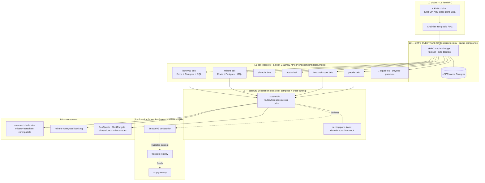
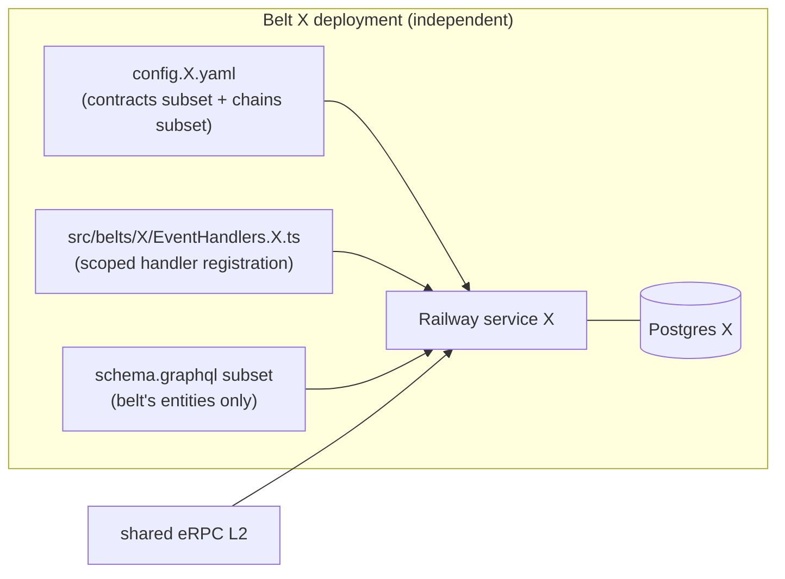
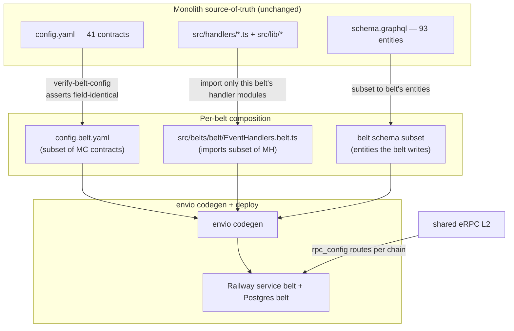
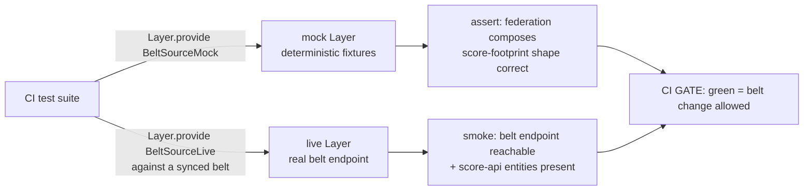

# Software Design Document — sonar-api Belt-Factory (N-belt decomposition)

**Version:** r6 (sonar-belt-factory) — r6 integrates the 3-model Flatline review (9 blockers + 10 high-consensus, 100% agreement); see **§17**. Operator-confirmed taxonomy (12 belts) + remediations applied.
**Date:** 2026-05-21
**Author:** Architecture Designer Agent (ARCH: the-arcade + protocol + noether, craft lens) + Flatline r6 remediation
**Status:** Draft (post-Flatline)
**PRD Reference:** `grimoires/loa/prd.md` (sonar-belt-factory)
**Supersedes:** the single-belt deployment-#1 framing of `sdd.md` r4 — this r5 generalizes the L0–L6 stack from *one* belt to *N pure-product belts*. The eRPC L2 substrate, the `src/belts/<belt>/` invariant, the `verify-belt-config` gate, and the gateway/federation §11 design input from r4 are **carried forward, not redone**.
**Builds on (ACTIVE):** `grimoires/loa/context/arch-brief-freeside-sonar-stack.md` (L0–L6, sovereignty ladder, eRPC-cache-compounds) · `SCALE.md` (D4 kickoff, D6, Guardrails 1/2/5) · `grimoires/loa/known-failures.md` (KF-012, KF-013 — load-bearing for multi-deployment mechanics).

> **Grounding legend**: `[CODE:file]` = codebase reality · `> file:Lnn` = doc quote · `[KF-nnn]` = known-failure provenance · `[ASSUMPTION]` = ungrounded claim flagged for verification.

---

## Table of Contents

1. [Project Architecture](#1-project-architecture)
2. [Software Stack](#2-software-stack)
3. [FR-0 — S0 Calibration Spike (Envio multi-deployment mechanics)](#3-fr-0--s0-calibration-spike-envio-multi-deployment-mechanics)
4. [FR-1 — Belt Taxonomy (the pure-product partition)](#4-fr-1--belt-taxonomy-the-pure-product-partition)
5. [FR-2 — Per-Belt Independent Deployment](#5-fr-2--per-belt-independent-deployment)
6. [FR-3 — Blast-Radius Isolation (the observable proof)](#6-fr-3--blast-radius-isolation-the-observable-proof)
7. [FR-4 — BeaconV3 Declaration (spike)](#7-fr-4--beaconv3-declaration-spike)
8. [FR-5 — Effect Serving / Ports Layer](#8-fr-5--effect-serving--ports-layer)
9. [FR-6 — Uptime SLO + Mock/Live Test Harness](#9-fr-6--uptime-slo--mocklive-test-harness)
10. [FR-7 — Federation-Layer Cross-Cutting Contract (design only)](#10-fr-7--federation-layer-cross-cutting-contract-design-only)
11. [Error Handling Strategy](#11-error-handling-strategy)
12. [Testing Strategy](#12-testing-strategy)
13. [Development Phases / Build Sequencing](#13-development-phases--build-sequencing)
14. [Risks & Mitigation](#14-risks--mitigation)
15. [Open Questions](#15-open-questions)
16. [Verification → Acceptance Criteria Mapping](#16-verification--acceptance-criteria-mapping)

---

## 1. Project Architecture

### 1.1 System Overview

`sonar-api` is the THJ sovereign on-chain indexer: today a **single Envio HyperIndex V3 deployment** ingesting **41 contract definitions** across **6 chains** into **93 GraphQL entities** `[CODE:reality/architecture-overview.md]`. Its structural bottleneck is architectural, not configurational:

> "a single deployment indexing 6 chains means *any* contract addition forces a full reindex of *all* chains … the structural fix is in Decision Log D4 (per-chain deployment split)." — `SCALE.md:L21`

This cycle is **D4's kickoff** — but reframed from D4's literal "per-chain split" into the operator-confirmed **per-product belt** partition: decompose the monolith into independently-deployable **pure-product belts**, each owning its own runtime + schema-subset + persistence; declare them to `loa-freeside`'s federation via a spiked **BeaconV3** contract; and structure a new serving layer on the Effect `domain/ports/live/mock` pattern. Belts become sovereign data producers; the federation layer (loa-freeside registry + MCP gateway) becomes the cross-cutting + analytics consumer.

### 1.2 Architectural Pattern

**Pattern:** *Factory of independently-deployable indexers behind a shared substrate and a federating gateway* — a per-product partition of a previously-monolithic event-sourcing pipeline, fronted by a Hexagonal (Ports & Adapters) serving layer.

**Justification (traces to PRD goals + arch brief):**
- **G2 blast-radius isolation** demands a deployment boundary per product, not a config flag inside one deployment. The empirical lesson is decisive: config-tightening "produced negligible UX improvements in backfill time" `> SCALE.md:L21`. Only a separate deployment changes the reset blast radius.
- **The eRPC L2 substrate stays SHARED, not per-belt** `> arch-brief §4` — "Scoping eRPC per-belt … is wrong. It is factory infrastructure." The cache compounds: "the first belt on a chain pays the cold sync; every belt after rides the cache" `> arch-brief:L99`. This is the load-bearing economic argument for the architecture.
- **Federation at the gateway, not consumer-shaped belts** (Direction Q-boundaries: "Pure product belts + federate") — keeps each belt a clean bounded context; cross-product needs (score-api) resolve at L5.
- **Hexagonal serving layer** (FR-5) isolates the *serving contract* from the *Envio adapter* so the data source can evolve (eRPC → archive RPC → ClickHouse) behind a stable port.

The pattern is deliberately **boring at the indexer layer** (Envio HyperIndex, unchanged) and **disciplined at the seam layer** (Effect ports + BeaconV3 contract). We do not rewrite handlers; we partition deployments and add a thin sovereign serving/declaration layer.

### 1.3 Component Diagram — the N-belt factory (L0–L6)



### 1.4 System Components

| Component | Layer | Own/Rent | Status this cycle |
|---|---|---|---|
| Free public RPC (Chainlist) | L1 | rent-free | unchanged (live) |
| **eRPC substrate** (shared, multi-chain) | L2 | own | **live** — extended to 4 chains [KF-012] `[NOTES.md]`; reused as-is |
| **Belt indexers** (N × Envio HyperIndex) | L3 | own | **NEW** — generalize the existing 1 belt → N belts |
| **Belt GraphQL APIs** (N × endpoint) | L4 | own | Envio-generated per belt |
| **Gateway / serving layer** (Effect ports) | L5 | own | **NEW structure** (FR-5) — federation-shaped (FR-7 design) |
| **BeaconV3 declaration** | L5/federation | own | **NEW** — spike (FR-4); validated against `loa-freeside/packages/beacon-schema` |
| loa-freeside registry + mcp-gateway | federation | external | **deferred** — wiring is a joint follow-up cycle |

The bounded-context boundary: **a belt owns its contracts, handlers-subset, schema-subset, and persistence.** Cross-product reads cross at L5, never by duplicating an indexed source in a second belt (FR-1 rule).

---

## 2. Software Stack

| Layer | Technology | Version | Justification |
|---|---|---|---|
| Indexer | Envio HyperIndex | `v3.0.0-alpha.17` (pinned) | Current production runtime `> claims-to-verify.md:A1` (A1 verified alpha.14; PRD pins alpha.17 — **reconcile in S0**, see §15 OQ-1). V3 is the migrated baseline; no version change this cycle. |
| RPC substrate | eRPC | `v0.0.64`-validated | Shared L2; live; cache compounds `> arch-brief §4`. NOT per-belt. |
| Persistence | PostgreSQL | Railway managed PG (per belt) | One Postgres **per belt** is the reset-isolation boundary (§3, §5). eRPC cache PG is separate + shared. |
| Serving / contract | TypeScript + Effect | `effect ^3.10.0` (beacon-schema peerDep) | FR-5 ports layer; FR-4 BeaconV3 is an Effect Schema `[CODE:loa-freeside/packages/beacon-schema/package.json]`. |
| Federation contract | `@freeside/beacon-schema` (BeaconV3) | `0.2.0` `[CODE:.../beacon-schema/package.json:L3]` | The sealed federation schema sonar-api declares against (FR-4). |
| Hosting | Railway | — | rent (paid hosting acceptable; the free-only constraint is the L1 data layer, not hosting — `> sdd.md r4 §11`). One Railway service per belt + one for eRPC + one for the gateway. |
| Runtime | Node.js | `>=22.0.0` | V3 requirement `> claims-to-verify.md:S2`. |
| Config gate | `scripts/verify-belt-config.js` | existing, **generalized** | Zero-dep YAML fidelity gate `[CODE:scripts/verify-belt-config.js]`; this cycle parameterizes it per belt. |

**Stack non-goals this cycle (PRD "Explicitly Out of Scope"):** ClickHouse/Dune OLAP; packaged self-host installable; score-api `ENVIO_GRAPHQL_URL` repoint; full mcp-gateway federation wiring; HyperSync (sovereign-data thesis — eRPC for all chains, HyperSync is Base break-glass only `[NOTES.md]`).

---

## 3. FR-0 — S0 Calibration Spike (Envio multi-deployment mechanics)

> **FR-0 gates the entire sprint.** Its output finalizes the belt count (§4) and resolves SCALE.md D6. This is a calibration spike per the operator's S0 doctrine (untested integration path: N independent Envio deployments). Half-day budget, max.

### 3.1 What the spike must answer

| Question | Why it gates | Existing evidence to confirm/extend |
|---|---|---|
| **Q-a: How does Envio run N independent deployments?** Separate Postgres per belt? Separate Railway service? Schema-subset codegen per belt? | Determines the §5 deployment unit + §6 isolation proof | **Strong prior evidence** [KF-013]: a belt = its own Railway service + its own Postgres + its own `config.<belt>.yaml`; codegen produces a belt-scoped schema. Two prod deployments (`b5da47c`/`914708e`) already coexist `> claims-to-verify.md:T3`. **S0 confirms this generalizes to ≥3 simultaneous belts**, not just 2 mirrors. |
| **Q-b: Per-belt infra cost.** | R2 (N× cost); may consolidate belts (Direction Q-cost: "S0 spike decides") | Measure: 1 Railway service + 1 Railway Postgres per belt. **eRPC is shared** (one cost, amortized). Produce a per-belt $/mo and an N-belt total; flag belts cheap enough to keep separate vs. cheap-to-consolidate. |
| **Q-c: Envio per-mutation reset semantics (closes SCALE.md D6).** Does adding an `address` / a `contract` / a `schema` field trigger full reset, or scan-from-start_block? | D6; the in-place-vs-blue-green decision; the **core blast-radius claim** | **Decisive prior evidence** [KF-013]: `isInitialized()` checks *table-existence, not config-hash* → a plain redeploy **resumes and silently skips new contracts**. Fresh init requires the `ENVIO_RESTART`-gated sequence. **This means: within a belt, a source addition is a deliberate full re-init of THAT belt only — and other belts (separate deployments) are mechanically untouched.** S0 formalizes this into the D6 answer + the §6 proof procedure. |

### 3.2 The multi-deployment mechanics (S0 hypothesis, grounded in KF-013)

The S0 spike is expected to **confirm and document** (not discover from scratch — the single-belt cycle already paid this cost) the following deployment unit:



**The re-init contract (the load-bearing operational fact, [KF-013]):**

> Envio's `isInitialized()` checks table-existence not config-hash → a plain redeploy RESUMES + silently skips new contracts. Force fresh init: `Dockerfile.belt` CMD env-gated (`${ENVIO_RESTART:+--restart}`) → set `ENVIO_RESTART=1` → deploy (seeds schema + chain_metadata, then the Rust-CLI persisted_state upsert crashes 28P01 on a fresh init — **`ENVIO_PG_SSL_MODE=false` does NOT fix this; that was a misdiagnosis, corrected in KF-013**) → **delete `ENVIO_RESTART` → redeploy → RESUME backfills** the seeded chains (resume skips the fatal upsert). The belt runs fine without `persisted_state` (resume reads `chain_metadata`/`checkpoints`).

This is **the multi-deployment primitive**: each belt is re-initialized in isolation by its own `ENVIO_RESTART` toggle on its own Railway service. **No belt's re-init touches another belt's Postgres or chain_metadata** — that mechanical isolation IS the blast-radius proof's foundation (§6).

### 3.3 S0 exit criteria

- A documented answer to Q-a/Q-b/Q-c written to `grimoires/loa/a2a/<sprint>/s0-multideploy-calibration.md`.
- A **per-belt cost number** + an **N-belt total**, with an explicit consolidation recommendation (the FR-1 belt count is finalized *after* this — §4 presents a candidate, S0+operator confirm).
- A reproducible re-init runbook generalizing [KF-013] from "the mibera belt" to "any belt `<X>`".
- **D6 closed**: per-mutation reset semantics stated definitively (replace SCALE.md Guardrail 1's `WARNING (SKP-004)` "unverified" labeling).
- **Spike deletes its scratch artifacts after audit** (S0 doctrine: NET 0 LOC to the cycle beyond the documented findings + the generalized runbook).

---

## 4. FR-1 — Belt Taxonomy (the pure-product partition)

> **This is an OPERATOR PAIR-POINT.** The partition below is the **first `/architect` deliverable** and the final count is **FR-0-gated** (cost may consolidate). Presented for confirmation; see the §Post-Completion debrief.

### 4.1 The partition rule (binding)

1. **Pure-product belts.** Each belt is one product's bounded context. No consumer-shaped belts (e.g. no "score-api belt") — cross-product needs resolve at L5 federation (FR-7). (Direction Q-boundaries.)
2. **One-belt-indexes-it.** A utility contract serving multiple products (`BgtToken`, `TrackedErc721`, `TrackedErc20`) and a shared entity *shape* (`Action`, `Mint`, `Holder`, `Token`) is indexed in **exactly ONE** belt. Other consumers read it through the gateway — **never re-indexed in a second belt.** (Direction Q-cross-cutting.)
3. **Cross-chain rollups stay within one belt.** `honeyjar` across 6 chains is one belt; cross-*product* aggregation is the gateway's job `> prd.md:L165`.

### 4.2 Contract → belt assignment (all 41 contracts)

Grounded in the config.yaml contract list `[CODE:config.yaml — 41 top-level names]` and the per-chain reference map `[CODE:config.yaml chains: block]`.

| Belt | Contracts | Chains | Notes |
|---|---|---|---|
| **honeyjar** | HoneyJar, HoneyJar2Eth, HoneyJar3Eth, HoneyJar4Eth, HoneyJar5Eth | ETH·OP·ARB·Base·Bera·Zora (HoneyJar is the cross-rollup) | The HoneyJar NFT generations. **Operator 2026-05-21: split the HoneyJar umbrella into honeyjar / honeycomb / cubquests.** |
| **honeycomb** | Honeycomb, MoneycombVault | ETH·Bera | Split from honeyjar (operator 2026-05-21: "Honeycomb Vault would be like Honeycomb"). |
| **cubquests** | CubBadges1155 | Bera | Own belt (operator 2026-05-21: "that would be CubQuests"). Writes `Action:hold1155`. |
| **mibera** | MiberaCollection, MiberaPremint, MiberaStaking, MiberaSets, MiberaZora1155, MiberaLiquidBacking, MirrorObservability, Seaport, **MiladyCollection**, **CandiesMarket1155** | Bera·OP·ETH | MiladyCollection (Mibera↔Milady lore; feeds `NftBurn`). Seaport = Mibera secondary sales. **CandiesMarket1155 → mibera (operator 2026-05-21: candies = Mibera drugs).** |
| **sf-vaults** | SFVaultERC4626, SFMultiRewards, SFVaultStrategyWrapper, HenloVault | Bera | Set&Forgetti. |
| **apdao** | ApdaoAuctionHouse, **TrackedErc721 (Bera/seat)** | Bera | TrackedErc721's *Berachain* reference (apdao seat) homes here. |
| **berachain-core** | FatBeraDeposits, FatBeraAccounting, BeaconDeposit, BlockRewardController, AutomatedStake, ValidatorWithdrawalModule, ValidatorDepositRouter, **BgtToken**, **TrackedErc20** | Bera | Berachain protocol-level. **BgtToken** (utility, feeds `BgtBoostEvent`) and **TrackedErc20** (utility, Bera+Base) indexed here once. |
| **aquabera** | AquaberaVault, AquaberaVaultDirect | Bera | |
| **crayons** | CrayonsFactory, CrayonsCollection | Bera | ⚠ **platform-vs-project** (operator 2026-05-21): if Crayons is a Zora-like launchpad, the belt boundary may be the *platform*, not the project. See §4.4. |
| **purupuru** | PuruApiculture1155 | Base | ⚠ may be a **Crayons-launched** collection — potential overlap with `crayons`. See §4.4. |
| **paddle** | PaddleFi | Bera | Pure lending (operator 2026-05-21: split the catch-all). |
| **friendtech** | FriendtechShares | Base | Own belt (operator 2026-05-21). ⚠ KF-012 op-stack getLogs-liar applies (dense Base) `[NOTES.md]`. |
| **⚠ GeneralMints** | *(unplaced)* | Bera | Operator 2026-05-21 unsure; resolve at S0/impl (likely folds to the belt consuming its `MintEvent`). |

That is **12 belts** (operator-revised 2026-05-21) covering **40 of 41 contracts**; `GeneralMints` is the one **unplaced** contract (flagged above + §4.4). Final count remains FR-0-gated (S0 cost may consolidate). `TrackedErc721` appears on two chains (Bera apdao-seat + OP mibera-lore) — its **definition** is one contract but its **references** split: Bera→`apdao`, OP→`mibera`. The `verify-belt-config` per-(contract,chain) check already models this `[CODE:scripts/verify-belt-config.js:L33-56]`.

### 4.3 Entity → belt assignment (all 93 entities)

Each of the 93 entities `[CODE:schema.graphql — 93 types]` lives in exactly one belt's schema-subset, determined by the contract(s) that write it. Summary by belt (shared shapes flagged):

| Belt | Owns entities (representative) | Shared-shape disposition |
|---|---|---|
| **honeyjar** | `HoneyJar_*` (Approval, ApprovalForAll, BaseURISet, OwnershipTransferred, SetGenerated, Transfer) | — |
| **honeycomb** | Moneycomb `Vault`/`VaultActivity` *(entity homes follow §4.2 contract homes; finalized in impl)* | — |
| **cubquests** | `BadgeAmount/BadgeBalance/BadgeHolder` (CubBadges) | writes `Action:hold1155` |
| **mibera** | `MiberaLoan/LoanStats`, `MiberaTransfer`, `MiberaOrder`, `MiberaStakedToken/Staker`, `MiberaTrade`, `MintActivity`, `Premint*`, `MirrorArticle*`, `NftBurn/NftBurnStats` (mibera+milady burns), **`Candies*` (Backing/Inventory/Trade — moved from paddle 2026-05-21)** | writes `Action` (treasury_purchase/mint), `Mint`, `Holder`, `Token` shapes |
| **sf-vaults** | `SFPosition`, `SFVaultStats/Strategy`, `SFMultiRewardsPosition`, `Henlo*` (Burn/Burner/Holder/Vault*), `UserVaultSummary`, `WithdrawalBatch/Fulfillment/Request` | — |
| **apdao** | `ApdaoAuction/AuctionStats/Bid/QueuedToken`, `TreasuryActivity/Item/Stats` | reads shared `TrackedHolder` shape |
| **berachain-core** | `FatBeraDeposit`, `ValidatorBlockRewards/Deposits/WithdrawalTotals`, `LatestValidatorDeposit/Reward`, `LatestVaultStrategy`, `BgtBoostEvent`, `Vault/VaultActivity`, `UserBalance` | owns shared utility shapes `Holder`, `Token`, `TrackedTokenBalance` (BgtToken/TrackedErc20). **`TrackedHolder` is NOT here** — it's a shared SHAPE written per-belt by whichever indexes a `TrackedErc721` instance (apdao Bera-seat + mibera OP-lore; disjoint rows). See §17 R-A (Flatline B8). |
| **aquabera** | `AquaberaBuilder/Deposit/Stats/Withdrawal` | — |
| **crayons** | `CollectionStat`, `GlobalCollectionStat`, `Transfer`, `Mint`, `Token`, `Holder` (crayons-scoped instances) | — |
| **purupuru** | `Erc1155MintEvent` (puru), `MintEvent` | — |
| **paddle** | `Paddle*` (Borrower/Liquidation/Pawn/Supplier/Supply) | writes `Action` (paddle borrow/supply) |
| **friendtech** | `Friendtech*` (Holder/SubjectStats/Trade) | — |
| *(GeneralMints — unplaced)* | `MintEvent` (general) → resolve with GeneralMints (§4.4) | — |

**Cross-cutting shapes (`Action`, `Mint`, `Holder`, `Token`, `CollectionStat`):** these *type names* recur across belts because handlers share helper logic (`src/lib/actions.ts` writes `Action` from many handlers `[CODE:reality/architecture-overview.md:L58]`). Per the FR-1 rule, **the type definition lives in each belt's schema-subset that writes it; the cross-product MERGE happens at L5 federation (FR-7), not by one belt indexing another belt's source.** The arch brief named this exactly: `Action:treasury_purchase` comes from the mibera belt; `Action:hold1155` from CubBadges1155 in the honeyjar belt; "a consumer reading one URL sees only one belt's fragment" `> sdd.md r4 §9.2:L505`. **Federation reassembles `Action` across belts (FR-7).**

### 4.4 The "to place" contracts — RESOLVED (operator pair-point, 2026-05-21)

The operator resolved the pair-point in favor of **pure-product split over the `paddle` catch-all**, with specific homes:

| Contract | Home | Operator rationale |
|---|---|---|
| PaddleFi | **paddle** | Lending — its own product (now pure). |
| CandiesMarket1155 | **mibera** | "Candies Market would be in mibera" — candies = Mibera drugs. |
| FriendtechShares | **friendtech** | Its own belt (Base social-fi). ⚠ KF-012 op-stack getLogs-liar applies. |
| CubBadges1155 | **cubquests** | "that would be CubQuests" — its own belt (moved out of honeyjar). |
| TrackedErc20 | **berachain-core** | Indexed-once utility (§4.5). |
| GeneralMints | **⚠ UNPLACED** | Operator unsure; resolve at S0/implementation (likely the belt consuming its `MintEvent`). |

The operator also **split the HoneyJar umbrella** (§4.2): `honeyjar` (NFT generations) · `honeycomb` (Honeycomb + MoneycombVault) · `cubquests` (CubBadges). Net: **12 belts**, 40/41 contracts placed, `GeneralMints` open.

> **OPEN — crayons ⟷ purupuru (platform-vs-project, operator-flagged):** "if Crayons is a Zora-like launchpad and we use Purupuru to launch *on* it, there might be a conflict." Is the belt boundary the **platform** (crayons indexes every collection launched on it) or the **project** (purupuru is its own belt)? **Deferred** — clarify before these two belts are built; the decoupling makes it cheap to revise.

> **Operator meta-direction (binding posture, 2026-05-21):** "I don't want to think about it too much, which is why we don't want to couple it too much — just take that into account and we'll go from there." The partition is **directional truth, refined during implementation** — not a frozen contract. Belt boundaries are intentionally cheap to move because belts are decoupled. Do NOT over-optimize the taxonomy now.

### 4.5 The score-api footprint preservation (R7 — HIGH)

The **shipped "mibera belt" is actually the score-api-footprint ECOSYSTEM belt** — 16 contracts across 4 chains `[CODE:scripts/verify-belt-config.js:L35-56 — BELT_CONTRACTS]` `[NOTES.md]`. Re-scoping it into the pure-product partition above **fragments the score-api footprint across `mibera` + `berachain-core` + `paddle` belts**. score-api currently reads (verified live `[NOTES.md]`): `MiberaLoan 176 · MiberaTransfer 39,714 · MintActivity 10,000 · NftBurn 39 · BgtBoostEvent 1.47M · Erc1155MintEvent 7,607 · Action 2.07M · FriendtechTrade 1,317 · PaddleSupply 363 · MintEvent 3,588 · MiberaStakedToken 1,603 · TreasuryActivity 11,819`.

**Preservation mechanism (binding):**
- The re-partition MUST NOT drop any score-api entity. The footprint moves *across belts*, it does not disappear.
- Until L5 federation reassembles the footprint, the **shipped ecosystem belt is RETAINED as a federation-overlay** (a "score-api compatibility belt" that the gateway can keep serving) OR the gateway fans the score-api query across the new `mibera`+`berachain-core`+`paddle` belts (FR-7 fan-out). **score-api#151 repoint is explicitly deferred** `> prd.md:L193` — so the shipped belt keeps serving score-api during this cycle, with zero forced cutover.
- **Acceptance gate (AC-R7):** after the re-partition, run the score-api footprint reconciliation (the entity-count check from `[NOTES.md]`) against the union of the new belts (or the retained overlay). Counts must match the shipped belt's within reconciliation tolerance. Recorded to `grimoires/loa/a2a/<sprint>/score-api-footprint-reconciliation.md`.

---

## 5. FR-2 — Per-Belt Independent Deployment

### 5.1 The deployment unit (extends the existing factory primitive, ADR-008)

Each belt is a deployable unit parameterized by three artifacts + one Railway service + one Postgres:

```
config.<belt>.yaml          ← contracts subset + chains subset (data source = eRPC rpc_config)
src/belts/<belt>/EventHandlers.<belt>.ts   ← scoped handler registration (DISS-001 invariant)
schema.graphql              ← belt's entity subset (see §5.2)
Dockerfile.belt             ← ENVIO_RESTART-gated CMD (KF-013 re-init primitive)
verify-belt-config (<belt>) ← fidelity gate, parameterized per belt
```

The primitive already exists for one belt `[CODE:config.mibera.yaml · src/belts/mibera/EventHandlers.mibera.ts · scripts/verify-belt-config.js]` and there are already-scaffolded sibling configs `[CODE:config.sf-vaults.yaml]`. **This cycle generalizes — it does not invent.**

### 5.2 How each belt's schema, handlers, and eRPC routing compose



**(a) schema.graphql subset.** The belt's `schema.graphql` contains only the entity types the belt's handlers write. Three composition options, decided in S0/S1:
- **Option A (recommended): per-belt physical schema file** — `src/belts/<belt>/schema.graphql` containing the subset; `envio codegen` runs against it. Cleanest isolation; each belt's GraphQL surface is exactly its entities.
- **Option B: shared schema.graphql, belt indexes a subset of contracts** — codegen still emits all 93 entity *tables* but the belt only populates the ones its contracts feed (others stay empty). Lower authoring cost; **but** empty entities are the "partial coverage is more dangerous than no coverage" hazard `> sdd.md r4 §7.2:L406`. Acceptable only with the empty-safe audit.
- **`[ASSUMPTION]`** Option A is preferred for blast-radius cleanliness, but Envio codegen's tolerance for a per-belt schema subset against shared handler modules must be confirmed in S0 (the handler imports `context.<Entity>` symbols from generated bindings — a subset schema must still generate every binding the imported handlers reference). **If a handler module references an entity not in the subset, that handler doesn't belong in the belt — which is exactly the FR-1 purity signal.** S0/S1 verifies the codegen path.

**(b) handler subset.** `src/belts/<belt>/EventHandlers.<belt>.ts` imports *only* the handler modules for the belt's contracts (the DISS-001 per-belt-entrypoint invariant, already generalized in r4 §4.3). `src/handlers/*.ts` and `src/lib/*` stay shared, unmodified — handlers are reused, never forked. The `verify-belt-config` gate deliberately excludes the `handler:` line from fidelity comparison because the belt points it at the scoped entrypoint `[CODE:scripts/verify-belt-config.js:L102-137]`.

**(c) eRPC routing.** Every belt's `config.<belt>.yaml` sets each chain's data source to the **shared eRPC** endpoint (`rpc_config` → eRPC URL per chain route, e.g. `/8453` `/10` `/1` `/80094` `[NOTES.md]`). No belt talks to L1 RPC directly. **The cache compounds** — the first belt to cold-sync a chain warms the cache; subsequent belts on that chain ride it `> arch-brief:L99`. Bera/Base/OP/ETH are already warm `> prd.md:L147`; only ARB/Zora belts pay fresh cold-sync.

### 5.3 verify-belt-config generalization

The current gate hard-codes `BELT_CONTRACTS` for the mibera/score-api-footprint belt `[CODE:scripts/verify-belt-config.js:L35]`. This cycle parameterizes it: a per-belt manifest (e.g. `belts/<belt>/contracts.manifest.json`) listing `{name, chainId}` pairs, and the gate asserts each belt config is field-identical to `config.yaml` for its declared contracts. The zero-dependency design (no YAML parser) is preserved — it is the gate's stated invariant `[CODE:scripts/verify-belt-config.js:L19-23]`. Extending the gate to the new chains (currently Berachain-focused) is a tracked cleanup `[NOTES.md]`.

---

## 6. FR-3 — Blast-Radius Isolation (the observable proof)

### 6.1 The mechanism (grounded in §3.2 / KF-013)

Belts are **separate Railway services with separate Postgres**. A belt's re-init (`ENVIO_RESTART` toggle) rewrites only that belt's tables. **Mechanically, belt X's source change cannot touch belt Y's chain_metadata / checkpoints / Postgres** — they are different databases. Blue-green per SCALE.md Guardrail 1 applies *per belt*: a source change deploys a fresh belt-X deployment ID, backfills, then swaps belt X's gateway upstream — siblings never observe it.

### 6.2 The observable proof (KPI: 0 reindex events on siblings)

```mermaid
sequenceDiagram
    participant Op as Operator
    participant BX as Belt X (apdao)
    participant BY as Belt Y (mibera)
    participant BZ as Belt Z (berachain-core)
    participant Prb as Isolation probe

    Note over Prb: T0 — snapshot all belts' chain_metadata<br/>(latest_processed_block + num_events_processed)
    Op->>BX: add a source to config.apdao.yaml + ENVIO_RESTART re-init
    BX->>BX: full reset + backfill (belt X only)
    Note over BY,BZ: continue serving — untouched
    Note over Prb: T1 — re-snapshot all belts
    Prb->>Prb: assert BY, BZ chain_metadata MONOTONIC<br/>(no reset: latest_processed_block did NOT drop to start_block;<br/>num_events_processed did NOT reset)
    Prb-->>Op: PASS = 0 reindex on siblings
```

**The probe** is a script that queries each belt's `chain_metadata` (the same probe SCALE.md uses `> SCALE.md:L31-39`) before and after a belt-X source change and asserts the sibling belts show **monotonic** `latest_processed_block` and **non-decreasing** `num_events_processed` — i.e. no reset event. This is the **measured KPI** `> prd.md:L66`: "0 reindex events on sibling belts."

**Acceptance gate (AC-FR3):** the probe runs as a **CI job triggered on any `config.<belt>.yaml` / belt-schema change** (durable, non-skippable — NOT a manual runbook step; Flatline HC 9, §17 R-E); sibling-monotonicity is the pass criterion. Written to `grimoires/loa/a2a/<sprint>/blast-radius-proof.md`.

### 6.3 Blue-green per belt (SCALE.md Guardrails carried forward)

- Guardrail 1 (blue-green) applies per belt: fresh deployment ID → backfill → schema-diff verify → staged consumer cutover → 7-day hot retention `> SCALE.md:L45-91`.
- Guardrail 5 (stable consumer alias) is a **precondition for safe per-belt cutover** `> SCALE.md:L332` — and is naturally satisfied by the L5 gateway (FR-5/§8): consumers point at the gateway, the gateway's per-belt upstream is the swap point. **The gateway IS Guardrail 5 realized.**

---

## 7. FR-4 — BeaconV3 Declaration (spike)

> Spike, not full wiring. sonar-api authors a BeaconV3 declaration validated against `loa-freeside/packages/beacon-schema`; registry aggregation + mcp-gateway routing is a deferred joint cycle `> prd.md:L126`. Manifest authoring routes to the **beacon construct** (Construct Resolution: manifest authoring → beacon).

### 7.1 The schema sonar-api declares against

`@freeside/beacon-schema@0.2.0` `[CODE:.../beacon-schema/package.json:L3]` — `BeaconV3Schema` = `BeaconV2` (mcp + cli + pricing + publisher + auth) ∪ six V3 boundary fields `[CODE:.../src/beacon-v3.ts:L235-249]`:

| V3 field | Constraint (from schema) | sonar-api value |
|---|---|---|
| `is.one_liner` | ≤120 chars `[L29-32]` | "Sovereign on-chain indexer for the THJ ecosystem — N pure-product belts over 6 chains." |
| `is.scope` | 2–7 entries, ≤100 chars each `[L36-47]` | ["Indexes 41 contracts into 93 entities", "Per-product belt deployments", "Federated GraphQL via gateway", "eRPC-backed sovereign data"] |
| `is_not` | ≥2 entries, each MUST start "Does NOT"/"Will NOT"/"Refuses to" `[L57-77]` | ["Does NOT serve OLAP/analytics queries (federation layer concern)", "Does NOT pay for data infrastructure (free RPC + eRPC only)", "Refuses to duplicate an indexed source across belts"] |
| `composes_with` | lowercase-kebab keys; `tag` = `TagName@semver+hash8-16` `[L92-123]` | `{ loa-freeside: { role: "federation registry + MCP gateway", tag: "BeaconRegistry@<v>+<hash>" } }` — **tag hash resolved at author time via `loa freeside doctor`** `> beacon-schema README:L168` |
| `acvp_invariants` | id ∈ {hash_chain, event_completeness, …}; `proof_artifact` path `[L129-158]` | e.g. `{ id: "event_completeness", scope: "per-belt indexed events vs on-chain", proof_artifact: "grimoires/loa/a2a/<sprint>/score-api-footprint-reconciliation.md" }` |
| `sealed_schemas` | `path` + sha256 hash + consumers `[L164-179]` | the per-belt `schema.graphql` subsets, hashed |
| `cycle_state` | status ∈ {candidate,active,mature,sunset,legacy}; `since` + `next_review` (≤+180d) `[L190-219]` | `{ status: "candidate", since: "2026-05-21", next_review: "2026-11-17" }` |

Plus the V2 `mcp` block `[CODE:.../src/beacon-v2.ts:L144-174]`: `shape: data`, `paths: [remote-http]`, `remote: { transport: streamable-http, endpoint: <gateway URL> }`, `auth: { kind: none }` (public read-only on-chain data), `capabilities: [resources]`, `pricing: { model: free, description: "first-party sovereign indexer" }`, `publisher: "0xHoneyJar"`.

### 7.2 Validation path

```bash
# beacon-schema ships a YAML→JSON build+validate CLI
npx build-beacon-json --in beacon.yaml --out app/.well-known/beacon.json
# exit 0 = valid · exit 1 = ParseError on stderr · exit 2 = usage  [beacon-schema README:L54-61]
```

**Acceptance gate (AC-FR4):** `beacon.yaml` authored at the sonar-api repo root, decodes clean against `BeaconV3Schema` (exit 0). **Spike-level** — the produced `beacon.json` is the artifact; registry registration + gateway routing is the deferred follow-up. Decoupling from loa-freeside team availability is the explicit R4 mitigation `> prd.md:L218` ("Spike-not-wire").

> **Pushback (MAY-LATITUDE-5):** `composes_with.loa-freeside.tag` requires a fully-qualified `TagName@semver+hash` and the validator recomputes the hash against the live Honeycomb Tag definition `> beacon-schema README:L161-170`. If loa-freeside hasn't published the Tag the spike references, validation of `composes_with` may fail even though our `is`/`is_not`/`cycle_state` are correct. **Mitigation:** `composes_with` is `optionalWith(default {})` `[CODE:.../beacon-v3.ts:L240]` — the spike MAY ship `composes_with: {}` and add the Tag reference when loa-freeside confirms it. Verify Tag availability before claiming AC-FR4 includes composition.

---

## 8. FR-5 — Effect Serving / Ports Layer

> Structure-only adoption at the NEW serving/gateway layer; **Envio HyperIndex handlers stay as-is and become live adapters behind ports** ("push deps to the edge"). NOT a full runtime rewrite. construct-effect-substrate is `status: candidate` — adopt the structure, not a framework dependency `> prd.md:L131`.

### 8.1 The four-folder pattern at the serving layer

Per the `domain-ports-live` pattern `[CODE:construct-effect-substrate/patterns/domain-ports-live.md]` — Hexagonal Architecture folder-realized with Effect Layer as the adapter mechanism. Applied to the **serving/gateway layer only** (a new TS package; the Envio indexer is untouched):

```
serving/
├── domain/          ← Schema only. The GraphQL query/result shapes consumers see. No effects.
│   ├── belt.ts          (Belt = Schema.Struct: id, chains, endpoint, entities[])
│   └── score-footprint.ts (the score-api federation result shape)
├── ports/           ← Context.Tag service interfaces (*.port.ts — grep-enumerable)
│   ├── belt-source.port.ts   (BeltSource: query a belt's GraphQL by entity)
│   └── federation.port.ts    (Federation: compose across N belts — FR-7)
├── live/            ← Production Layer (*.live.ts) — the Envio adapter
│   └── belt-source.live.ts   (wraps Envio belt GraphQL HTTP; Effect at the boundary)
└── mock/            ← Test/dev Layer (*.mock.ts) — deterministic fixtures (FR-6 harness)
    └── belt-source.mock.ts
```

**The Envio handler → live adapter mapping:** the Envio handlers/GraphQL endpoint are the *imperative core* the `belt-source.live.ts` Layer wraps. Per the pattern's rule: "Implementation can use any language idiom … Effect lives at the boundary, not throughout" `[domain-ports-live.md:L98-103]`. We do **not** rewrite the handlers in Effect; we wrap the belt endpoint behind the `BeltSource` port. The serving layer speaks Effect; the indexer below it does not change.

### 8.2 Single Effect.provide site (the load-bearing invariant)

Per `single-effect-provide-site` `[CODE:construct-effect-substrate/patterns/single-effect-provide-site.md]` — exactly **one** `ManagedRuntime.make` call, in `serving/runtime/runtime.ts`:

```typescript
// serving/runtime/runtime.ts — THE single Effect.provide site.
export const AppLayer = Layer.mergeAll(BeltSourceLive, FederationLive);
export const runtime = ManagedRuntime.make(AppLayer);
```

**CI gate (FR-6, FAGAN-checkable, zero-dep):**

```bash
COUNT=$(grep -rEc "ManagedRuntime\.make\(" --include="*.ts" serving/ | grep -v ":0$" | awk -F: '{sum+=$2} END {print sum+0}')
[ "${COUNT:-0}" = "1" ] || { echo "FAIL: $COUNT runtime sites (expected 1)"; exit 1; }
```

Note the `\(` — without it the grep matches the doc-comment that names the rule and fails on its own evidence (cycle-2 footgun `[single-effect-provide-site.md:L44]`).

### 8.3 suffix-as-type enforcement

Per `suffix-as-type` `[CODE:construct-effect-substrate/patterns/suffix-as-type.md]`: `*.port.ts` / `*.live.ts` / `*.mock.ts` make the behavior surface grep-enumerable. Port+live pairing is the load-bearing gate:

```bash
for port in $(find serving/ports -name '*.port.ts'); do
  base=$(basename "$port" .port.ts)
  [[ -f "serving/live/${base}.live.ts" ]] || echo "MISSING: serving/live/${base}.live.ts"
done
```

**Scope discipline:** FR-5 ships the **structure** (folders, ports, the live adapter wrapping the existing belt endpoint, the single provide-site). It is NOT a runtime rewrite of the indexer (R5 mitigation: structure-only, Envio handlers untouched `> prd.md:L219`). The `mock/` Layer is what makes FR-6's CI harness possible.

---

## 9. FR-6 — Uptime SLO + Mock/Live Test Harness

### 9.1 Sync-lag SLO (seeded from SCALE.md Guardrail 2)

The per-chain block-lag SLO `> SCALE.md:L139-146`, applied **per belt × chain** (each belt has its own chain_metadata):

| Chain | Lag SLO (proposed, seed) | Status |
|---|---|---|
| ETH (1) | < 50 blocks (~10 min) | PROPOSED — observation-only until baselined |
| Optimism (10) | < 600 blocks (~20 min) | PROPOSED |
| Arbitrum (42161) | < 2,400 blocks (~10 min) | PROPOSED |
| Base (8453) | < 600 blocks (~20 min) | PROPOSED |
| **Berachain (80094)** | < 300 blocks (~10 min) | PROPOSED — strictest (primary) |
| Zora (7777777) | < 1,800 blocks (~60 min) | PROPOSED |

These remain **PROPOSED, observation-only** until one week of baseline lag is observed per belt `> SCALE.md:L137`. The SLO **must run from a managed environment, NOT a developer laptop** `> SCALE.md:L160` (D3) — GitHub Actions scheduled workflow or Railway scheduled service. The lag-check is the `chain_head − latest_processed_block` probe `> SCALE.md:L150-156`, run per belt endpoint.

> **Note on the cold-sync caveat (carried from r4 §7.4):** during a belt's initial cold backfill, lag is *expected* to be large. The alert must distinguish "backfilling at the S0-measured rate" (healthy) from "stalled, making no progress" (the failure mode). The S0 cold-sync rate (§3.3) is the load-bearing input that makes the alert meaningful.

### 9.2 Effect mock/live test harness (the CI gate)

The `domain/ports/live/mock` split (§8) makes a deterministic CI harness possible:



- **Mock path (unit, fast, deterministic):** tests provide `BeltSourceMock`, assert the federation/serving logic composes belt fragments into the score-footprint shape correctly — no network, no live belt.
- **Live path (integration, gated):** against a synced belt, smoke-test that the endpoint is reachable and the score-api entities resolve (the §4.5 footprint check). 
- **Gate:** both green = a belt change is allowed to ship. This is the "Effect live/mock harness passes in CI" KPI `> prd.md:L68`.

**Acceptance gate (AC-FR6):** sync-lag SLO thresholds defined + a managed-environment monitor wired (per D3); the mock/live harness runs green in CI.

---

## 10. FR-7 — Federation-Layer Cross-Cutting Contract (design only)

> Design only this cycle. Cross-product aggregation (score-api across mibera + berachain-core + paddle) and the future ClickHouse/Dune OLAP path are **federation-layer** concerns, not belt concerns. Lock the contract shape; wiring + ClickHouse are deferred `> prd.md:L137`.

### 10.1 The federation contract shape

The L5 gateway's `Federation` port (§8) defines how cross-belt queries compose. Two realization options (decided before wiring, NOT now — carried from r4 §9.2):
- **(a) fan-out + merge** — the gateway fans a query across N belt endpoints and merges results. Lower-effort first step.
- **(b) true GraphQL federation/composition endpoint** — the cleaner realization of operator doctrine ("consuming apps compose data across belts at the API layer"). 

**The binding design constraint:** the gateway's interface MUST be designed so federation is **purely additive** — the public URL + the GraphQL contract consumers see MUST NOT change when belts are added or when the realization shifts from (a) to (b) `> sdd.md r4 §9.2:L513`.

### 10.2 The cross-cutting entity contract

The `Action`, `Mint`, `Holder`, `Token` shapes fragment across belts (§4.3). The federation contract specifies:
- A consumer querying `Action` through the gateway gets the **union** of all belts' `Action` fragments (mibera's `treasury_purchase` + honeyjar's `hold1155` + paddle's borrow/supply).
- **score-api federation** (the named cross-product consumer): the gateway federates `mibera` + `berachain-core` + `paddle` to reassemble the score-api footprint (§4.5). This is the FR-7 contract that R7 preservation depends on.

### 10.3 ClickHouse/Dune OLAP — the federation-layer home

The OLAP analytics path lives at the federation layer, **not in belts** (Direction Q-serving). Belts are OLTP event stores; the federation layer is where cross-belt analytical aggregation (and a future ClickHouse/Dune mirror) attaches. **Deferred to a fast-follow** `> prd.md:L74` — this SDD only locks that it is a federation-layer concern, so belts are not designed around it.

---

## 11. Error Handling Strategy

| Failure class | Detection | Handling | Provenance |
|---|---|---|---|
| **Free RPC empty-200 on filtered eth_getLogs** (op-stack getLogs-liar) | eRPC per-upstream error metrics; reconciliation count gaps | eRPC `ignoreMethods: [eth_getLogs]` on the lying upstream + widened getLogs cluster + per-upstream rate-limit pacing | [KF-012] — RESOLVED-VIA-CONFIG; **WILL recur on Base/new op-stack chains — verify per chain before trusting** `[NOTES.md]` |
| **Envio Rust-CLI 28P01 on fresh init** (persisted_state SCRAM-over-SSL) | belt deploy crashes on `--restart` | the `ENVIO_RESTART`-seeds-then-resume pattern (§3.2); belt runs without persisted_state | [KF-013] — RESOLVED-VIA-WORKAROUND; **`ENVIO_PG_SSL_MODE=false` does NOT fix it (misdiagnosis corrected)** |
| **Silent cold-sync stall** | sync-lag alert (§9.1) distinguishes backfill-at-rate from stalled | alert to managed-env monitor; operator re-init or RPC escalation | r4 §7.4 (the silent-death class) |
| **Partial coverage / empty entity** | empty GraphQL array (NOT an error) | empty-safe audit before any consumer repoint; "empty ≠ error" — uncovered entities return empty arrays, never schema errors | r4 §7.2:L406 |
| **Belt endpoint down** | Railway healthcheck (3 consecutive fail → restart); gateway upstream health | gateway repoints upstream (operator-controlled, no consumer change) | r4 §7.3 |
| **eRPC degraded** (whole chain cluster blacklisted) | eRPC health/metrics endpoint | L2 outage alert; affects all belts on that chain (shared substrate trade-off) | r4 §7.3 |
| **BeaconV3 validation fail** | `build-beacon-json` exit 1 (ParseError on stderr) | fix the declaration; `composes_with` may ship empty if Tag unavailable (§7.2) | beacon-schema README:L54 |

**The two-layer-silent-failure principle (carried from r4):** the stack has TWO layers that fail silently — L2 eRPC and L3 the belt. A healthy belt fed by a degraded eRPC is still a degraded factory `> sdd.md r4 §7.3:L421`. Both need health signals.

---

## 12. Testing Strategy

| Test layer | What it covers | Tool | Gate |
|---|---|---|---|
| **verify-belt-config** | Each belt config field-identical to `config.yaml` for its contracts (address/start_block/field_selection) | `scripts/verify-belt-config.js` (generalized, §5.3) | exit 0 required pre-deploy |
| **Effect mock harness** | serving/federation logic composes belt fragments correctly | `Layer.provide(BeltSourceMock)` (§9.2) | green in CI |
| **Effect live smoke** | belt endpoint reachable + score-api entities resolve | `Layer.provide(BeltSourceLive)` against synced belt | green in CI |
| **single-runtime grep gate** | exactly 1 `ManagedRuntime.make` site | grep CI gate (§8.2) | =1 required |
| **suffix-pairing gate** | every `*.port.ts` has a `*.live.ts` | find-loop CI gate (§8.3) | no MISSING |
| **blast-radius probe** | sibling belts show 0 reindex on a belt-X change | chain_metadata monotonicity probe (§6.2) | sibling-monotonic = PASS |
| **score-api footprint reconciliation** | re-partition preserves all score-api entities (R7) | entity-count check vs shipped belt (§4.5) | counts match within tolerance |
| **per-source health probe** | a new source produces a stat row within N blocks | SCALE.md Guardrail 4 template, per belt | TrackedHolder/CollectionStat returns a row |

**Test-first discipline** applies to the new serving layer (FR-5/FR-6). The Envio handlers are reused unmodified (no new handler code → no new handler tests this cycle); the existing `test/verify-belt-config.test.ts` is extended to the parameterized gate.

---

## 13. Development Phases / Build Sequencing

Build **bottom-up** — the eRPC L2 floor is already live; this cycle builds L3 (N belts) → L5 (serving/federation structure) and the FR-4 declaration as a parallel spike.

| Sprint | Layer / FR | What it builds | Gates |
|---|---|---|---|
| **S0** | FR-0 (P0, **gates all**) | Envio multi-deployment calibration: confirm Q-a/Q-b/Q-c (§3); per-belt cost; **finalize belt count** (§4 operator pair-point); close D6; generalize the KF-013 re-init runbook | S0 exit criteria (§3.3); **belt count confirmed by operator** |
| **S1** | FR-1 + FR-2 (P0) | Generalize the factory: parameterize `verify-belt-config` (§5.3); author `config.<belt>.yaml` + `src/belts/<belt>/` for the confirmed belts; per-belt schema-subset composition (§5.2 Option A) | verify-belt-config exit 0 per belt; codegen+typecheck exit 0 |
| **S2** | FR-2 + FR-3 (P0) | Deploy belts (eRPC-routed, ENVIO_RESTART per belt); the blast-radius probe (§6.2); **R7 score-api footprint reconciliation** (§4.5) | blast-radius PASS (sibling-monotonic); footprint reconciliation PASS |
| **S3** | FR-5 + FR-6 (P1) | The Effect serving/ports layer structure (§8); single-runtime + suffix gates; sync-lag SLO + managed-env monitor (D3); mock/live CI harness | grep gates pass; harness green; SLO monitor wired |
| **S4** | FR-4 + FR-7 (P2) | BeaconV3 `beacon.yaml` authored + validated against beacon-schema (§7); the federation contract shape design (§10, design-only) | `build-beacon-json` exit 0; federation contract documented |

**Priority (PRD):** P0 = FR-0, FR-1, FR-2, FR-3. P1 = FR-5, FR-6. P2 = FR-4, FR-7 `> prd.md:L196`.

**Branch-state check before S1 (operator doctrine):** before authoring belt configs, `ls`/`find` each belt's handler modules against the cycle branch — if a handler module a belt config references doesn't exist, surface to operator (the §5.2(a) purity signal).

---

## 14. Risks & Mitigation

| ID | Risk | Likelihood | Impact | Mitigation | Source |
|---|---|---|---|---|---|
| **R1** | Envio multi-deployment mechanics/cost unknown | Med (KF-013 de-risks) | High | FR-0 S0 spike before sprint commit; finalizes belt count. Strong prior evidence from the shipped belt + 2-deployment coexistence | `> prd.md:L215` |
| **R2** | N× infra cost (N belts × Postgres × Railway) | Med | Med | S0 cost calibration; cost-driven consolidation allowed (`paddle` is the consolidation bucket, §4.4); eRPC is shared (amortized) | `> prd.md:L216` |
| **R3** | Cross-cutting entity tension (shared shapes, score-api footprint) | Med | High | Federation-layer resolution (FR-7); one-belt-indexes rule (FR-1) | `> prd.md:L217` |
| **R4** | BeaconV3 cross-repo dependency on loa-freeside team/schema | Med | Med | Spike-not-wire (FR-4) decouples; `composes_with` may ship empty (§7.2) | `> prd.md:L218` |
| **R5** | construct-effect-substrate is `status: candidate` (1 project) | Low | Med | Structure-only adoption at serving layer; Envio handlers untouched | `> prd.md:L219` |
| **R6** | Simultaneous cold-syncs during full migration | Med | Med | eRPC warm cache (Bera/Base/OP/ETH warm `> prd.md:L147`); blue-green per belt; stagger; **dense regions THROTTLE to hundreds of blk/s** `[NOTES.md]` → dense belts (Base friend.tech, ETH Milady) may need paid archive RPC as an eRPC upstream | `> prd.md:L220` |
| **R7** | **Re-scoping the shipped ecosystem belt regresses score-api coverage** | Med | High | §4.5 preservation: retain shipped belt as federation overlay OR gateway fan-out; AC-R7 reconciliation; score-api#151 repoint deferred (no forced cutover) | `> prd.md:L221` |
| **R8** | Ledger pollution (loa-framework cycles in sonar-api ledger) | Low | Low | Flagged for separate cleanup; non-blocking | `> prd.md:L222` |
| **R9** | KF-012 op-stack getLogs-liar recurs on a new belt's chain | Med | High | Per-chain getLogs verification before trusting any new belt's data `[NOTES.md, KF-012]`; reconciliation gate catches silent loss | [KF-012] |
| **R10** | `[ASSUMPTION]` Envio codegen tolerance for per-belt schema subset (§5.2a) | Med | Med | S0/S1 verifies the codegen path; a handler referencing an out-of-subset entity is the FR-1 purity signal (belongs in another belt) | §5.2 |

---

## 15. Open Questions

- **OQ-1 — Envio version reconciliation.** PRD pins `alpha.17` `> prd.md:L172`; reality says `alpha.14` `> claims-to-verify.md:A1`; NOTES references the shipped belt. **S0 confirms the pinned version** before belt codegen.
- **OQ-2 — `paddle` belt split (the FR-1 judgment).** Keep `paddle` as the catch-all, or split → `paddle`+`candies`+`friendtech` if S0 cost shows belts are cheap (§4.4). **Operator pair-point.**
- **OQ-3 — Schema-subset composition strategy (§5.2).** **RESOLVED → §17 R-D:** Option A (per-belt physical schema) is a HARD S0 exit criterion (pre-codegen reference check + a real `envio codegen`+`tsc` build); Option B (shared schema, subset-populated, empty-safe) is the mandatory fallback. Flatline B1/B2.
- **OQ-4 — score-api footprint preservation mechanism (§4.5).** **RESOLVED → §17 R-B:** the shipped ecosystem belt stays the SOLE score-api source this cycle (one source = no split-brain); new belts backfill *dark*; cutover+decommission is next cycle, gated by AC-R7 + a hard decommission guard. Flatline B3/B7.
- **OQ-5 — Belt count finalization.** §4 presents **12 belts** (40/41 placed; `GeneralMints` + crayons/purupuru resolve by **S1 exit** — §17 R-A); S0 cost may consolidate. The final count is the FR-0 output + operator confirmation.
- **OQ-6 — Dense-chain longevity (R6).** Base friend.tech + ETH Milady throttle on free eRPC; the longevity answer (paid archive RPC as an eRPC upstream, sovereign-routed, vs own-nodes) is decided **empirically after measuring** `[NOTES.md]` — out of scope this cycle, flagged for fast-follow.

---

## 16. Verification → Acceptance Criteria Mapping

| PRD Launch Criterion `> prd.md:L203-208` | SDD section | Acceptance gate |
|---|---|---|
| All 41 contracts / 93 entities assigned to a belt (no monolith remainder) | §4.2, §4.3, §17 R-A | At planning: **40/41 placed** (12 belts). `GeneralMints` placement + crayons/purupuru platform-vs-project resolved by **end of S1** → 41/41 + 93/93. AC measured at **S1 exit**, not planning (Flatline B6). |
| Blast-radius proof: a source change reindexes only its belt's chains | §6.2 | AC-FR3 sibling-monotonicity probe PASS |
| BeaconV3 declaration validates against beacon-schema; ≥1 consumer routed (spike) | §7 | AC-FR4 `build-beacon-json` exit 0 |
| Sync-lag SLO defined + monitored; Effect mock/live harness green in CI | §9 | AC-FR6 SLO monitor wired (managed env) + harness green |
| eRPC capacity verified for migration cold-syncs (SKP-003) | §5.2c, R6 | eRPC warm-cache check + per-chain getLogs verification (R9) |
| **(implied) score-api footprint preserved (R7)** | §4.5 | AC-R7 footprint reconciliation PASS |

---

> **Sources:** `grimoires/loa/prd.md` (sonar-belt-factory) · `grimoires/loa/context/arch-brief-freeside-sonar-stack.md` (L0–L6, eRPC-compounds, sovereignty ladder) · `SCALE.md` (D4/D6, Guardrails 1/2/5) · `grimoires/loa/known-failures.md` (KF-012 getLogs-liar, KF-013 re-init pattern) · `grimoires/loa/sdd.md` r4 (single-belt baseline — §7.2/§7.3/§9.1/§9.2 carried forward) · `config.yaml` + `schema.graphql` (41 contracts / 93 entities, chain map) · `scripts/verify-belt-config.js` (the factory gate) · `loa-freeside/packages/beacon-schema/src/beacon-v3.ts` + `beacon-v2.ts` + README (BeaconV3 contract) · `construct-effect-substrate/patterns/{domain-ports-live,single-effect-provide-site,suffix-as-type}.md` (FR-5 patterns) · `grimoires/loa/NOTES.md` (shipped ecosystem belt reality, KF-013 operational detail, dense-chain throttle finding) · Direction AskUserQuestion answers 2026-05-21 (scope/boundaries/tenancy/serving/effect/federation/cost) · `grimoires/loa/a2a/flatline/sdd-review.json` (3-model Flatline review — §17).

---

## 17. Flatline r6 Remediation (2026-05-21)

> 3-model Flatline review (claude + codex + gemini · 100% agreement · full confidence · 277s) found **9 blockers + 10 high-consensus**. Raw: `grimoires/loa/a2a/flatline/sdd-review.json`. Operator decision: "integrate all → r6". The resolutions below are **authoritative** and supersede any contradicting inline text.

### R-A · Partition contradictions (Flatline B5, B6, B8)
- **Belt count = 12** (not 9). All stale "9 belts" references corrected (§15 OQ-5).
- **`GeneralMints` placement + crayons/purupuru platform-vs-project are S1 exit criteria, not planning-time gaps.** The "41/41 assigned" launch gate is measured at **end of S1**, not at planning. At planning: 40/41 placed (12 belts); the two opens MUST be resolved before S1 exit or the launch gate fails. The planning artifact makes **no** "all assigned" claim (closes the B6 contradiction).
- **`TrackedHolder` is a shared SHAPE, not a single-belt entity.** `TrackedErc721` has two disjoint instances (apdao Bera-seat, mibera OP-lore). Each belt writes its OWN `TrackedHolder` rows for its instance — disjoint token sets, no merge (identical to `Action`/`Mint`/`Holder`). The one-belt-indexes-it rule holds **per contract-instance**; `berachain-core` does NOT own `TrackedHolder`. Federation merges only if a consumer wants both instances.

### R-B · score-api transition: no double-serve, no split-brain (Flatline B3, B7 / OQ-4 RESOLVED)
The CRITICAL risk: running the shipped ecosystem belt AND the new pure-product belts as *simultaneous score-api sources* → double-index + split-brain. Resolution (blue-green, single authoritative source):
- **This cycle, the shipped ecosystem belt remains the SOLE score-api source.** Consumers read ONE belt → no split-brain.
- New pure-product belts **backfill in parallel ("dark")** — indexed but NOT served to score-api. The temporary double-index (same contracts in shipped belt + new belts) is the **accepted, bounded blue-green cost**, not a steady state.
- **Cutover + decommission of the shipped belt is NEXT cycle**, only after federation (FR-4 wiring) reassembles the footprint AND AC-R7 reconciliation passes against the new-belt union.
- **HARD GUARD (binding):** the shipped ecosystem belt MUST NOT be decommissioned until federation coverage of the score-api#151 footprint is proven (AC-R7 PASS). A deploy-gate, not a runbook note.

### R-C · Shared SPOFs need explicit failover (Flatline B9 eRPC-CRITICAL, B4 gateway)
- **eRPC (L2):** internal multi-upstream failover + auto-blacklist already mitigate per-upstream failure. ADD: (a) run eRPC **HA** (≥2 stateless proxy instances behind one internal address); (b) a **degraded-mode direct-L1 fallback** — belts repointable to direct L1 RPC if the eRPC service is fully down (slower, no cache, but live). Documented in §11.
- **L5 gateway:** run **HA** (≥2 instances); consumers retain **direct per-belt GraphQL URLs as a degraded fallback**. The gateway is a routing convenience, not the only path to a belt's data.
- **Cost note (operator awareness):** HA ≈ 2× the eRPC + gateway service cost (small vs the per-belt Postgres cost). Folded into the S0 cost calibration (FR-0 Q-b).

### R-D · Schema-subset (Option A) is a HARD S0 exit, not an assumption (Flatline B1-CRITICAL, B2 / OQ-3 RESOLVED)
Per-belt physical schema subset (Option A) **likely breaks TS codegen** when a shared handler references an entity omitted from the belt's subset (missing Envio bindings). Now a **blocking S0 exit criterion**:
- S0 runs a **pre-codegen reference check**: for each belt, statically verify every entity its handlers reference is in that belt's subset. An out-of-subset reference is either (i) the FR-1 purity signal (contract belongs in another belt) or (ii) a genuine shared shape (Option B).
- S0 runs a **real `envio codegen` + `tsc` build** for ≥1 representative belt. If Option A fails to compile, **Option B (shared `schema.graphql`, subset-populated, empty-safe) is the mandatory fallback** — no belt ships on an unproven codegen path.
- **Envio version (OQ-1)** is also an S0 exit: confirm `alpha.17` vs `alpha.14` + test codegen on the pinned version before any belt build.

### R-E · FR-3 enforcement is CI, not a runbook (Flatline HC 9)
The blast-radius proof (AC-FR3 sibling-monotonicity) runs as a **CI job triggered on any `config.<belt>.yaml` / belt-schema change** — durable, non-skippable enforcement of the core D4 guarantee (§6.2 updated).

### R-F · Federation port shape lands this cycle (Flatline HC 8)
FR-7's federation contract MUST define a minimal typed **Federation port** (the gateway↔belt query interface) so AC-FR7 is objective — the port *shape* lands this cycle even though wiring is deferred.

### Remediation → sprint mapping
S0 absorbs R-D + the OQ-1 version check (hard exit criteria). S1 absorbs R-A's two opens (GeneralMints + crayons/purupuru) as exit criteria. R-B (dark backfill + decommission guard), R-C (HA + degraded fallback), R-E (CI gate), R-F (Federation port) become explicit sprint tasks in `/sprint-plan`.
